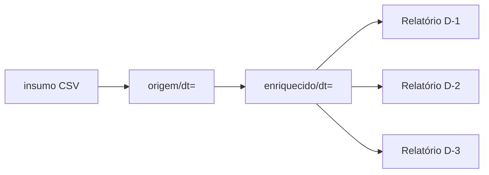
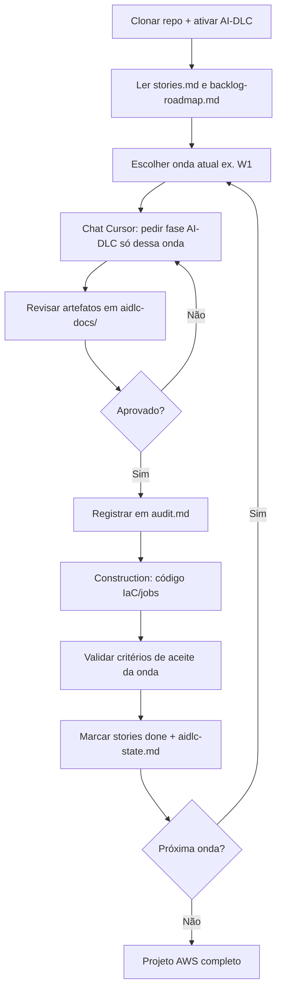

# datamesh-retail-inventory-insights-d1-d2-d3

Esteira de dados de **estoque em varejo** com três relatórios de insight (**D-1**, **D-2**, **D-3**), partindo do dataset Kaggle `retail_store_inventory.csv`.

O fluxo de referência está no notebook [`Esteira_3Relatorios_D1_D2_D3.ipynb`](Esteira_3Relatorios_D1_D2_D3.ipynb). A evolução para **AWS** é feita em ondas, com **20 user stories** documentadas em [`aidlc-docs/`](aidlc-docs/) e desenvolvimento guiado pelo **[AI-DLC](aidlc-rules/README.md)** no Cursor.

**Repositório:** https://github.com/welligtoncos/datamesh-retail-inventory-insights-d1-d2-d3

---

## O que este projeto entrega

| Camada | Hoje (local) | Meta (AWS) |
|--------|--------------|------------|
| Insumo | `retail_store_inventory.csv` | S3 `insumo/` |
| Origem diária | `tabela_origem/dt=` | S3 `origem/dt=` |
| Enriquecido | `tabela_enriquecida/dt=` | S3 `enriquecido/dt=` |
| Relatório D-1 | Excel implementado | S3 `relatorios/D1/` |
| Relatório D-2 | Dados prontos, Excel planejado | S3 `relatorios/D2/` |
| Relatório D-3 | Dados prontos, Excel planejado | S3 `relatorios/D3/` |
| Orquestração | Células Python no Jupyter | Step Functions + EventBridge |

### Resultados de negócio que queremos

| Relatório | Insight | Pergunta respondida | Status |
|-----------|---------|---------------------|--------|
| **D-1** | Produtos vendidos | O que mais saiu? Onde está a receita? | Implementado no notebook · meta AWS na onda W5 |
| **D-2** | Reposição | O que está em ruptura? Quanto se perdeu de venda? | Planejado · onda W6 |
| **D-3** | Tendência | O consumo sobe ou cai? Efeito de fim de semana? | Planejado · onda W6 |

Cada execução usa **defasagem D-1**: a esteira roda em `DATA_EXECUCAO` e processa o dado do **dia anterior** (`DIA_DADO`).

---

## Fluxo da esteira



Funções centrais do notebook (espelho obrigatório na AWS):

- `carregar_origem_dia(dt)` — extrai um dia do insumo → parquet em `origem/`
- `enriquecer_dia(dt)` — adiciona `_revenue`, `_stockout`, `_lost`, `_is_weekend`
- `processar_dia(dt)` — origem + enriquecido (idempotente por partição)

Diagramas: [`diagrams/`](diagrams/) · Documentação técnica: [`PROJETO_DATAMESH.txt`](PROJETO_DATAMESH.txt)

---

## User stories · escopo completo

**20 stories** em **7 épicos**, entregues em **6 ondas (W1–W6)**. Detalhes e critérios de aceite: [`aidlc-docs/inception/user-stories/stories.md`](aidlc-docs/inception/user-stories/stories.md)

### Roadmap por onda

| Onda | Épico | Stories | Resultado esperado ao concluir |
|------|-------|---------|------------------------------|
| **W1** | E1 Fundação | E1-US01 … US04 | S3 com prefixos, CSV no `insumo/`, IAM mínimo, mapa local→S3 |
| **W2** | E2 Origem | E2-US01 … US03 | `carregar_origem_dia` na AWS; parquet `origem/dt=` = notebook |
| **W3** | E3 Enriquecimento | E3-US01 … US03 | `enriquecer_dia` na AWS; colunas `_*` com paridade local |
| **W4** | E4 Orquestração | E4-US01 … US03 | `processar_dia` via Step Functions; cron diário EventBridge |
| **W5** | E5 Relatório D-1 | E5-US01 … US03 | Excel D-1 no S3, mesmo ranking/totais do notebook |
| **W6** | E6 + E7 Ops | E6-US01 … E7-US02 | Excel D-2/D-3, Athena, alarme se a esteira falhar |

### Resumo das stories por épico

#### E1 · Fundação (W1)
| ID | O que queremos |
|----|----------------|
| E1-US01 | Buckets/prefixos S3: `insumo/`, `origem/dt=`, `enriquecido/dt=`, `relatorios/` |
| E1-US02 | `retail_store_inventory.csv` carregado e validado (15 colunas) |
| E1-US03 | Roles IAM (Glue, Lambda, Step Functions) com least privilege |
| E1-US04 | Documentação de paths para o analista |

#### E2 · Origem diária (W2)
| ID | O que queremos |
|----|----------------|
| E2-US01 | Job que replica `carregar_origem_dia(dt)` → `origem/dt=/data.parquet` |
| E2-US02 | Reprocessar um `dt` sem afetar outras partições |
| E2-US03 | Paridade com `tabela_origem/` local (ex.: `dt=2022-01-01`) |

#### E3 · Enriquecimento (W3)
| ID | O que queremos |
|----|----------------|
| E3-US01 | Job que replica `enriquecer_dia(dt)` com `_revenue`, `_stockout`, `_lost`, `_is_weekend` |
| E3-US02 | Indicadores de ruptura coerentes com sanidade do notebook §1 |
| E3-US03 | Paridade com `tabela_enriquecida/` local |

#### E4 · Orquestração (W4)
| ID | O que queremos |
|----|----------------|
| E4-US01 | Step Functions: origem → enriquecido para um `dt` |
| E4-US02 | EventBridge cron diário (`DATA_EXECUCAO` hoje, dado D-1 ontem) |
| E4-US03 | Logs CloudWatch por execução (`dt`, status) |

#### E5 · Relatório D-1 (W5)
| ID | O que queremos |
|----|----------------|
| E5-US01 | Excel `relatorio_D1_exec*_dado*.xlsx` no S3 (insight + fórmulas) |
| E5-US02 | Analista acessa relatório sem Jupyter |
| E5-US03 | Top 3 produtos e totais iguais ao Excel gerado localmente |

#### E6 · D-2 e D-3 (W6)
| ID | O que queremos |
|----|----------------|
| E6-US01 | Excel D-2: rupturas por loja × produto, ordenado por `_lost` |
| E6-US02 | Excel D-3: tendência de consumo em janela histórica |

#### E7 · Operação (W6)
| ID | O que queremos |
|----|----------------|
| E7-US01 | Athena/Glue Catalog sobre `enriquecido/dt=` |
| E7-US02 | Alarme CloudWatch se a execução diária falhar |

**Personas:** analista de estoque, engenheiro de dados, gestor de compras, plataforma AWS — ver [`personas.md`](aidlc-docs/inception/user-stories/personas.md)

**Caminho e dependências:** [`backlog-roadmap.md`](aidlc-docs/inception/user-stories/backlog-roadmap.md)

---

## Como o desenvolvedor usa o AI-DLC

O projeto está configurado para o Cursor injetar o workflow AI-DLC em todo chat (regra em [`.cursor/rules/ai-dlc-workflow.mdc`](.cursor/rules/ai-dlc-workflow.mdc)). Setup: [`aidlc-rules/README.md`](aidlc-rules/README.md).

### Princípio

> **Não peça “cria tudo na AWS”.** Trabalhe **uma onda por vez**, aprove cada fase no `aidlc-docs/audit.md`, e mantenha paridade com o notebook.

### Fluxo do desenvolvedor



### Passo a passo

1. **Clone e ambiente local**
   ```bash
   git clone https://github.com/welligtoncos/datamesh-retail-inventory-insights-d1-d2-d3.git
   cd datamesh-retail-inventory-insights-d1-d2-d3
   python -m venv .venv
   source .venv/Scripts/activate   # Windows Git Bash
   pip install -r requirements.txt
   ```
   Rode o notebook local para entender o comportamento de referência.

2. **Ative o AI-DLC** (se `.aidlc-rule-details/` estiver vazio)
   - Siga [`aidlc-rules/README.md`](aidlc-rules/README.md) (PowerShell ou bash).

3. **Consulte o backlog**
   - Status geral: [`aidlc-docs/aidlc-state.md`](aidlc-docs/aidlc-state.md)
   - Stories: [`aidlc-docs/inception/user-stories/stories.md`](aidlc-docs/inception/user-stories/stories.md)
   - Ordem de entrega: [`aidlc-docs/inception/user-stories/backlog-roadmap.md`](aidlc-docs/inception/user-stories/backlog-roadmap.md)

4. **Abra um chat no Cursor** com pedido explícito, por exemplo:
   ```text
   Siga o AI-DLC. Escopo desta rodada: Onda W1 apenas (E1-US01 a E1-US04).
   Brownfield: Esteira_3Relatorios_D1_D2_D3.ipynb.
   Não implementar Glue/Lambda ainda.
   Região: us-east-1 · IaC: [CDK/Terraform]
   ```

5. **Revise o Inception (REVIEW REQUIRED)**

   Antes de **Approve & Continue** para Construction, revise os artefatos gerados:

   - [`aidlc-docs/inception/requirements/requirements.md`](aidlc-docs/inception/requirements/requirements.md)
   - [`aidlc-docs/inception/user-stories/stories.md`](aidlc-docs/inception/user-stories/stories.md) (épico da onda)
   - [`aidlc-docs/inception/plans/execution-plan.md`](aidlc-docs/inception/plans/execution-plan.md)
   - [`aidlc-docs/inception/reverse-engineering/`](aidlc-docs/inception/reverse-engineering/)
   - [`aidlc-docs/inception/application-design/`](aidlc-docs/inception/application-design/)

   **Guia passo a passo:** [`aidlc-docs/README.md#revisar-inception-antes-de-construction`](aidlc-docs/README.md#revisar-inception-antes-de-construction)

   - **Approve & Continue** — se escopo, região, bucket e ausência de Glue/Lambda/SFN (W1) estiverem corretos
   - **Request Changes** — cite arquivo e o que mudar; não inicie Construction

6. **Registre aprovação e Construction**
   - Registre em [`aidlc-docs/audit.md`](aidlc-docs/audit.md)
   - Atualize status das stories em `stories.md` (`in_progress` → `done` após validar)

7. **Valide o resultado da onda**
   - Use os checkboxes de **Definition of Done** em [`backlog-roadmap.md`](aidlc-docs/inception/user-stories/backlog-roadmap.md)
   - Stories de paridade (E2-US03, E3-US03, E5-US03) comparam AWS vs. artefatos locais

### Regras para o desenvolvedor

| Faça | Não faça |
|------|----------|
| Uma onda (W1…W6) por PR/entrega | Misturar infra S3 com Step Functions no mesmo escopo |
| Manter lógica igual ao notebook | Mudar regra de `_stockout` só na AWS |
| Atualizar `stories.md` e `aidlc-state.md` | Deixar decisões só no histórico do chat |
| Pedir aprovação antes de Construction | Pular User Stories / Workflow Planning |

### Próxima onda recomendada

**W1 (E1)** — fundação S3 + insumo + IAM. Nada de Glue até W1 estar `done`.

---

## Execução local (notebook)

```bash
# Na raiz do projeto, com venv ativo
jupyter notebook Esteira_3Relatorios_D1_D2_D3.ipynb
```

Ordem das células: **§0 Setup** → **§1 Insumo** → **carga incremental** → **relatório D-1**.

Artefatos gerados localmente:

```
retail_store_inventory.csv          # insumo
tabela_origem/dt=YYYY-MM-DD/        # origem
tabela_enriquecida/dt=YYYY-MM-DD/   # enriquecido
relatorio_D1_exec*_dado*.xlsx       # saída D-1
```

---

## Estrutura do repositório

```
├── Esteira_3Relatorios_D1_D2_D3.ipynb   # fonte brownfield
├── retail_store_inventory.csv
├── requirements.txt
├── PROJETO_DATAMESH.txt                 # documentação técnica
├── README.md                            # este arquivo
├── aidlc-docs/                          # backlog + estado AI-DLC
│   ├── aidlc-state.md
│   ├── audit.md
│   └── inception/user-stories/
│       ├── stories.md                   # 20 user stories
│       ├── backlog-roadmap.md           # ondas W1–W6
│       └── personas.md
├── aidlc-rules/                         # fonte AI-DLC + README de setup
├── .cursor/rules/ai-dlc-workflow.mdc    # regra ativa no Cursor
├── diagrams/                            # Mermaid do fluxo
├── tabela_origem/                       # partições locais (demo)
└── tabela_enriquecida/
```

---

## Documentação relacionada

| Documento | Conteúdo |
|-----------|----------|
| [`PROJETO_DATAMESH.txt`](PROJETO_DATAMESH.txt) | Escopo, schema, funções, tecnologias |
| [`aidlc-docs/README.md`](aidlc-docs/README.md) | Gestão do backlog |
| [`aidlc-rules/README.md`](aidlc-rules/README.md) | Configurar AI-DLC no Cursor |
| [`diagrams/README.md`](diagrams/README.md) | Diagramas Mermaid |

---

## Licença e dados

Dataset de referência: [Retail Store Inventory Forecasting](https://www.kaggle.com/) (Kaggle). Uso conforme termos da fonte.

---

**Status do projeto:** notebook local com D-1 implementado · migração AWS em backlog (W1 pendente) · stories aprovadas para revisão em `aidlc-docs/audit.md`
