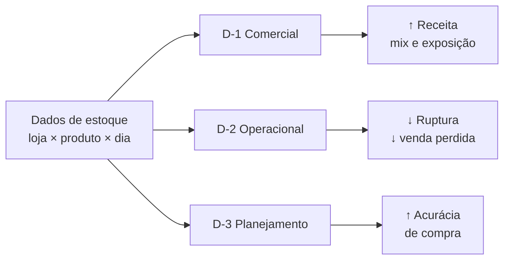
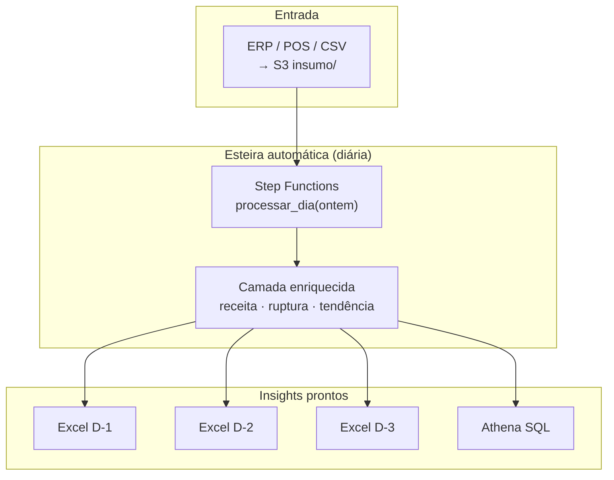

# Retail Inventory Insights · Datamesh de estoque varejo

**Transforme dados de estoque em decisões diárias** — sem planilhas manuais, sem adivinhação na reposição e com visão clara do que vende, do que falta e para onde o consumo está indo.

Esteira de dados na **AWS** que processa automaticamente o dia anterior e entrega **três relatórios de insight** prontos para compras, operações de loja e equipe comercial.

**Repositório:** https://github.com/welligtoncos/datamesh-retail-inventory-insights-d1-d2-d3

---

## O problema que resolve

| Dor do varejo | Impacto no negócio | Como este datamesh responde |
|---------------|-------------------|----------------------------|
| Não saber o que vendeu ontem | Perda de oportunidade comercial | **D-1** — ranking de produtos e receita |
| Ruptura descoberta tarde demais | Venda perdida (`_lost`) e cliente insatisfeito | **D-2** — lista priorizada por impacto financeiro |
| Pedido no “feeling” | Estoque parado ou falta crônica | **D-3** — tendência de consumo e efeito fim de semana |
| Dados espalhados em CSVs | Horas de trabalho manual, baixa confiança | Pipeline automatizado, particionado e auditável na AWS |

> **Defasagem D-1:** toda manhã a esteira processa o **fechamento de ontem** — o dado que importa para decidir hoje.

---

## Agregação de valor · três insights, três decisões



### D-1 · Produtos vendidos — *“O que saiu? Onde está o dinheiro?”*

| Entrega | Valor para a empresa |
|---------|---------------------|
| Ranking por unidades e receita | Foco no mix que realmente vende |
| Insight automático no Excel | Concentração top 3 → evita dependência de poucos SKUs |
| Atualização diária | Reunião comercial com dado de ontem, não de semana passada |

**Decisão típica:** aumentar exposição de gôndola, ajustar promoção, negociar com fornecedor dos líderes.

---

### D-2 · Reposição — *“O que está em ruptura? Quanto estou perdendo?”*

| Entrega | Valor para a empresa |
|---------|---------------------|
| Filtro inteligente (`ruptura` + `venda perdida`) | Só o que exige ação — sem ruído |
| Ordenação por `_lost` | Prioriza o que **mais custa** não repor |
| Visão loja × produto | Pedido expresso ou transferência entre filiais |

**Decisão típica:** reposição urgente na loja S003, produto P0007 — antes que a venda perdida acumule.

---

### D-3 · Tendência — *“O consumo sobe ou cai? Fim de semana vende mais?”*

| Entrega | Valor para a empresa |
|---------|---------------------|
| Média dias úteis vs fim de semana | Entrega certa na hora certa |
| Classificação Subindo / Caindo / Estável | Ajuste de estoque mínimo com antecedência |
| Janela configurável (3, 7, 14 dias) | Planejamento de compra baseado em padrão, não em achismo |

**Decisão típica:** reforçar estoque de quinta a sábado nos SKUs em alta com pico no FDS.

---

## Para quem é

| Persona | O que ganha | Canal principal |
|---------|-------------|-----------------|
| **Gestor de compras / loja** | Lista de reposição e tendências acionáveis | Excel D-2 e D-3 no S3 |
| **Analista de estoque** | Relatórios confiáveis + validação SQL | Excel + Amazon Athena |
| **Diretoria comercial** | Ranking de vendas e concentração de receita | Excel D-1 |
| **TI / dados** | Pipeline idempotente, monitorado, escalável | Step Functions, Glue, CloudWatch |

**Guia completo de uso na empresa:** [`docs/como-usar-datamesh-empresa.md`](docs/como-usar-datamesh-empresa.md)

---

## Resultados que a empresa pode medir

| KPI | Antes | Com o datamesh |
|-----|-------|----------------|
| Tempo até insight diário | Horas (Excel manual) | Minutos (automático após a esteira) |
| Visibilidade de ruptura | Reativa | Proativa, priorizada por `_lost` |
| Confiança no dado | Planilhas isoladas | Camada enriquecida única + paridade validada |
| Rastreabilidade | “De onde veio esse número?” | Partição `dt=`, execução nomeada, logs CloudWatch |
| Consultas ad hoc | Depende de TI | Athena sobre `enriquecido` (analistas autônomos) |

---

## Como funciona · da fonte ao insight



**Fluxo em linguagem de negócio:**

1. Os dados de estoque entram no data lake (`insumo/`).
2. Toda noite/madrugada a esteira processa **o dia anterior**.
3. Métricas de negócio são calculadas (receita, ruptura, venda perdida, fim de semana).
4. Pela manhã, gestores recebem Excel; analistas consultam Athena.

Diagramas detalhados: [`diagrams/08-datamesh-empresa.mmd`](diagrams/08-datamesh-empresa.mmd)

---

## O que está entregue na AWS

| Capacidade | Status | Benefício |
|------------|--------|-----------|
| Data lake particionado (S3) | ✅ | Escala por dia, reprocessamento seguro |
| Jobs Glue origem + enriquecido | ✅ | Mesma lógica do notebook, na nuvem |
| Orquestração Step Functions | ✅ | Um `dt` processado de ponta a ponta |
| Relatório D-1 Excel | ✅ | Ranking comercial diário |
| Relatório D-2 Excel | ✅ | Rupturas priorizadas |
| Relatório D-3 Excel | ✅ | Tendência em janela histórica |
| Amazon Athena | ✅ | Consultas SQL para analistas |
| Alarme CloudWatch | ✅ | Falha na esteira visível em minutos |

**Ambiente de referência:** `us-east-1` · bucket `retail-inventory-insights-dev-use1`

---

## Rotina sugerida na empresa

| Quando | Quem | Ação |
|--------|------|------|
| Manhã | Gestor compras | Abre **D-2** → define reposições do dia |
| Manhã | Comercial | Abre **D-1** → revisa top vendas e receita |
| Semanal | Planejamento | Abre **D-3** → ajusta mínimos e pedidos |
| Diário | TI | Confirma esteira OK (ou trata alarme) |

---

## Comece por aqui

| Objetivo | Documento |
|----------|-----------|
| Entender valor e adoção na empresa | [`docs/como-usar-datamesh-empresa.md`](docs/como-usar-datamesh-empresa.md) |
| Validar dados com SQL | [`scripts/athena-validation-queries.md`](scripts/athena-validation-queries.md) |
| Visão técnica completa | [`PROJETO_DATAMESH.txt`](PROJETO_DATAMESH.txt) |
| Personas e user stories | [`aidlc-docs/inception/user-stories/personas.md`](aidlc-docs/inception/user-stories/personas.md) |

**Validar a esteira na AWS:**

```powershell
.\scripts\w6-run-and-validate.ps1
```

---

## Para equipes técnicas

<details>
<summary>Desenvolvimento, IaC e AI-DLC</summary>

### Testar a esteira (dev)

**Guia completo:** [`docs/dev-testar-esteira.md`](docs/dev-testar-esteira.md)

```powershell
# Simular 7 dias: SFN + D-1/D-2/D-3 + download Excel
.\scripts\simular-esteira-dev.ps1 -DiaInicio "2022-01-01" -DiaFim "2022-01-07" -JanelaD3 7

# Ver dias processados vs faltantes
.\scripts\list-partitions.ps1 -DiaInicio "2022-01-01" -DiaFim "2022-01-31"
```

### Referência brownfield

- Notebook: [`Esteira_3Relatorios_D1_D2_D3.ipynb`](Esteira_3Relatorios_D1_D2_D3.ipynb)
- Funções espelhadas na AWS: `carregar_origem_dia`, `enriquecer_dia`, `processar_dia`

### Infraestrutura

- **IaC:** Terraform em [`terraform/`](terraform/)
- **Lambdas:** D-1, D-2, D-3 em [`lambda/reports/`](lambda/reports/)
- **Scripts de validação:** [`scripts/`](scripts/) (`w4`, `w5`, `w6-run-and-validate.ps1`)

### AI-DLC e backlog

- Estado do projeto: [`aidlc-docs/aidlc-state.md`](aidlc-docs/aidlc-state.md)
- 20 user stories (W1–W6 concluídas): [`aidlc-docs/inception/user-stories/stories.md`](aidlc-docs/inception/user-stories/stories.md)
- Workflow Cursor: [`aidlc-rules/README.md`](aidlc-rules/README.md)

### Execução local

```bash
python -m venv .venv
source .venv/Scripts/activate   # Windows Git Bash
pip install -r requirements.txt
jupyter notebook Esteira_3Relatorios_D1_D2_D3.ipynb
```

</details>

---

## Documentação

| Documento | Público | Conteúdo |
|-----------|---------|----------|
| [`docs/dev-testar-esteira.md`](docs/dev-testar-esteira.md) | Dev | Simular esteira, scripts, checklist |
| [`docs/como-usar-datamesh-empresa.md`](docs/como-usar-datamesh-empresa.md) | Negócio | Insights, personas, rotina, KPIs |
| [`scripts/athena-validation-queries.md`](scripts/athena-validation-queries.md) | Analistas | Queries de validação |
| [`PROJETO_DATAMESH.txt`](PROJETO_DATAMESH.txt) | Técnico | Schema, funções, artefatos |
| [`diagrams/README.md`](diagrams/README.md) | Todos | Diagramas Mermaid |
| [`aidlc-docs/README.md`](aidlc-docs/README.md) | Eng. dados | Backlog e estado AI-DLC |

---

## Dados de referência

Dataset demo: [Retail Store Inventory Forecasting](https://www.kaggle.com/) (Kaggle). Em produção, substitua o CSV por integração com ERP, WMS ou POS — a esteira permanece a mesma.

---

**Status:** esteira completa na AWS (W1–W6) · D-1, D-2 e D-3 operacionais · Athena e alarmes configurados
