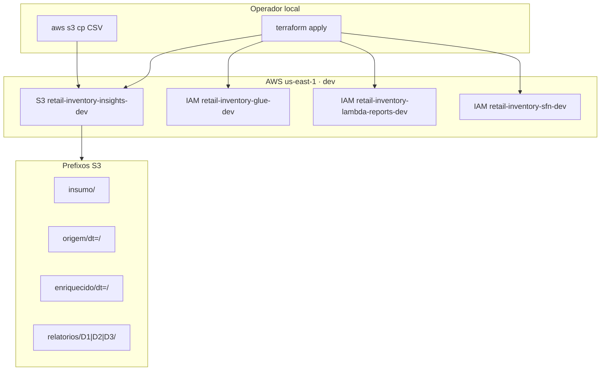

# Deployment Architecture · U1 Dev



## Deploy Sequence

1. Configure AWS credentials (profile ou env) com permissão IAM+S3
2. `cd terraform/environments/dev`
3. `terraform init`
4. `terraform plan -var-file=dev.tfvars`
5. `terraform apply -var-file=dev.tfvars`
6. Upload CSV: `aws s3 cp ../../../retail_store_inventory.csv s3://retail-inventory-insights-dev/insumo/ --region us-east-1`
7. Validar: `aws s3 ls s3://retail-inventory-insights-dev/ --recursive`

## Rollback

```bash
terraform destroy -var-file=dev.tfvars
```

**Atenção:** destroy remove bucket se vazio ou force; dados em S3 serão perdidos.

## Future attachment (W2+)

| Onda | Recurso | Role |
|------|---------|------|
| W2 | Glue Job origem | glue-dev |
| W3 | Glue Job enriquecido | glue-dev |
| W4 | Step Functions | sfn-dev |
| W5 | Lambda D-1 | lambda-reports-dev |
