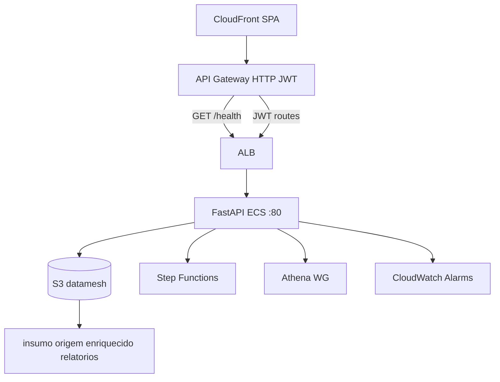

# Application Design · U8 Portal API (E8-US12)

**Unidade:** U8-Portal-API  
**Story:** E8-US12 · FastAPI BFF e deploy E2E dev  
**Persona:** P2 Engenheiro de dados  
**Data:** 2026-07-01  
**Depende:** E8-US01 (infra portal) · E8-US02…E8-US11 (contratos Angular)

---

## Escopo desta story

Implementar o **Backend for Frontend (BFF)** FastAPI que substitui o placeholder nginx no ECS, expondo **RF-API-01, 02, 04–15** com contratos JSON idênticos aos models Angular. Deploy da imagem em dev e validação E2E: login Cognito → D-1 `dt=2022-01-01` → download Excel.

**Fora de escopo:** RF-API-03 upload, RBAC Cognito groups, SQL Athena livre, CI/CD GitHub Actions, multi-ambiente prod.

---

## Decisões de arquitetura (adotadas)

| ID | Decisão | Escolha |
|----|---------|---------|
| D1 | Estrutura | **Routers por domínio** + `services/` + `repositories/` (boto3/S3/SFN/Athena/CW) |
| D2 | Insights | **Portar regras** das Lambdas W5/W6 + utils Angular; leitura Parquet com **pyarrow** |
| D3 | KPIs enriquecido | **Scan Parquet** S3 `enriquecido/dt=` (sem Athena para latência dev) |
| D4 | Athena templates | **Whitelist** `template_id` → SQL parametrizado (arquivos em `app/athena/sql/`) |
| D5 | Porta container | **80** — uvicorn `0.0.0.0:80` (compatível ALB/target group atual) |
| D6 | Imagem | **ECR** `retail-inventory-insights-portal-api-dev` (novo repo no account) |
| D7 | Config | **Env vars** Fargate (bucket, region, ARNs, alarm name) |
| D8 | Erros | JSON `{"detail": "...", "code": "..."}` PT-BR + HTTPException FastAPI |
| D9 | Testes | **pytest** + **hypothesis** em módulos puros de agregação |
| D10 | OpenAPI | FastAPI auto `/docs`, `/redoc`; snapshot opcional em Part 2 |

### JWT (D11 — adicional)

| Camada | Comportamento |
|--------|---------------|
| **API Gateway** | Valida JWT Cognito em `$default` (exceto `GET /health`) |
| **BFF** | **Confia no proxy** — não re-valida assinatura JWT em dev |
| **Auditoria pipeline** | Extrai `sub` / `email` de `Authorization` Bearer (decode payload sem verificar) ou header `x-amzn-oidc-data` se presente; se ausente, `sub: "unknown"` |

> Part 2 pode adicionar validação opcional via `COGNITO_ISSUER` + JWKS se exigido em prod.

---

## Camadas e módulos

```text
portal-api/
├── app/
│   ├── main.py                 # FastAPI app, CORS, exception handlers, routers
│   ├── config.py               # Settings (pydantic-settings)
│   ├── dependencies.py         # get_settings, get_s3_client, request_id
│   ├── logging.py              # structlog/json → stdout (ECS awslogs)
│   ├── routers/
│   │   ├── health.py           # RF-API-01
│   │   ├── insumos.py          # RF-API-02
│   │   ├── origem.py           # RF-API-04, 05
│   │   ├── enriquecido.py      # RF-API-06, 07, 07b
│   │   ├── insights_d1.py      # RF-API-08, 11 d1
│   │   ├── insights_d2.py      # RF-API-09, 11 d2
│   │   ├── insights_d3.py      # RF-API-10, 11 d3
│   │   ├── pipeline.py         # RF-API-12, 13, 13b
│   │   ├── athena.py           # RF-API-14
│   │   └── ops.py              # RF-API-15
│   ├── schemas/                # Pydantic models (espelho TypeScript)
│   ├── services/               # Regras de negócio por domínio
│   ├── repositories/
│   │   ├── s3_partitions.py
│   │   ├── s3_parquet.py
│   │   ├── s3_presign.py
│   │   ├── sfn.py
│   │   ├── athena.py
│   │   └── cloudwatch.py
│   ├── domain/                 # Agregações puras (D-1/D-2/D-3, KPIs)
│   │   ├── d1_aggregate.py
│   │   ├── d2_filter.py
│   │   ├── d3_trend.py
│   │   ├── enriquecido_kpis.py
│   │   └── dates.py
│   └── athena/
│       ├── catalog.py          # 9 template_ids whitelist
│       └── sql/                # *.sql por template
├── tests/
│   ├── unit/
│   └── integration/            # moto opcional
├── Dockerfile
├── requirements.txt
├── requirements-dev.txt
└── README.md
```

---

## Routers e serviços

| ID | Router | Service | Repository | RF |
|----|--------|---------|------------|-----|
| R01 | `health` | — | — | RF-API-01 |
| R02 | `insumos` | `InsumosService` | `S3ListRepository` | RF-API-02 |
| R03 | `origem` | `OrigemService` | `S3Partitions`, `S3Parquet` | RF-API-04, 05 |
| R04 | `enriquecido` | `EnriquecidoService` | `S3Partitions`, `S3Parquet` | RF-API-06, 07 |
| R05 | `insights_d1` | `InsightsD1Service` | `S3Parquet`, `S3Presign` | RF-API-08, 11 |
| R06 | `insights_d2` | `InsightsD2Service` | `S3Parquet`, `S3Presign` | RF-API-09, 11 |
| R07 | `insights_d3` | `InsightsD3Service` | `S3Parquet`, `S3Presign` | RF-API-10, 11 |
| R08 | `pipeline` | `PipelineService` | `SfnRepository` | RF-API-12, 13 |
| R09 | `athena` | `AthenaTemplateService` | `AthenaRepository` | RF-API-14 |
| R10 | `ops` | `OpsAlarmsService` | `CloudWatchRepository` | RF-API-15 |

---

## Contratos API (espelho Angular)

Fonte de verdade dos DTOs: `portal-web/src/app/core/api/models/*.ts`.

### Endpoints públicos

| Método | Path | Response |
|--------|------|----------|
| GET | `/health` | `text/plain` body `ok` (status 200) |

### Endpoints JWT (via API GW)

| Método | Path | Schema response |
|--------|------|-----------------|
| GET | `/insumos` | `InsumosListResponse` |
| GET | `/origem/partitions` | `OrigemPartitionsResponse` |
| GET | `/origem/{dt}/preview` | `OrigemPreviewResponse` |
| GET | `/enriquecido/partitions` | `PartitionListResponse` |
| GET | `/enriquecido/{dt}/kpis` | `EnriquecidoKpis` |
| GET | `/enriquecido/{dt}/preview` | `EnriquecidoPreviewResponse` |
| GET | `/insights/d1` | `InsightsD1Response` |
| GET | `/insights/d2` | `InsightsD2Response` |
| GET | `/insights/d3` | `InsightsD3Response` |
| GET | `/insights/d1/download` | `InsightsD1DownloadResponse` |
| GET | `/insights/d2/download` | `InsightsD2DownloadResponse` |
| GET | `/insights/d3/download` | `InsightsD3DownloadResponse` |
| POST | `/pipeline/processar-dia` | `ProcessarDiaResponse` |
| GET | `/pipeline/executions` | `PipelineExecutionsListResponse` |
| GET | `/pipeline/executions/{execution_id}` | `PipelineExecutionSummary` |
| POST | `/athena/query-template` | `AthenaQueryTemplateResponse` |
| GET | `/ops/alarms` | `OpsAlarmsResponse` |

---

## Fluxo de dados (visão geral)



---

## Athena RF-API-14 (resumo)

1. Validar `template_id` no catálogo (9 IDs — paridade E8-US11).
2. Validar params (`dt`, `dts`, `limit`).
3. `StartQueryExecution` com SQL bind seguro + `QueryExecutionContext` Glue DB.
4. Poll `GetQueryExecution` até SUCCEEDED/FAILED (max **60s**).
5. `GetQueryResults` com cap **100** linhas + `truncated: true` se exceder.
6. Response `AthenaQueryTemplateResponse` sem expor SQL ao cliente.

---

## Pipeline RF-API-12/13 (resumo)

- **ARN state machine:** env `SFN_STATE_MACHINE_ARN` = `arn:aws:states:us-east-1:303238378103:stateMachine:retail-inventory-insights-processar-dia-dev`
- **Execution ARN:** `{sm_arn.replace(':stateMachine:', ':execution:')}:{execution_name}` (paridade `buildSfnExecutionArn`)
- **Input SFN:** `{"dt": "YYYY-MM-DD"}` (alinhar com esteira W4)
- **Audit:** `ProcessarDiaResponse.audit` com claims JWT

---

## Variáveis de ambiente (Settings)

| Variável | Exemplo | Uso |
|----------|---------|-----|
| `AWS_REGION` | `us-east-1` | boto3 default |
| `DATAMESH_BUCKET` | `retail-inventory-insights-dev-use1` | S3 |
| `SFN_STATE_MACHINE_ARN` | `arn:aws:states:...` | pipeline |
| `ATHENA_DATABASE` | `retail_inventory_insights_dev` | Glue |
| `ATHENA_WORKGROUP` | `retail-inventory-insights-dev` | Athena |
| `ATHENA_RESULTS_PREFIX` | `athena-results/` | output location |
| `SFN_ALARM_NAME` | `retail-inventory-insights-processar-dia-failed-dev` | ops |
| `PRESIGNED_TTL_SECONDS` | `900` | download Excel |
| `LOG_LEVEL` | `INFO` | logging |
| `CORS_ORIGINS` | CloudFront URL | middleware opcional |

---

## Rastreabilidade

| Requisito | Artefato |
|-----------|----------|
| RF-API-01..15 (exc. 03) | Routers + schemas |
| NFR-W7-01 | JWT no GW; IAM task role existente |
| NFR-W7-02 | Presigned TTL 900s |
| NFR-W7-03 | page_size max 500; Athena 60s/100 rows |
| NFR-W7-04 | `/health` ALB; retry boto3 |
| NFR-W7-06 | OpenAPI + PBT domain |
| Persona P2 | Deploy doc + E2E |

---

## Referências brownfield

| Artefato | Caminho |
|----------|---------|
| Lambdas D-1/D-2/D-3 | `lambda/reports/gerar_relatorio_*.py` |
| Utils frontend | `portal-web/src/app/core/api/d1-aggregate.util.ts`, `d2-filter.util.ts`, `d3-trend.util.ts` |
| Athena SQL | `scripts/athena-validation-queries.sql` |
| IAM task role | `terraform/modules/portal/iam.tf` |
| ECS placeholder | `terraform/modules/portal/ecs.tf` |
