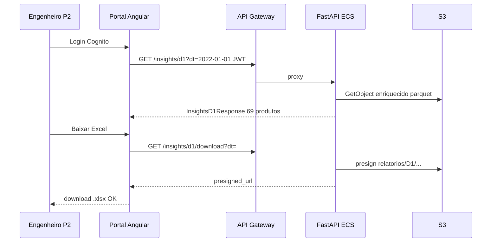

# Functional Design · U8 Portal API (E8-US12)

**Story:** E8-US12  
**Persona:** P2 Engenheiro de dados  
**Data:** 2026-07-01

---

## Regras de negócio globais

### BR-BFF-01 · Formato de data
- `dt` deve ser ISO `YYYY-MM-DD` (regex + `datetime.strptime`).
- Resposta **400** com `code: "INVALID_DT"` se inválido.

### BR-BFF-02 · Partições S3
- Listar prefixos `origem/dt=` e `enriquecido/dt=` via `ListObjectsV2` (delimiter `/`).
- Extrair `dt` do segmento `dt=YYYY-MM-DD/`.
- `latest` = partição mais recente (ordem lexicográfica desc para ISO dates).

### BR-BFF-03 · Preview paginado
- Query params: `page` (default 1), `page_size` (default 50, max **500**).
- Origem: colunas schema 15 colunas notebook §1.
- Enriquecido: colunas origem + derivadas `_revenue`, `_stockout`, `_lost`, `_is_weekend`, `dt`.

### BR-BFF-04 · KPIs enriquecido
Para `enriquecido/dt={dt}/data.parquet`:
- `row_count` = número de linhas
- `revenue_total` = sum(`_revenue`)
- `stockout_count` = count onde `_stockout == 1`
- `stockout_pct` = round(100 * stockout_count / row_count, 1)
- `products_stockout` = distinct `Product ID` com stockout
- `stores_count` = distinct `Store ID`
- `lost_total` = sum(`_lost`)
- `is_weekend` = mode de `_is_weekend` (ou primeira linha)

### BR-BFF-05 · Insights D-1 (paridade Lambda + `d1-aggregate.util.ts`)
- `data_execucao` = `dt + 1 dia`.
- Agregar por `(Product ID, Category)`: sum `Units Sold`, sum `_revenue`.
- Ordenar por `unidades` desc, desempate `receita` desc.
- `top3_concentration_pct` = top3 unidades / total * 100.
- `insight_text` PT-BR (mesma frase do frontend).
- `partition_exists` = objeto Parquet existe no prefixo.
- Referência `dt=2022-01-01`: **69** produtos, **14484** unidades, receita **879026.03**.

### BR-BFF-06 · Insights D-2
- Filtrar `_stockout == 1` **e** `_lost > 0`.
- Ordenar por `lost` desc.
- `rupturas_count`, `total_lost`, `top_impact` (primeira linha).
- `insight_text` PT-BR alinhado `insights-d2-mock.data.ts`.

### BR-BFF-07 · Insights D-3
- Query `window` (default 7): últimas N partições ≤ `dt` inclusive.
- Por `(Store ID, Product ID)`: médias weekday vs weekend (`_is_weekend`).
- `trend_pct`, `trend_label` ∈ {Subindo, Caindo, Estável}.
- Contadores `subindo_count`, `caindo_count`, `estavel_count`.

### BR-BFF-08 · Download Excel
- Resolver `s3_key`:
  - D1: `relatorios/D1/relatorio_D1_exec{data_execucao}_dado{dt}.xlsx`
  - D2: `relatorios/D2/relatorio_D2_exec{data_execucao}_dado{dt}.xlsx`
  - D3: `relatorios/D3/relatorio_D3_exec{data_execucao}_dado{dt}.xlsx`
- Se objeto não existe → **404** `code: "REPORT_NOT_FOUND"`.
- Gerar presigned GET TTL **900s**.
- Response: `presigned_url`, `expires_in_seconds`, `s3_key`, `filename`.

### BR-BFF-09 · Pipeline processar dia
- Body `{ "dt": "YYYY-MM-DD" }`.
- `StartExecution` com name único (`processar-{dt}-{uuid4 hex 8}`).
- Retornar `ProcessarDiaResponse` com `execution_arn`, `execution_id`, `status: RUNNING`, `audit`.
- **Não** garantir idempotência (múltiplas execuções permitidas).

### BR-BFF-10 · Pipeline histórico
- `ListExecutions` max `limit` (default 20, cap 50).
- Mapear `execution_id` = último segmento do ARN.
- `duration_seconds` = `stopped_at - started_at` se terminal.

### BR-BFF-11 · Athena query-template
- Whitelist 9 `template_id` (E8-US11).
- Params validados; SQL apenas server-side.
- Poll 60s; max 100 rows; `truncated` flag.
- Estados: `SUCCEEDED` | `FAILED` (+ `state_reason` PT-BR).

### BR-BFF-12 · Ops alarms
- `DescribeAlarms` filtro `AlarmNames=[SFN_ALARM_NAME]`.
- `pipeline_operational` = todos alarmes em `OK`.
- Alarm name default: `retail-inventory-insights-processar-dia-failed-dev`.

### BR-BFF-13 · Health
- `GET /health` → `200` body `ok` (text/plain).
- Sem dependência de S3 (liveness simples).

### BR-BFF-14 · Insumos
- Listar `insumo/` (não recursivo profundo — arquivos diretos).
- `InsumoItem`: `key`, `name` (basename), `size_bytes`, `last_modified` ISO.

---

## Modelo de domínio (Python)

| Módulo | Responsabilidade |
|--------|------------------|
| `domain/dates.py` | `parse_dt`, `add_one_day`, `validate_iso_date` |
| `domain/d1_aggregate.py` | `aggregate_d1(table) -> InsightsD1Response` |
| `domain/d2_filter.py` | `build_d2_rows(table) -> InsightsD2Response` |
| `domain/d3_trend.py` | `build_d3(rows_by_dt, window) -> InsightsD3Response` |
| `domain/enriquecido_kpis.py` | `compute_kpis(table) -> EnriquecidoKpis` |

---

## Fluxo E2E principal (critério de aceite)

---

## Casos de erro

| Situação | HTTP | code |
|----------|------|------|
| dt inválido | 400 | `INVALID_DT` |
| Partição ausente (insights) | 200 | `partition_exists: false` |
| Excel ausente | 404 | `REPORT_NOT_FOUND` |
| template_id desconhecido | 400 | `UNKNOWN_TEMPLATE` |
| Athena timeout | 408 | `ATHENA_TIMEOUT` |
| Athena FAILED | 502 | `ATHENA_FAILED` |
| S3/SFN erro interno | 503 | `AWS_UNAVAILABLE` |

Mensagens `detail` em **português** (RF-M7-03).

---

## Cenários de teste (Part 2)

| ID | Cenário | Esperado |
|----|---------|----------|
| T1 | D-1 dt=2022-01-01 | 69 produtos, 14484 un., receita 879026.03 |
| T2 | partition_sanity Athena | 100 linhas, receita 879026.03 |
| T3 | download D-1 | presigned URL válida, key correta |
| T4 | health público | 200 ok |
| T5 | processar-dia | execution_arn formato válido |
| T6 | page_size 600 | 400 ou cap 500 |

---

## Fora de escopo funcional

- Upload insumo (RF-API-03)
- Geração de Excel no BFF (Lambdas W5/W6 já gravam S3)
- Remoção automática de mock no Angular (opcional Part 2b)
