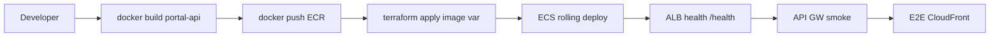

# Infrastructure Design · U8 Portal API (E8-US12)

**Story:** E8-US12  
**Data:** 2026-07-01

---

## Escopo infraestrutura

Substituir **placeholder nginx** no ECS Fargate por imagem **FastAPI**; adicionar **ECR repository**; atualizar task definition. **Sem** novos buckets, SFN, Glue ou Cognito.

| Camada | Alteração E8-US12 |
|--------|-------------------|
| **ECR** | Novo repo `retail-inventory-insights-portal-api-dev` |
| **ECS** | Task definition: image FastAPI, port 80, env vars |
| **ALB** | Sem mudança — target group HTTP:80 |
| **API GW** | Sem mudança — proxy para ALB |
| **CloudFront** | Sem mudança — SPA estática |
| **Cognito** | Sem mudança |
| **IAM** | Reutilizar task role E8-US01 (`terraform/modules/portal/iam.tf`) |
| **S3 portal-web** | Deploy Angular opcional pós-BFF (script existente) |

---

## Terraform (diff mínimo planejado Part 2)

### Novo: `terraform/modules/portal/ecr.tf`

```hcl
resource "aws_ecr_repository" "portal_api" {
  name                 = "${local.name_prefix}-api"
  image_tag_mutability = "MUTABLE"
  force_delete         = true  # dev only
  tags                 = local.default_tags
}
```

### Alterar: `terraform/modules/portal/ecs.tf`

| Campo | Antes | Depois |
|-------|-------|--------|
| `name` | `bff-placeholder` | `portal-api` |
| `image` | `nginx:alpine` | `{ecr_url}:latest` ou var |
| `port` | 80 | 80 |
| `environment` | — | bucket, ARNs, alarm name |

### Nova variável: `portal_api_image`

```hcl
variable "portal_api_image" {
  description = "ECR image URI for FastAPI BFF (E8-US12)"
  type        = string
  default     = ""  # empty keeps placeholder until set
}
```

**Estratégia:** `count` ou `image` condicional — se `portal_api_image` vazio, manter placeholder (brownfield safe plan).

### Output novo

```hcl
output "ecr_portal_api_url" {
  value = aws_ecr_repository.portal_api.repository_url
}
```

---

## Deploy flow (dev)



---

## Scripts planejados (Part 2)

| Script | Função |
|--------|--------|
| `scripts/w7-us12-deploy.ps1` | build, tag, push ECR, terraform apply |
| `scripts/w7-us12-validate.ps1` | pytest, curl health, checklist E2E |
| `docs/portal-deploy-dev.md` | Passo a passo manual |

---

## Ambiente dev (valores conhecidos)

| Recurso | Valor |
|---------|-------|
| CloudFront | `https://d3g8ihrhzv7hsx.cloudfront.net/` |
| API GW | `https://jvpw3k4mnf.execute-api.us-east-1.amazonaws.com` |
| Cognito pool | `us-east-1_yJLzwZgZE` |
| Bucket | `retail-inventory-insights-dev-use1` |
| SFN ARN | `arn:aws:states:us-east-1:303238378103:stateMachine:retail-inventory-insights-processar-dia-dev` |

---

## Health check ALB

| Propriedade | Valor |
|-------------|-------|
| Path | `/health` |
| Matcher | 200 |
| Interval | 30s |
| Healthy threshold | 2 |

FastAPI deve responder `ok` antes do rolling deploy completar.

---

## Validação local (sem ECS)

```powershell
cd portal-api
python -m venv .venv
.\.venv\Scripts\Activate.ps1
pip install -r requirements-dev.txt
$env:DATAMESH_BUCKET="retail-inventory-insights-dev-use1"
$env:SFN_STATE_MACHINE_ARN="arn:aws:states:us-east-1:303238378103:stateMachine:retail-inventory-insights-processar-dia-dev"
uvicorn app.main:app --reload --port 8080
```

Angular `proxy.conf.json` pode apontar para `localhost:8080` temporariamente para dev BFF local.

---

## Dados brownfield

| Artefato | Caminho |
|----------|---------|
| Parquet local | `tabela_enriquecida/dt=2022-01-01/data.parquet` |
| Excel D-1 | `relatorios/D1/relatorio_D1_exec2022-01-02_dado2022-01-01.xlsx` |
| Terraform portal | `terraform/modules/portal/` |
| Validate infra | `scripts/w7-us01-validate.ps1` |

---

## Extension compliance

| Extension | Infra |
|-----------|-------|
| Security | ECR scan on push (opcional); IAM unchanged |
| Resiliency | ALB health; ECS desired_count=1 |
| PBT | N/A em infra |

---

## Riscos e mitigação

| Risco | Mitigação |
|-------|-----------|
| Placeholder → FastAPI downtime | Rolling deploy ECS; health check |
| Imagem grande | python:3.12-slim + multi-stage se necessário |
| Credenciais local | AWS profile / IAM role dev |
| Terraform destroy acidental | `portal_api_image` condicional; plan review |
