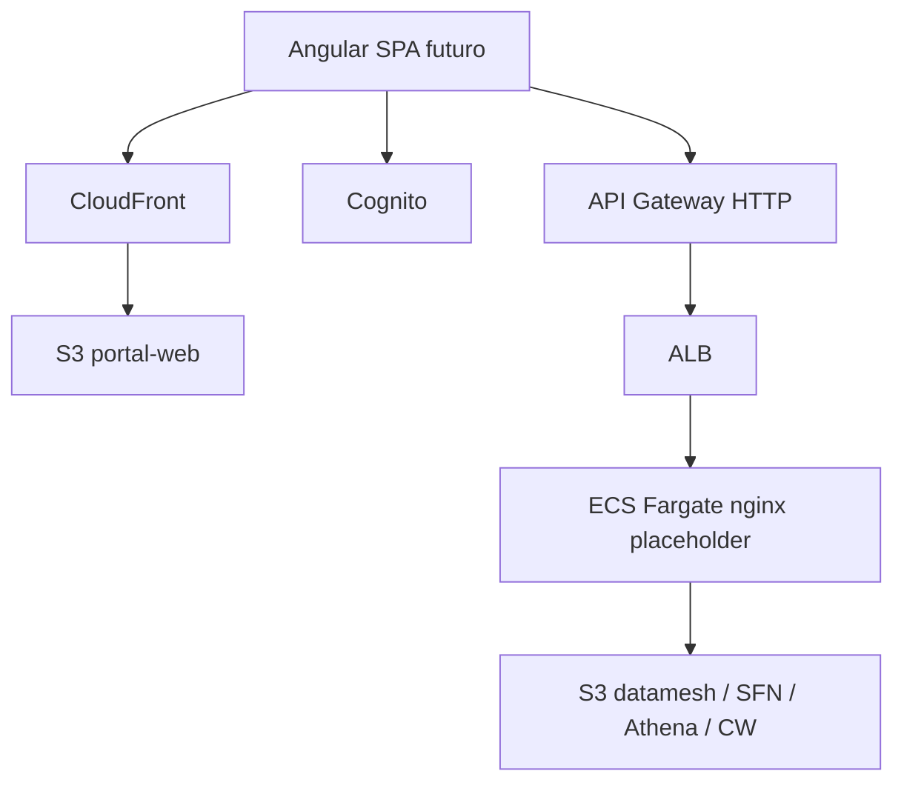

# Application Design · U8 Portal Infra (E8-US01)

**Unidade:** U8-Infra  
**Story:** E8-US01  
**Data:** 2026-06-29

---

## Componentes

| ID | Recurso AWS | Função |
|----|-------------|--------|
| C1 | Cognito User Pool | Auth SPA Angular |
| C2 | S3 + CloudFront OAC | Host estático `portal-web` |
| C3 | ECS Fargate + ALB | BFF placeholder → FastAPI E8-US12 |
| C4 | API Gateway HTTP | Front door API + JWT Cognito |
| C5 | IAM task role | Least privilege datamesh (S3, SFN, Athena, CW) |

---

## Diagrama

---

## Outputs Terraform (contrato E8-US02+)

- `cognito_user_pool_id`, `cognito_client_id`, `cognito_domain`
- `cloudfront_url`, `api_gateway_url`
- `ecs_cluster_name`, `ecs_task_role_arn`

---

## Fora de escopo E8-US01

- `portal-web/` Angular
- `portal-api/` FastAPI
- Upload insumo, dashboards
