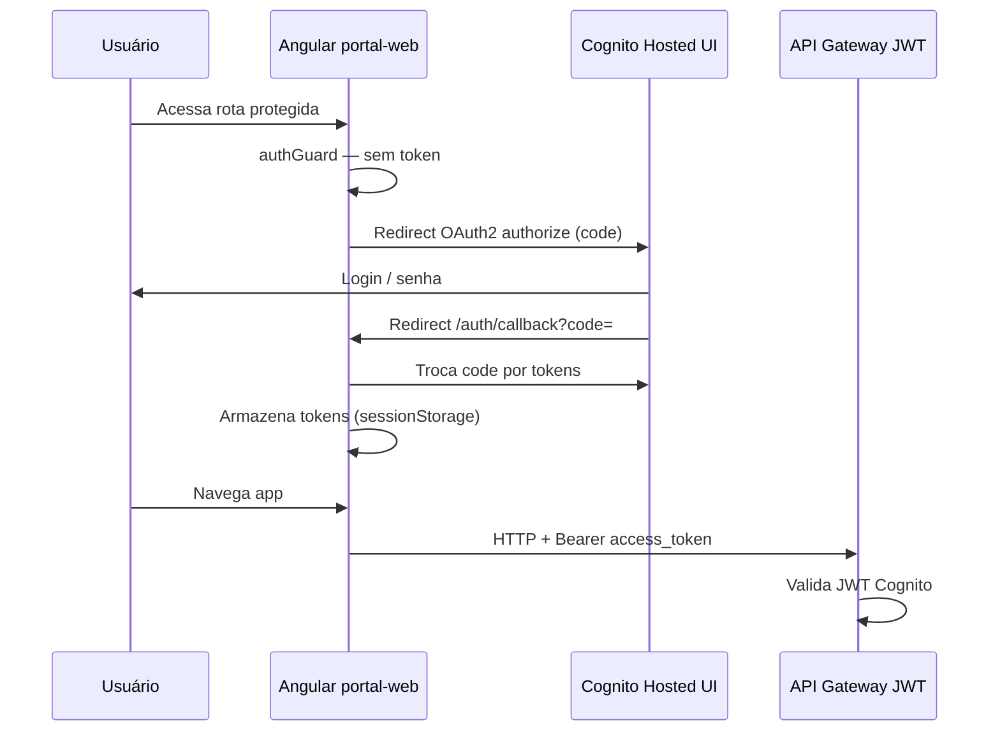

# Application Design · U8 Portal Web (E8-US02)

**Unidade:** U8-Portal-Web  
**Story:** E8-US02 · Login Cognito no Angular  
**Data:** 2026-06-30  
**Depende:** U8-Portal-Infra (E8-US01) — outputs Terraform

---

## Escopo desta unidade

Implementar **autenticação Cognito** no SPA Angular (`portal-web/`): login, logout, proteção de rotas e envio de JWT ao BFF via API Gateway.

**Fora de escopo:** shell M1–M5 (E8-US03), FastAPI (E8-US12), RBAC por persona.

---

## Componentes Angular

| ID | Componente | Responsabilidade |
|----|------------|------------------|
| AW1 | `AuthService` | OAuth2 code flow via Hosted UI; tokens; refresh; logout |
| AW2 | `authInterceptor` | Anexa `Authorization: Bearer <access_token>` em HTTP ao BFF |
| AW3 | `authGuard` | Bloqueia rotas internas sem sessão válida |
| AW4 | `LoginComponent` / callback | Redireciona para Cognito; processa callback `/auth/callback` |
| AW5 | `HomeComponent` (mínimo) | Página pós-login: email + botão logout (placeholder E8-US03) |
| AW6 | `environment.*` | URLs Cognito, clientId, pool, API GW, CloudFront |

---

## Fluxo de autenticação



---

## Decisão técnica (fechada)

| Item | Escolha |
|------|---------|
| Lib auth | **angular-oauth2-oidc** (SPA pública, authorization code + PKCE) |
| UI login | **Cognito Hosted UI** (redirect) |
| Armazenamento token | **sessionStorage** (não localStorage) |
| Material | Angular Material (botões, toolbar mínima) |

---

## Contrato com infra (E8-US01)

| Config | Valor dev |
|--------|-----------|
| `authority` | `https://cognito-idp.us-east-1.amazonaws.com/us-east-1_yJLzwZgZE` |
| `clientId` | `co18jsioudbvk36n8a4hdih4q` |
| `redirectUri` | `http://localhost:4200/auth/callback` (local) · CloudFront `/auth/callback` (prod) |
| `logoutUrl` | mesma origem SPA |
| `scope` | `openid profile email` |
| `apiBaseUrl` | `https://jvpw3k4mnf.execute-api.us-east-1.amazonaws.com` |

---

## Estrutura de pastas alvo

```text
portal-web/
├── src/app/
│   ├── core/auth/          # AuthService, guard, interceptor
│   ├── features/home/      # Home mínima pós-login
│   ├── app.routes.ts
│   └── app.config.ts
├── src/environments/
│   ├── environment.ts
│   ├── environment.local.ts
│   └── environment.prod.ts
└── angular.json
```

---

## Rastreabilidade

| Requisito | Implementação |
|-----------|---------------|
| RF-M6-01 | Hosted UI + interceptor JWT |
| RF-M6-02 | Logout revoga sessão + limpa storage |
| NFR-W7-01 | HTTPS; tokens não logados; PKCE |
