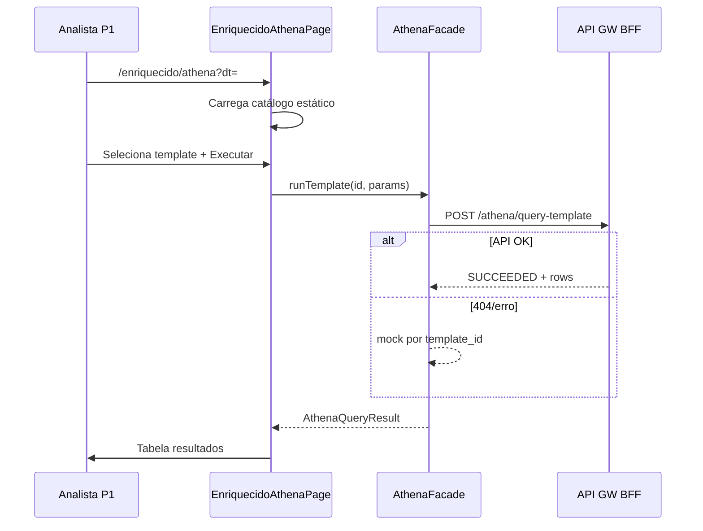

# Application Design · U8 Portal Web Athena Templates (E8-US11)

**Unidade:** U8-Portal-Web  
**Story:** E8-US11 · Athena templates no portal (M3)  
**Data:** 2026-07-01  
**Depende:** E8-US06 (enriquecido) · E7-US01 (Athena/Glue) · E8-US12 (BFF real)

---

## Escopo desta story

Completar **RF-M3-05**: permitir que o analista (P1) execute **queries pré-aprovadas** sobre a tabela Glue `enriquecido` via Athena, sem editor SQL livre — listando templates documentados, parametrizando `dt` / `dts`, e exibindo resultado tabular limitado.

**Fora de escopo:** SQL ad hoc, deploy FastAPI (E8-US12), Terraform/Glue, camada `origem`, alterações em insights/operações/home.

---

## Decisão UX: opção B — rota filha `/enriquecido/athena`

| Opção | Decisão |
|-------|---------|
| A — Painel inline em `/enriquecido` | Rejeitada — página já densa (partições + KPIs + preview + compare) |
| **B — Rota filha `/enriquecido/athena`** | **Adotada** — deep-link, reusa contexto M3, sem alterar shell nav (RF-M7-01) |
| C — `/athena` no menu shell | Rejeitada — altera menu fixo sem necessidade |

**Navegação:**
- Link no header de `EnriquecidoPageComponent`: **Consultas Athena** → `/enriquecido/athena?dt={selectedDt}`
- Breadcrumb/voltar: **← Enriquecido** preserva `?dt=`
- Deep-link direto: `/enriquecido/athena?dt=2022-01-01&template=d1_totals` (opcional pré-seleção)

---

## Componentes Angular

### Nova página

| ID | Componente | Rota | Responsabilidade |
|----|------------|------|------------------|
| AW50 | `EnriquecidoAthenaPageComponent` | `/enriquecido/athena` | Container M3 Athena: catálogo + execução + resultados |

### Filhos da página

| ID | Componente | Responsabilidade |
|----|------------|------------------|
| AW51 | `AthenaTemplateListComponent` | Lista templates por categoria (mat-list / expansion) |
| AW52 | `AthenaTemplateRunFormComponent` | Params `dt` / `dts` / `limit`; botão Executar |
| AW53 | `AthenaResultsTableComponent` | `mat-table` dinâmico; chip `truncated` |

### Alterações em existentes

| ID | Componente | Alteração |
|----|------------|-----------|
| AW24 | `EnriquecidoPageComponent` | Link **Consultas Athena** no header com `queryParams dt` |
| AW29 | `app.routes.ts` | Rota filha `enriquecido/athena` |

### Serviços (novos)

| ID | Serviço | Responsabilidade |
|----|---------|------------------|
| AS21 | `AthenaApiService` | `POST /athena/query-template` |
| AS22 | `AthenaFacadeService` | API + mock fallback; expõe `AthenaQueryResult` |

### Utilitários e mock

| ID | Artefato | Responsabilidade |
|----|----------|------------------|
| U25 | `athena-templates.catalog.ts` | Whitelist 9 templates + `params_schema` PT-BR |
| U26 | `athena-template-params.util.ts` | Valida/bind params; cap `limit` ≤ 100 |
| U27 | `athena-results-mock.data.ts` | Resultados por `template_id` + params (paridade mock enriquecido) |

### Reutilizados

`EnriquecidoFacadeService` (partições para selects), `authInterceptor`, `ApiErrorBannerComponent`, padrão chip mock.

---

## Estrutura de pastas alvo

```text
portal-web/src/app/
├── core/api/
│   ├── models/
│   │   └── athena.model.ts
│   ├── athena-api.service.ts
│   ├── athena-facade.service.ts
│   ├── athena-templates.catalog.ts
│   ├── athena-template-params.util.ts
│   └── data/
│       └── athena-results-mock.data.ts
├── features/enriquecido/
│   ├── enriquecido-page.component.ts    # + link Athena
│   └── athena/
│       ├── enriquecido-athena-page.component.ts
│       ├── athena-template-list.component.ts
│       ├── athena-template-run-form.component.ts
│       └── athena-results-table.component.ts
└── app.routes.ts
```

---

## Catálogo de templates (whitelist)

| template_id | Categoria | Params |
|-------------|-----------|--------|
| `smoke_preview` | smoke | `dt` |
| `partition_sanity` | sanity | `dt` |
| `enriched_null_check` | sanity | `dt` |
| `d1_top_products` | d1 | `dt`, `limit?` |
| `d1_totals` | d1 | `dt` |
| `d2_stockouts` | d2 | `dt` |
| `d2_top_lost` | d2 | `dt`, `limit?` |
| `d3_weekend_trend` | d3 | `dts` (2–7) |
| `multi_dt_coverage` | quality | `dts` (2–7) |

Catálogo **estático no frontend** (Part 2); `GET /athena/templates` opcional no BFF (E8-US12).

---

## Contratos API

### POST `/athena/query-template` (RF-API-14, JWT)

**Request:**

```typescript
export interface AthenaQueryTemplateRequest {
  template_id: string;
  params?: {
    dt?: string;
    dts?: string[];
    limit?: number;
  };
}
```

**Response:**

```typescript
export type AthenaQueryStatus =
  | 'QUEUED'
  | 'RUNNING'
  | 'SUCCEEDED'
  | 'FAILED'
  | 'CANCELLED';

export interface AthenaQueryTemplateResponse {
  query_execution_id: string;
  template_id: string;
  status: AthenaQueryStatus;
  columns: string[];
  rows: Record<string, string | number | null>[];
  row_count: number;
  truncated: boolean;
  data_scan_bytes?: number;
  execution_time_ms?: number;
  state_reason?: string;
}

export interface AthenaQueryResult {
  response: AthenaQueryTemplateResponse;
  data_source: 'api' | 'mock';
  loaded_at: Date;
}
```

**Erros BFF futuro:** 400 (template_id inválido / params), 401, 408 (timeout 60s), 502 (Athena).

---

## Fluxo de dados



---

## Layout da página Athena

```text
┌─────────────────────────────────────────────────────────┐
│ Enriquecido › Consultas Athena          [chip mock?]    │
│ Partição contexto: dt=2022-01-01                        │
├──────────────────┬──────────────────────────────────────┤
│ Templates        │ Form params + [Executar consulta]    │
│ (lista)          │                                      │
│                  │ AthenaResultsTable                   │
│                  │ (spinner se RUNNING)                 │
└──────────────────┴──────────────────────────────────────┘
```

---

## Rastreabilidade

| Requisito | Artefato |
|-----------|----------|
| RF-M3-05 | Página `/enriquecido/athena` + facade |
| RF-API-14 | `AthenaApiService` |
| RF-M7-01 | Shell nav inalterado |
| RF-M7-03/05 | Mensagens PT-BR |

---

## Regressão

| Módulo | Expectativa |
|--------|-------------|
| `/enriquecido` KPIs/preview/compare | Inalterados |
| Home, insights, operações | Inalterados |
| Shell nav | Sem item Athena |
