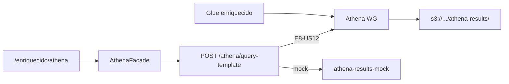

# Infrastructure Design · U8 Portal Web Athena Templates (E8-US11)

**Story:** E8-US11  
**Data:** 2026-07-01

---

## Escopo infraestrutura

**Nenhum recurso Terraform novo.** Frontend + mock até E8-US12.

| Camada | Recurso brownfield | Uso E8-US11 |
|--------|-------------------|-------------|
| **Glue** | DB `retail_inventory_insights_dev`, table `enriquecido` | Alvo das queries |
| **Athena** | WG `retail-inventory-insights-dev` | Execução via BFF futuro |
| **S3** | `athena-results/` prefix | Output queries |
| **IAM ECS** | `terraform/modules/portal/iam.tf` | Já prevê `athena:*` + Glue read |
| **API GW** | Rota `POST /athena/query-template` | BFF E8-US12 |

---

## Mapeamento story × infra

| Story | Infra |
|-------|-------|
| **E7-US01** | Athena workgroup + Glue catalog |
| **E8-US11** | UI templates + contrato API |
| **E8-US12** | BFF StartQueryExecution + GetQueryResults |

---

## BFF futuro (referência E8-US12)

```text
POST /athena/query-template
  → lookup template_id in server whitelist
  → bind params (dt, dts, limit)
  → athena:StartQueryExecution (workgroup retail-inventory-insights-dev)
  → poll GetQueryExecution (max 60s)
  → GetQueryResults (truncate 100 rows)
  → JSON response
```

Database context: `Database=retail_inventory_insights_dev`

---

## Validação local (Part 2)

```powershell
.\scripts\w7-us11-validate.ps1
```

Athena real (opcional manual): `scripts/athena-validation-queries.md` + AWS CLI.

---

## Diagrama



---

## Extension compliance

| Extension | Aplicável |
|-----------|-----------|
| Security Baseline | Sim (whitelist server-side futuro) |
| Resiliency Baseline | Sim |
| Property-Based Testing | Sim |
