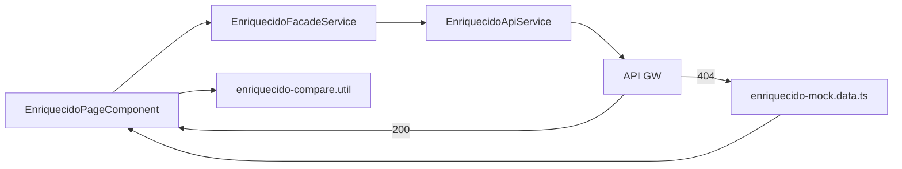

# Application Design · U8 Portal Web Enriquecido (E8-US06)

**Unidade:** U8-Portal-Web  
**Story:** E8-US06 · Partições enriquecido, KPIs e comparativo (M3)  
**Data:** 2026-06-30  
**Depende:** E8-US05 (origem) · E8-US03 (shell) · E8-US12 (BFF real)

---

## Escopo desta story

Substituir o placeholder `/enriquecido` por tela que lista **partições** `enriquecido/dt=YYYY-MM-DD/`, exibe **KPIs agregados** da partição selecionada, **preview paginado** (colunas originais + derivadas) e **comparativo** entre duas datas (delta de KPIs).

**Fora de escopo:** RF-M3-05 Athena templates (E8-US11), pipeline SFN (E8-US09), insights D-1/D-2/D-3 (E8-US07/08).

---

## Componentes Angular (novos)

| ID | Componente | Responsabilidade |
|----|------------|------------------|
| AW24 | `EnriquecidoPageComponent` | Container `/enriquecido`: partições, KPIs, preview, comparativo |
| AW25 | `EnriquecidoPartitionsPanelComponent` | Lista `dt=` clicáveis (RF-M3-01) |
| AW26 | `EnriquecidoKpiPanelComponent` | Cards KPIs: receita, rupturas, venda perdida (RF-M3-02) |
| AW27 | `EnriquecidoPreviewTableComponent` | `mat-table` + `mat-paginator` preview (RF-M3-03) |
| AW28 | `EnriquecidoComparePanelComponent` | Seletores dt A / dt B + tabela delta KPIs (RF-M3-04) |

### Serviços (estender / novos)

| ID | Serviço | Responsabilidade |
|----|---------|------------------|
| AS4 | `EnriquecidoApiService` | **Estender:** `getPreview(dt, page)` além de partitions + kpis |
| AS9 | `EnriquecidoFacadeService` | API + mock fallback; `data_source`; orquestra KPIs + preview + compare |

### Utilitários

| ID | Artefato | Responsabilidade |
|----|----------|------------------|
| U4 | `enriquecido-mock.data.ts` | Partições, KPIs e preview mock brownfield |
| U5 | `enriquecido-partition.util.ts` | Normaliza `dt`, ordena desc (reuso lógica origem) |
| U6 | `enriquecido-compare.util.ts` | Calcula delta KPIs entre dt A e dt B |

### Mantidos (sem quebrar)

`DashboardService`, `EnriquecidoApiService` (home), `AppShellComponent`, `authGuard`, `authInterceptor`, `ApiErrorService`, `KpiSummaryCardComponent`, `MatPaginatorIntl` PT-BR.

---

## Estrutura de pastas alvo

```text
portal-web/src/app/
├── core/api/
│   ├── models/
│   │   └── enriquecido.model.ts      # estender DTOs
│   ├── enriquecido-api.service.ts    # + getPreview()
│   ├── enriquecido-facade.service.ts # novo
│   ├── enriquecido-compare.util.ts
│   ├── enriquecido-partition.util.ts
│   └── data/
│       └── enriquecido-mock.data.ts
├── features/enriquecido/
│   ├── enriquecido-page.component.ts
│   ├── enriquecido-partitions-panel.component.ts
│   ├── enriquecido-kpi-panel.component.ts
│   ├── enriquecido-preview-table.component.ts
│   └── enriquecido-compare-panel.component.ts
└── app.routes.ts                     # /enriquecido → EnriquecidoPageComponent
```

---

## Contratos API

### `GET /enriquecido/partitions` (RF-API-06)

```typescript
interface EnriquecidoPartitionsResponse {
  partitions: string[];
  latest?: string;
}
```

### `GET /enriquecido/{dt}/kpis` (RF-API-07)

```typescript
interface EnriquecidoKpis {
  dt: string;
  row_count: number;
  revenue_total: number;       // sum(_revenue)
  stockout_count: number;      // count(_stockout == 1)
  lost_total: number;            // sum(_lost)
  stockout_pct: number;          // derivado: stockout_count / row_count * 100
  products_stockout: number;     // distinct Product ID com _stockout==1
  stores_count: number;
  is_weekend: boolean;           // agregado: qualquer linha _is_weekend==1 no dia
}
```

> **Compatibilidade home:** campos existentes (`revenue_total`, `stockout_pct`, `products_stockout`, `stores_count`) mantidos. Novos campos opcionais no mock até BFF real.

### `GET /enriquecido/{dt}/preview?page=1&page_size=50` (RF-M3-03 · contrato BFF E8-US12)

```typescript
interface EnriquecidoPreviewResponse {
  dt: string;
  columns: string[];
  rows: Record<string, unknown>[];
  page: number;
  page_size: number;
  total_pages: number;
  total_rows: number;            // min(row_count, 500)
}
```

**Colunas preview:** 15 SCHEMA originais + `_revenue`, `_stockout`, `_lost`, `_is_weekend`, `dt` (20 cols).

**Regra:** `total_rows ≤ 500` (mesmo cap origem).

### Comparativo (RF-M3-04)

Sem endpoint dedicado nesta story: **frontend** chama `GET /kpis` para dt A e dt B e calcula delta via `enriquecido-compare.util.ts`.

```typescript
interface EnriquecidoKpiDelta {
  metric: string;
  dt_a: number | boolean;
  dt_b: number | boolean;
  delta: number;                 // B - A (numérico); boolean → 0/1 delta
  delta_pct?: number;            // quando aplicável (receita, lost)
}
```

---

## Layout da página (wireframe)

```text
┌────────────────────────────────────────────────────────────────────┐
│ Enriquecido · métricas derivadas                                   │
├──────────────────┬─────────────────────────────────────────────────┤
│ Partições dt=    │ KPIs · dt=2022-01-01                            │
│ ● 2022-01-02     │ [Receita] [Rupturas] [Venda perdida] [FDS?]    │
│ ● 2022-01-01 ✓   │                                                 │
│                  │ Preview (pág. 1/2) — 20 colunas                 │
│                  │ ┌ Date │ … │ _revenue │ _stockout │ _lost │ … ┐ │
│                  │ └──────────────────────────────────────────────┘ │
│                  │              < mat-paginator >                   │
│                  │                                                 │
│                  │ Comparar dias                                   │
│                  │ dt A [2022-01-01 ▼]  dt B [2022-01-02 ▼]       │
│                  │ ┌ Métrica │ dt A │ dt B │ Δ │ Δ% ┐             │
│                  │ └ Receita │ …    │ …    │ … │ …  ┘             │
└──────────────────┴─────────────────────────────────────────────────┘
```

- Painel esquerdo: partições disponíveis (clicáveis), ordenação desc
- Painel direito: KPIs da dt selecionada + preview + seção comparativo abaixo

---

## Mock brownfield (dev)

| Campo | Valor mock |
|-------|------------|
| `partitions` | `['2022-01-02', '2022-01-01']` (2 dt para demo comparativo) |
| `latest` | `2022-01-02` |
| KPIs `2022-01-01` | Alinhar `MOCK_KPIS` home: revenue 879026.03, row_count 100, stores 10, stockout 0 |
| KPIs `2022-01-02` | Variante sintética: revenue ~5% menor, stockout_count 3, lost_total 42.5 |
| Preview | 100 linhas × 20 cols; paginação 50; reutilizar lógica origem + cols derivadas |

Chip *"Dados de demonstração"* quando `data_source === 'mock'`.

---

## Rotas

| Path | Antes | Depois |
|------|-------|--------|
| `/enriquecido` | `PlaceholderPageComponent` | `EnriquecidoPageComponent` |

Query params opcionais: `/enriquecido?dt=2022-01-01&compare_a=2022-01-01&compare_b=2022-01-02`.

---

## Decisões técnicas (fechadas)

| Item | Escolha |
|------|---------|
| Seletor dt | Lista lateral (espelho origem E8-US05) |
| KPIs | `KpiSummaryCardComponent` + card boolean FDS |
| Preview | `mat-table` dinâmico + `mat-paginator` page_size=50 |
| Comparativo | Dois `mat-select` + tabela delta; default A=penúltima, B=última partição |
| Cap linhas | 500 total preview |
| Dashboard home | `DashboardService` inalterado; usa `EnriquecidoApiService` direto |
| BFF | Mock até E8-US12 |

---

## Rastreabilidade

| Requisito | Implementação |
|-----------|---------------|
| RF-M3-01 | EnriquecidoPartitionsPanel |
| RF-M3-02 | EnriquecidoKpiPanel |
| RF-M3-03 | EnriquecidoPreviewTable + getPreview |
| RF-M3-04 | EnriquecidoComparePanel + compare util |
| RF-API-06 | EnriquecidoApiService.getPartitions() |
| RF-API-07 | EnriquecidoApiService.getKpis() |

---

## Diagrama


