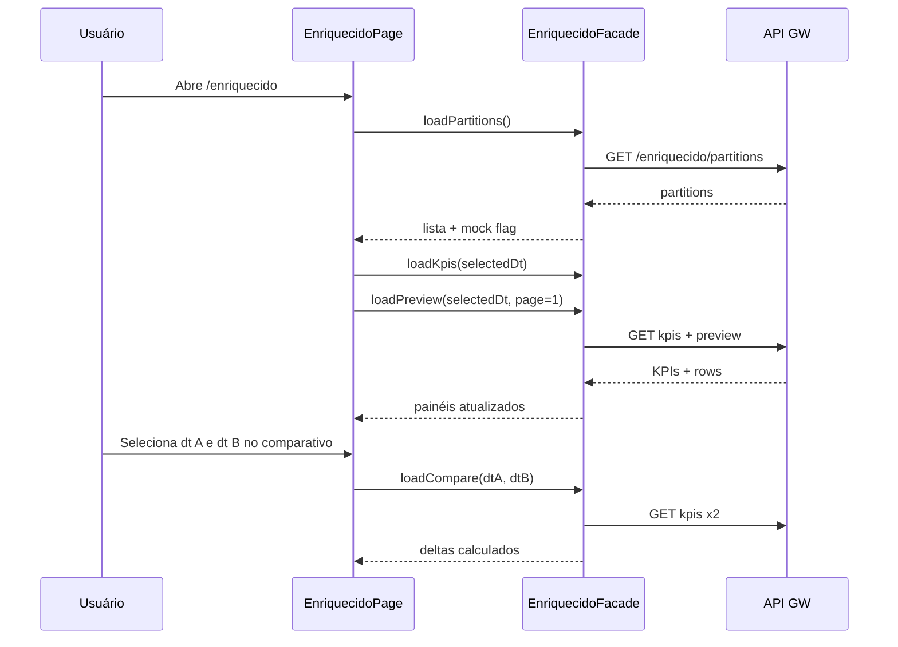

# Functional Design · U8 Portal Web Enriquecido (E8-US06)

**Story:** E8-US06  
**Persona:** P1 · Analista de estoque  
**Data:** 2026-06-30

---

## Regras de negócio

### BR-ENR-01 · Listagem de partições
Exibir todas as partições `enriquecido/dt=YYYY-MM-DD/` retornadas por `GET /enriquecido/partitions`, ordenadas **desc** (mais recente primeiro).

### BR-ENR-02 · Seleção de dt
Ao clicar em uma partição, carregar KPIs + preview para essa `dt`. A partição mais recente é selecionada automaticamente ao abrir a tela (ou `?dt=` na URL).

### BR-ENR-03 · KPIs da partição (RF-M3-02)
Para a `dt` selecionada, exibir:

| KPI UI | Campo API | Regra brownfield |
|--------|-----------|------------------|
| Receita total | `revenue_total` | `sum(_revenue)` |
| Rupturas | `stockout_count` | `count(_stockout == 1)` |
| Venda perdida | `lost_total` | `sum(_lost)` |
| Fim de semana | `is_weekend` | `true` se qualquer linha `_is_weekend == 1` |
| Linhas | `row_count` | contagem de linhas da partição |
| Lojas | `stores_count` | lojas distintas |

Subtítulo opcional: `% ruptura` (`stockout_pct`) e `products_stockout` como métricas secundárias.

### BR-ENR-04 · Preview paginado (RF-M3-03)
- Tabela com **20 colunas**: 15 SCHEMA + `_revenue`, `_stockout`, `_lost`, `_is_weekend`, `dt`
- Máximo **500 linhas** no preview total
- Paginação: `page_size` default **50**
- `mat-paginator` PT-BR

### BR-ENR-05 · Comparativo dois dias (RF-M3-04)
- Usuário seleciona **dt A** e **dt B** (apenas partições existentes)
- Sistema carrega KPIs de ambas e exibe tabela com valores lado a lado e **delta** (B − A)
- Métricas comparadas: `revenue_total`, `stockout_count`, `lost_total`, `row_count`, `stockout_pct`
- Default ao abrir: A = penúltima partição, B = última (quando ≥ 2 partições); se 1 partição, comparativo desabilitado com hint

### BR-ENR-06 · Fallback mock
Se API indisponível, usar mock com `2022-01-01` + `2022-01-02` e banner informativo.

### BR-ENR-07 · Athena / pipeline
**N/A** nesta story — RF-M3-05 (E8-US11), reprocessar (E8-US09).

---

## Modelo de domínio

| Conceito | Atributos |
|----------|-----------|
| `EnriquecidoPartition` | `dt` |
| `EnriquecidoViewState` | `partitions`, `selectedDt`, `kpis`, `preview`, `compareA`, `compareB`, `deltas`, `data_source` |
| `EnriquecidoKpiDelta` | `metric`, `dt_a`, `dt_b`, `delta`, `delta_pct?` |

---

## Fluxo principal

---

## Estados da tela

| Estado | UI |
|--------|-----|
| `loading_partitions` | Spinner painel esquerdo |
| `partitions_ready` | Lista dt |
| `loading_detail` | Spinner KPIs + preview |
| `detail_ready` | KPIs + mat-table + paginator |
| `loading_compare` | Spinner seção comparativo |
| `compare_ready` | Tabela delta |
| `no_partitions` | Empty state "Nenhuma partição enriquecida encontrada" |
| `compare_disabled` | Hint "Selecione duas partições para comparar" |
| `error` | ApiErrorBanner + retry |

---

## Casos de teste

### Unitários

| ID | Cenário | Resultado |
|----|---------|-----------|
| TC-U01 | Facade 404 partitions | Mock + `data_source: mock` |
| TC-U02 | Preview page 2 | `rows.length ≤ page_size` |
| TC-U03 | Compare delta receita | `delta = revenue_B - revenue_A` |
| TC-U04 | Cap 500 rows | `total_rows ≤ 500` |
| TC-U05 | KPIs mock 2022-01-01 | Paridade `MOCK_KPIS` dashboard |

### Manuais (checklist E8-US06)

| ID | Cenário | Resultado |
|----|---------|-----------|
| TC-M01 | Login → Enriquecido | Partições visíveis |
| TC-M02 | Selecionar dt | KPIs + preview atualizam |
| TC-M03 | Preview 20 colunas | Colunas derivadas visíveis |
| TC-M04 | Comparativo A×B | Delta exibido corretamente |
| TC-M05 | DevTools | GET partitions, kpis, preview com JWT |

---

## Mensagens UI (PT-BR)

| Situação | Mensagem |
|----------|----------|
| Carregando | "Carregando partições enriquecidas…" / "Carregando KPIs…" |
| Vazio | "Nenhuma partição enriquecida encontrada." |
| Mock | "Exibindo dados de demonstração até o BFF estar disponível." |
| Comparativo 1 dt | "É necessário ao menos duas partições para comparar." |
| Paginator | Labels Material em PT-BR (já configurado) |
