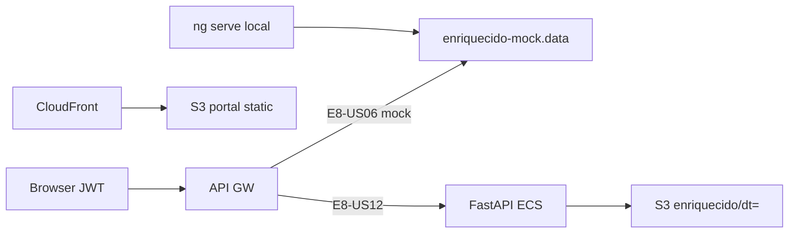

# Infrastructure Design · U8 Portal Web Enriquecido (E8-US06)

**Story:** E8-US06  
**Data:** 2026-06-30

---

## Escopo infraestrutura

**Nenhum recurso Terraform novo** nesta story. Frontend-only + mock até E8-US12.

| Camada | Alteração |
|--------|-----------|
| **S3** | Leitura futura `enriquecido/dt=*/` via BFF (já existe no datamesh W3) |
| **API GW** | Rotas `/enriquecido/*` — hoje nginx 404 → mock frontend |
| **CloudFront** | Deploy portal após build (mesmo fluxo E8-US04/05) |
| **Cognito** | Sem mudança — JWT existente |
| **ECS/FastAPI** | E8-US12 implementará RF-API-06, RF-API-07 + preview |

---

## Mapeamento story × infra

| Story | Infra |
|-------|-------|
| **E8-US06** | Frontend + mock + contratos API documentados |
| E8-US12 | BFF FastAPI: partitions, kpis, preview enriquecido |
| E3 (W3) | Glue já grava `enriquecido/dt=` no bucket |

---

## Validação local

```powershell
.\scripts\w7-us06-validate.ps1
```

Etapas planejadas:
1. `npm ci` em `portal-web/`
2. `npm run build:prod`
3. `npm test` (headless)
4. Checklist manual E8-US06

---

## Deploy dev (opcional pós-story)

```powershell
# Mesmo fluxo E8-US03/04/05 — build + sync S3 portal + invalidação CloudFront
```

Sem alteração de `terraform/environments/dev/` nesta story.

---

## Diagrama deploy



---

## Dados brownfield referência

| Artefato | Caminho |
|----------|---------|
| Parquet local | `tabela_enriquecida/dt=2022-01-01/data.parquet` |
| Notebook | `Esteira_3Relatorios_D1_D2_D3.ipynb` — `enriquecer_dia()` |
| Mock home | `dashboard.service.ts` — `MOCK_KPIS` |

---

## Extension compliance

| Extension | Aplicável | Notas |
|-----------|-----------|-------|
| Security Baseline | Sim | JWT, sem secrets no mock |
| Resiliency Baseline | Sim | Fallback mock |
| Property-Based Testing | Sim | Testes unitários facade/compare |
