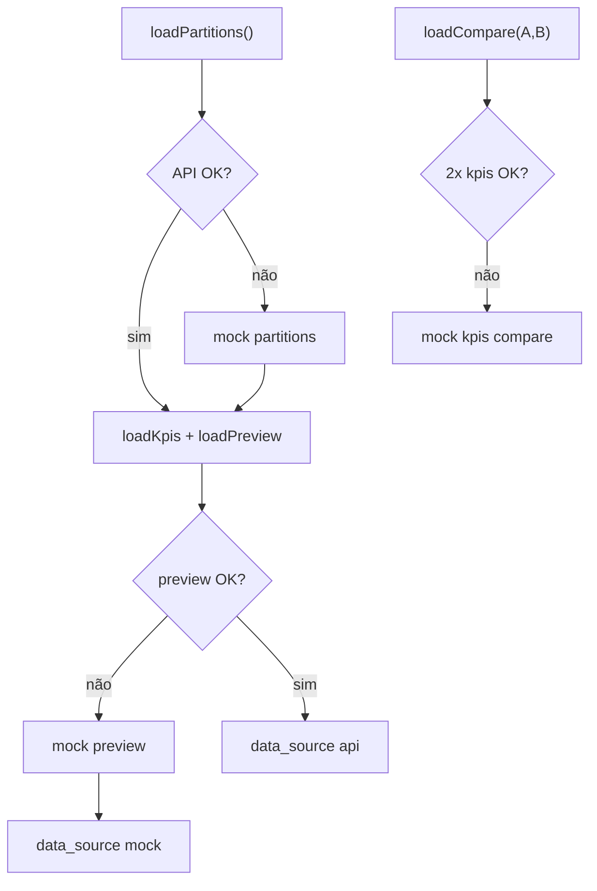

# NFR Design · U8 Portal Web Enriquecido (E8-US06)

**Data:** 2026-06-30

---

## Preview table — implementação

```typescript
const PREVIEW_PAGE_SIZE = 50;
const PREVIEW_MAX_ROWS = 500;
```

- Reutilizar `origem-preview.util.ts` (clamp + slice) ou extrair para `preview.util.ts` compartilhado
- `mat-table` com `displayedColumns` dinâmico (20 cols)
- `mat-paginator` `[pageSizeOptions]="[25, 50, 100]"` — default 50
- Container `.preview-scroll { overflow-x: auto; }`

---

## KPI panel — formatação

| Campo | Formato UI |
|-------|------------|
| `revenue_total` | `KpiSummaryCard` format `currency` BRL |
| `stockout_count` | `number` |
| `lost_total` | `number` (1 decimal se mock) |
| `is_weekend` | Chip "Sim" / "Não" |
| `stockout_pct` | `percent` subtítulo |

---

## Comparativo — implementação

```typescript
interface CompareRow {
  label: string;
  valueA: number;
  valueB: number;
  delta: number;
  deltaPct: number | null;
}
```

- `mat-select` para dt A e dt B (opções = `partitions`)
- Validação: `dtA !== dtB` antes de carregar
- Tabela Material 5 colunas: Métrica | dt A | dt B | Δ | Δ%
- Δ% apenas para `revenue_total` e `lost_total`

---

## Responsividade

| Breakpoint | Layout |
|------------|--------|
| ≥ 960px | Grid 2 colunas: partições 280px \| conteúdo flex |
| &lt; 960px | Stack: partições → KPIs → preview → comparativo |

---

## EnriquecidoFacadeService — resiliência



---

## Compatibilidade DashboardService

- Estender `EnriquecidoKpis` com campos novos **opcionais** (`stockout_count?`, `lost_total?`, `is_weekend?`)
- `DashboardService` e `dashboard.service.spec.ts` não devem quebrar
- Home usa subset: `revenue_total`, `stockout_pct`, `products_stockout`

---

## Testes (PBT leve)

| Arquivo | Propriedade |
|---------|-------------|
| `enriquecido-facade.service.spec.ts` | 404 → mock partitions |
| `enriquecido-compare.util.spec.ts` | delta B - A |
| `enriquecido-preview` (reuse) | total_rows ≤ 500 |

---

## Extension compliance (E8-US06)

| Extension | Status |
|-----------|--------|
| Security Baseline | Compliant |
| Resiliency Baseline | Compliant |
| Property-Based Testing | Compliant |
