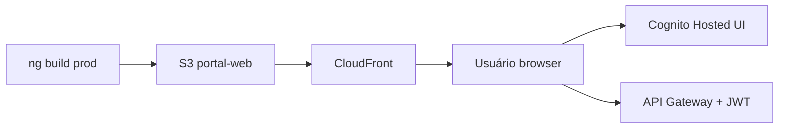

# Infrastructure Design · U8 Portal Web (E8-US02)

**Story:** E8-US02  
**Data:** 2026-06-30

---

## Deploy estático (sem novo Terraform obrigatório)

| Recurso | Identificador dev | Origem |
|---------|-------------------|--------|
| S3 portal-web | `retail-inventory-insights-portal-web-dev-use1` | E8-US01 Terraform |
| CloudFront | `E1KJGUHSP2GWTK` / `d3g8ihrhzv7hsx.cloudfront.net` | E8-US01 Terraform |
| Cognito callbacks | `http://localhost:4200/auth/callback` + CloudFront URL | `additional_callback_urls` |

---

## Pipeline de deploy (script)

`scripts/w7-deploy-portal-web.ps1`:

1. `cd portal-web && npm ci && npm run build -- --configuration=production`
2. `aws s3 sync dist/portal-web/browser s3://retail-inventory-insights-portal-web-dev-use1/ --delete`
3. `aws cloudfront create-invalidation --distribution-id E1KJGUHSP2GWTK --paths "/*"`

---

## Environments Angular

| Arquivo | Uso | `redirectUri` |
|---------|-----|---------------|
| `environment.local.ts` | `ng serve` | `http://localhost:4200/auth/callback` |
| `environment.prod.ts` | build CloudFront | `https://d3g8ihrhzv7hsx.cloudfront.net/auth/callback` |

**Nota:** Após primeiro deploy com `/auth/callback`, validar se Cognito client inclui URL CloudFront com path `/auth/callback`. Se não, `terraform apply` com `additional_callback_urls` atualizado.

---

## Cognito — URLs adicionais (se necessário)

Em `terraform/environments/dev/dev.tfvars`:

```hcl
portal_additional_callback_urls = [
  "http://localhost:4200/auth/callback",
  "https://d3g8ihrhzv7hsx.cloudfront.net/auth/callback"
]
```

*(Ajuste fino Terraform — somente se callback CloudFront falhar.)*

---

## CI local / validação

`scripts/w7-us02-validate.ps1`:

1. `npm run build` (portal-web)
2. `npm test -- --watch=false` (unit auth)
3. Checklist manual login (documentado no script)

---

## Diagrama deploy


