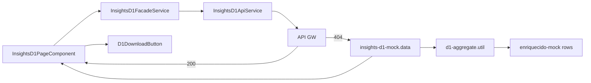

# Application Design · U8 Portal Web Insights D-1 (E8-US07)

**Unidade:** U8-Portal-Web  
**Story:** E8-US07 · Dashboard insight D-1 (M4)  
**Data:** 2026-06-30  
**Depende:** E8-US06 (enriquecido) · E5/W5 (Lambda D-1) · E8-US12 (BFF real)

---

## Escopo desta story

Substituir o placeholder `/insights/d1` por dashboard comercial que exibe **insight textual**, **ranking de produtos** (unidades e receita) e **download Excel** para o dado D-1 selecionado.

**Fora de escopo:** D-2/D-3 (E8-US08), pipeline SFN real (E8-US09), FastAPI BFF (E8-US12), Athena (E8-US11).

---

## Componentes Angular (novos)

| ID | Componente | Responsabilidade |
|----|------------|------------------|
| AW29 | `InsightsD1PageComponent` | Container `/insights/d1`: seletor dt, insight, ranking, download, banner ausência |
| AW30 | `D1DateSelectorComponent` | Seletor `dt` (mat-datepicker ou mat-select); default ontem; RF-M4-01 |
| AW31 | `D1InsightPanelComponent` | Card destacado com `insight_text` (RF-M4-07) |
| AW32 | `D1RankingTableComponent` | `mat-table` ranking + `mat-paginator` PT-BR (RF-M4-02) |
| AW33 | `D1DownloadButtonComponent` | Botão download Excel via presigned URL (RF-M4-05) |
| AW34 | `D1MissingPartitionBannerComponent` | Banner + CTA quando `partition_exists=false` (RF-M4-06) |

### Serviços (novos)

| ID | Serviço | Responsabilidade |
|----|---------|------------------|
| AS10 | `InsightsD1ApiService` | `GET /insights/d1?dt=`, `GET /insights/d1/download?dt=` |
| AS11 | `InsightsD1FacadeService` | API + mock fallback; `data_source`; orquestra insight + download |

### Utilitários

| ID | Artefato | Responsabilidade |
|----|----------|------------------|
| U7 | `d1-aggregate.util.ts` | Agregação brownfield (paridade `gerar_relatorio_d1.py`) |
| U8 | `d1-date.util.ts` | `data_execucao = dt + 1`, default ontem, normalização `YYYY-MM-DD` |
| U9 | `d1-report-key.util.ts` | `report_s3_key`, `filename` amigável para download |
| U10 | `insights-d1-mock.data.ts` | Resposta mock agregando rows enriquecido |

### Reutilizados (sem quebrar)

`AppShellComponent`, `authGuard`, `authInterceptor`, `ApiErrorService`, `ApiErrorBannerComponent`, `MatPaginatorIntl` PT-BR, `EnriquecidoFacadeService` / `enriquecido-mock.data.ts` (fonte rows mock), `InsightShortcutCardComponent` (home).

---

## Estrutura de pastas alvo

```text
portal-web/src/app/
├── core/api/
│   ├── models/
│   │   └── insights-d1.model.ts
│   ├── insights-d1-api.service.ts
│   ├── insights-d1-facade.service.ts
│   ├── d1-aggregate.util.ts
│   ├── d1-date.util.ts
│   ├── d1-report-key.util.ts
│   └── data/
│       └── insights-d1-mock.data.ts
├── features/insights/d1/
│   ├── insights-d1-page.component.ts
│   ├── d1-date-selector.component.ts
│   ├── d1-insight-panel.component.ts
│   ├── d1-ranking-table.component.ts
│   ├── d1-download-button.component.ts
│   └── d1-missing-partition-banner.component.ts
└── app.routes.ts                     # /insights/d1 → InsightsD1PageComponent
```

---

## Contratos API

### `GET /insights/d1?dt=YYYY-MM-DD` (RF-API-08)

```typescript
interface D1RankingRow {
  product_id: string;
  category: string;
  unidades: number;
  receita: number;
  pct_total: number;           // unidades / total_unidades (0–1)
}

interface D1Leader {
  product_id: string;
  category: string;
  unidades: number;
  receita: number;
}

interface InsightsD1Response {
  dt: string;                    // DIA_DADO
  data_execucao: string;         // dt + 1 dia (ISO date)
  partition_exists: boolean;
  insight_text: string;
  leader: D1Leader;
  top3_concentration_pct: number;
  total_unidades: number;
  total_receita: number;
  ranking: D1RankingRow[];
}
```

### `GET /insights/d1/download?dt=YYYY-MM-DD` (RF-API-11 · tipo=d1)

> BFF futuro pode expor `GET /insights/d1/download` como alias de `GET /insights/{tipo}/download?dt=`.

```typescript
interface InsightsD1DownloadResponse {
  presigned_url: string;
  expires_in_seconds: number;  // ≤ 900 (NFR-W7-02)
  s3_key: string;
  filename: string;
}
```

**Exemplo s3_key:** `relatorios/D1/relatorio_D1_exec2022-01-02_dado2022-01-01.xlsx`

---

## Regras de agregação (paridade Lambda/notebook)

```typescript
// d1-aggregate.util.ts — espelha aggregate_enriquecido_table + table_to_rows
// Input: rows enriquecido com Product ID, Category, Units Sold, _revenue
// 1. groupby(Product ID, Category) → sum(Units Sold), sum(_revenue)
// 2. rename → unidades, receita
// 3. sort unidades desc
// 4. pct_total = unidades / sum(unidades)
// 5. top3_concentration_pct = sum(top3.unidades) / total * 100
// 6. insight_text = f"No dado de {dt} (D-1), o produto líder foi {id} ({cat}) com {n} un. Os 3 primeiros concentram {pct:.0f}% das vendas."
```

Referência: `lambda/reports/gerar_relatorio_d1.py` — `aggregate_enriquecido_table`, `_insight`, `report_s3_key`.

---

## Layout da página (wireframe)

```text
┌────────────────────────────────────────────────────────────────────┐
│ Insight D-1 · Produtos vendidos                                    │
├────────────────────────────────────────────────────────────────────┤
│ Dado D-1: [ 2022-01-01 ▼ ]  Execução: 2022-01-02   [↓ Excel]     │
├────────────────────────────────────────────────────────────────────┤
│ 💡 No dado de 2022-01-01 (D-1), o produto líder foi P042 (...)    │
├────────────────────────────────────────────────────────────────────┤
│ Ranking · 69 produtos · 1.234 un. · R$ 879.026,03                  │
│ ┌ Produto │ Categoria │ Unid. │ Receita (R$) │ % Total ┐          │
│ │ P042    │ Electronics│  120  │  12.345,00   │  9,7%   │          │
│ └──────────────────────────────────────────────────────┘          │
│              < mat-paginator >                                       │
└────────────────────────────────────────────────────────────────────┘
```

- Layout single-column (foco diretoria); `minmax(0, 1fr)` + scroll local na tabela (padrão E8-US06)
- Banner ausência acima do insight quando `partition_exists=false`

---

## Mock brownfield (dev)

| Campo | Valor mock |
|-------|------------|
| Partições disponíveis | `2022-01-01`, `2022-01-02` (via enriquecido mock) |
| Default `dt` | Ontem relativo a `latest` mock (`2022-01-01` quando latest=`2022-01-02`) |
| Agregação | `getMockEnriquecidoRows(dt)` → `aggregateD1FromEnriquecidoRows()` |
| `partition_exists` | `true` para dt mock; `false` para dt fora da lista (ex. `2022-01-03`) |
| Download mock | Retorna DTO com `s3_key`/`filename` corretos; `presigned_url` vazio + snackbar PT-BR: *"Download real disponível após BFF (E8-US12). Chave S3: …"* — botão exibe metadados sem abrir URL inválida |

Chip *"Dados de demonstração"* quando `data_source === 'mock'`.

---

## CTA partição ausente (RF-M4-06)

Quando `partition_exists=false`:

- `mat-card` warning: *"Não há partição enriquecida para {dt}. Processe o dia para gerar o insight D-1."*
- Botão **"Ir para Operações"** → `routerLink="/operacoes"` (placeholder E8-US09)
- Tooltip no botão: *"Disparo do pipeline estará disponível em E8-US09"*
- Ranking e download **desabilitados**; insight panel oculto

---

## Rotas

| Path | Antes | Depois |
|------|-------|--------|
| `/insights/d1` | `PlaceholderPageComponent` | `InsightsD1PageComponent` |
| `/insights/d2`, `/insights/d3` | Placeholder | **Inalterado** (E8-US08) |

Query param: `/insights/d1?dt=2022-01-01` (deep-link da home).

**NFR-W7-05:** Home → atalho D-1 → dashboard = **2 cliques** (login já feito).

---

## Decisões técnicas (fechadas)

| Item | Escolha |
|------|---------|
| Seletor dt | `mat-select` com partições enriquecido + input manual opcional via datepicker |
| Default dt | `yesterdayIso(latestPartition)`; fallback `2022-01-01` em mock |
| Agregação | Função pura `d1-aggregate.util.ts` (PBT) |
| Fonte mock | Exportar `getMockEnriquecidoRows(dt)` em `enriquecido-mock.data.ts` |
| Download | `window.open(presigned_url)` quando URL válida; mock = snackbar informativo |
| Paginação ranking | `mat-paginator` page_size=25; sem cap artificial (produtos distintos ~69) |
| BFF | Mock até E8-US12 |

---

## Rastreabilidade

| Requisito | Implementação |
|-----------|---------------|
| RF-M4-01 | D1DateSelectorComponent |
| RF-M4-02 | D1RankingTableComponent + aggregate util |
| RF-M4-05 | D1DownloadButtonComponent + download API |
| RF-M4-06 | D1MissingPartitionBannerComponent |
| RF-M4-07 | D1InsightPanelComponent + `buildD1InsightText()` |
| RF-API-08 | InsightsD1ApiService.getInsight(dt) |
| RF-API-11 | InsightsD1ApiService.getDownload(dt) |

---

## Diagrama


