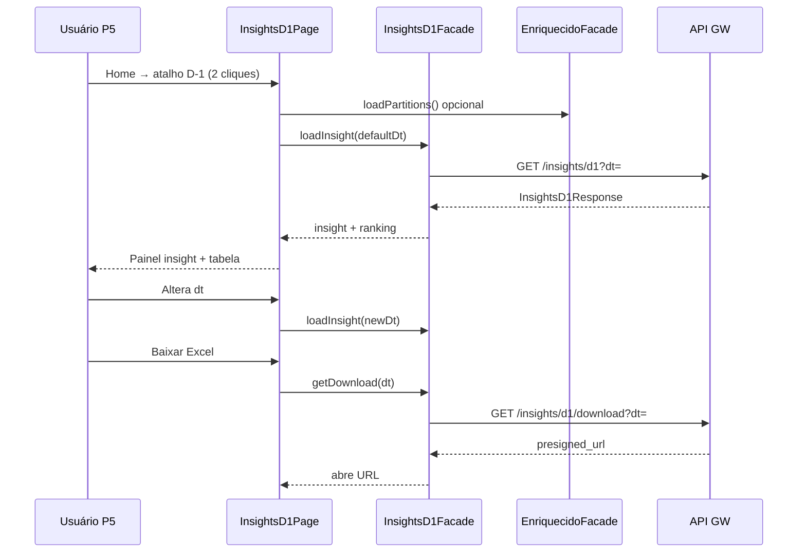
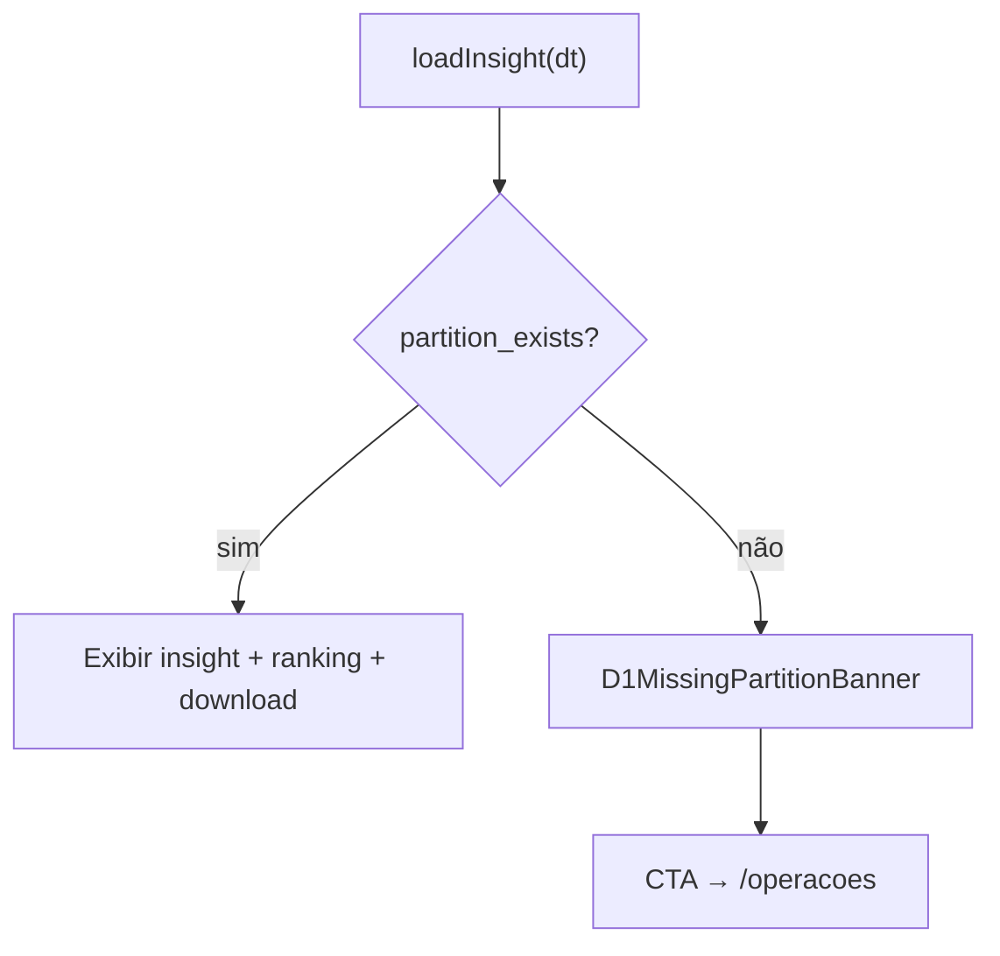

# Functional Design · U8 Portal Web Insights D-1 (E8-US07)

**Story:** E8-US07  
**Persona:** P5 · Diretoria comercial  
**Data:** 2026-06-30

---

## Regras de negócio

### BR-D1-01 · Semântica de datas
- **`dt` (DIA_DADO):** partição enriquecida consultada; é o dia do insight comercial.
- **`data_execucao`:** `dt + 1 dia` (quando a esteira roda). Ex.: dado `2022-01-01` → execução `2022-01-02`.
- Exibir ambos no cabeçalho da página para alinhar com Excel e notebook §3.

### BR-D1-02 · Default ontem (RF-M4-01)
Ao abrir `/insights/d1` sem `?dt=`:
1. Carregar partições enriquecido (via facade enriquecido ou lista embutida no mock D-1).
2. `defaultDt = yesterdayIso(latestPartition)` se existir partição para ontem; senão `latestPartition - 1 dia` se existir; senão primeira partição disponível.
3. Em ambiente mock brownfield: default **`2022-01-01`** (ontem relativo a `latest=2022-01-02`).

### BR-D1-03 · Agregação ranking (RF-M4-02)
Para `dt` com partição existente:
- Grão: `(Product ID, Category)`.
- Métricas: `unidades = sum(Units Sold)`, `receita = sum(_revenue)`.
- Ordenação: `unidades` descendente (desempate por `receita` desc).
- `% Total`: `unidades / total_unidades` formatado como percentual na UI.

### BR-D1-04 · Insight textual (RF-M4-07)
Frase única no painel destacado, paridade Lambda:

> No dado de {dt} (D-1), o produto líder foi {product_id} ({category}) com {unidades} un. Os 3 primeiros concentram {top3_pct:.0f}% das vendas.

- Se `total_unidades === 0`: *"Não há vendas registradas para {dt}."*
- Se ranking vazio mas partição existe: mensagem de vazio (edge case).

### BR-D1-05 · Download Excel (RF-M4-05)
- Botão **"Baixar Excel"** chama `GET /insights/d1/download?dt=`.
- Sucesso: abre `presigned_url` em nova aba (`window.open`, `noopener`).
- Exibir `filename` no tooltip; `expires_in_seconds` não exposto ao usuário.
- Chave S3 esperada: `relatorios/D1/relatorio_D1_exec{data_execucao}_dado{dt}.xlsx`.

### BR-D1-06 · Partição ausente (RF-M4-06)
Se `enriquecido/dt={dt}/` não existe:
- `partition_exists = false`.
- Exibir banner com CTA **"Ir para Operações"** (`/operacoes`).
- Ocultar insight e ranking; download desabilitado.
- **Não** chamar `POST /pipeline/processar-dia` nesta story.

### BR-D1-07 · Fallback mock (BR-D1-07)
Se API indisponível:
- Agregar rows de `enriquecido-mock.data.ts` via `d1-aggregate.util.ts`.
- Banner informativo: *"Exibindo dados de demonstração até o BFF estar disponível."*

### BR-D1-08 · Escopo
D-2, D-3, pipeline SFN, BFF real: **N/A** nesta story.

---

## Modelo de domínio

| Conceito | Atributos |
|----------|-----------|
| `D1InsightView` | `dt`, `data_execucao`, `partition_exists`, `insight_text`, `leader`, `top3_concentration_pct`, `totals`, `ranking` |
| `D1PageState` | `selectedDt`, `insight`, `downloadMeta`, `partitions`, `data_source`, `loading`, `error` |

---

## Fluxo principal

---

## Fluxo partição ausente

---

## Estados da tela

| Estado | UI |
|--------|-----|
| `loading` | Spinner central + "Carregando insight D-1…" |
| `ready` | Seletor + insight + ranking + download |
| `missing_partition` | Banner CTA; seletor ativo |
| `empty_ranking` | Insight de vazio; tabela sem linhas |
| `error` | ApiErrorBanner + retry |
| `mock_banner` | Chip/banner dados demonstração |

---

## Casos de teste

### Unitários

| ID | Cenário | Resultado |
|----|---------|-----------|
| TC-U01 | Aggregate 100 rows mock | `ranking.length` = produtos distintos (~69) |
| TC-U02 | Sort unidades desc | `ranking[0].unidades >= ranking[1].unidades` |
| TC-U03 | top3_concentration_pct | Paridade fórmula Lambda |
| TC-U04 | insight_text | Contém product_id líder e % top 3 |
| TC-U05 | Facade 404 | Mock + `data_source: mock` |
| TC-U06 | report_s3_key | `relatorio_D1_exec2022-01-02_dado2022-01-01.xlsx` |
| TC-U07 | yesterdayIso | `2022-01-02` → `2022-01-01` |

### Manuais (checklist E8-US07)

| ID | Cenário | Resultado |
|----|---------|-----------|
| TC-M01 | Login → Home → D-1 | Dashboard em ≤ 3 cliques |
| TC-M02 | Default dt | Ontem / 2022-01-01 em mock |
| TC-M03 | Ranking | Colunas produto, categoria, unid., receita, % |
| TC-M04 | Insight | Frase líder + top 3 % |
| TC-M05 | dt sem partição | Banner + CTA Operações |
| TC-M06 | Download mock | Snackbar com s3_key; sem URL quebrada |
| TC-M07 | DevTools | GET /insights/d1 com JWT |

---

## Mensagens UI (PT-BR)

| Situação | Mensagem |
|----------|----------|
| Carregando | "Carregando insight D-1…" |
| Mock | "Exibindo dados de demonstração até o BFF estar disponível." |
| Partição ausente | "Não há partição enriquecida para {dt}. Processe o dia para gerar o insight D-1." |
| Download mock | "Download real disponível após BFF (E8-US12). Arquivo: {filename}" |
| Erro download | "Não foi possível obter o link de download. Tente novamente." |
| Título página | "Insight D-1 · Produtos vendidos" |
