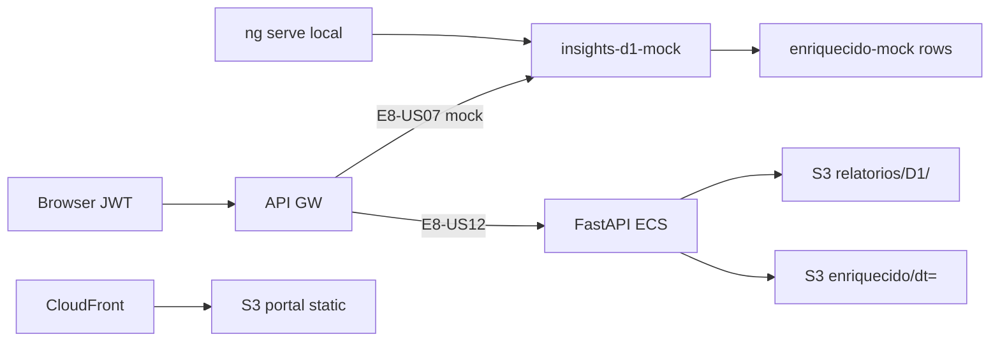

# Infrastructure Design · U8 Portal Web Insights D-1 (E8-US07)

**Story:** E8-US07  
**Data:** 2026-06-30

---

## Escopo infraestrutura

**Nenhum recurso Terraform novo** nesta story. Frontend-only + mock até E8-US12.

| Camada | Alteração |
|--------|-----------|
| **S3** | Leitura futura `relatorios/D1/*.xlsx` via presigned (BFF E8-US12); agregação de `enriquecido/dt=` |
| **Lambda D-1** | Já deployada W5 — `retail-inventory-insights-gerar-relatorio-d1-dev` gera Excel no bucket |
| **API GW** | Rotas `/insights/d1`, `/insights/d1/download` — hoje nginx → mock frontend |
| **CloudFront** | Deploy portal após build (mesmo fluxo E8-US04–06) |
| **Cognito** | Sem mudança — JWT existente |
| **ECS/FastAPI** | E8-US12 implementará RF-API-08, RF-API-11 |

---

## Mapeamento story × infra

| Story | Infra |
|-------|-------|
| **E8-US07** | Frontend + mock + contratos API documentados |
| E8-US12 | BFF: agrega enriquecido Parquet + presigned S3 D1 |
| E5/W5 | Lambda D-1 já grava `relatorios/D1/` |
| E8-US09 | SFN `processar_dia` — CTA stub nesta story |

---

## Validação local

```powershell
.\scripts\w7-us07-validate.ps1
```

Etapas planejadas:
1. `npm ci` em `portal-web/`
2. `npm run build:prod`
3. `npm test` (headless)
4. Checklist manual E8-US07

---

## Deploy dev (opcional pós-story)

```powershell
# Mesmo fluxo E8-US03…06 — build + sync S3 portal + invalidação CloudFront
```

Sem alteração de `terraform/environments/dev/` nesta story.

---

## Diagrama deploy



---

## Dados brownfield referência

| Artefato | Caminho |
|----------|---------|
| Parquet local | `tabela_enriquecida/dt=2022-01-01/data.parquet` |
| Notebook §3 | `Esteira_3Relatorios_D1_D2_D3.ipynb` |
| Lambda D-1 | `lambda/reports/gerar_relatorio_d1.py` |
| Excel exemplo | `relatorios/D1/relatorio_D1_exec2022-01-02_dado2022-01-01.xlsx` |

---

## Extension compliance

| Extension | Aplicável | Notas |
|-----------|-----------|-------|
| Security Baseline | Sim | JWT; presigned TTL ≤ 15 min no BFF |
| Resiliency Baseline | Sim | Fallback mock |
| Property-Based Testing | Sim | `d1-aggregate.util` |
