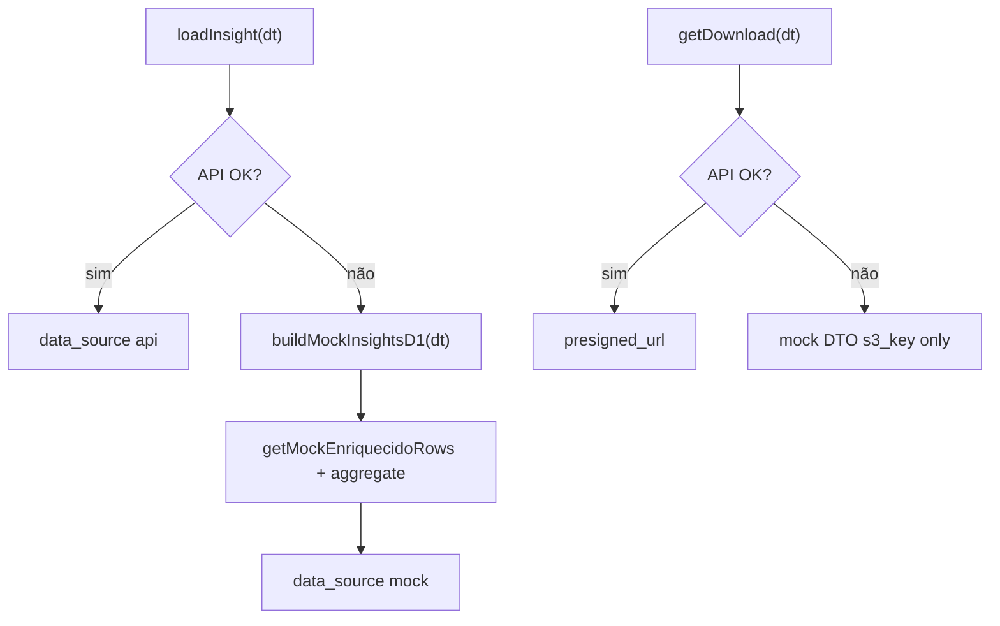

# NFR Design · U8 Portal Web Insights D-1 (E8-US07)

**Data:** 2026-06-30

---

## Agregação pura — implementação

```typescript
// d1-aggregate.util.ts
export interface EnriquecidoRowInput {
  productId: string;
  category: string;
  unitsSold: number;
  revenue: number;
}

export function aggregateD1FromEnriquecidoRows(
  rows: EnriquecidoRowInput[],
  dt: string,
): InsightsD1Response { /* ... */ }

export function buildD1InsightText(
  dt: string,
  leader: D1Leader,
  top3Pct: number,
): string { /* paridade gerar_relatorio_d1.py */ }
```

- Mapear rows mock: `Product ID`, `Category`, `Units Sold`, `_revenue`
- PBT com `fast-check` ou loops determinísticos em spec (mesmo padrão enriquecido)

---

## Ranking table — implementação

```typescript
const RANKING_PAGE_SIZE = 25;
const DISPLAYED_COLUMNS = [
  'product_id',
  'category',
  'unidades',
  'receita',
  'pct_total',
];
```

- `mat-table` + `mat-paginator` PT-BR (reuso `MatPaginatorIntl`)
- Container `.ranking-scroll { overflow-x: auto; max-width: 100%; }`
- `pct_total`: pipe `percent:'1.1-1'` (UI) · valor API 0–1

---

## Insight panel — implementação

- `mat-card` com classe `.d1-insight-panel`
- Ícone `lightbulb` + texto `insight_text` em `font-size: 1.05rem`
- Fundo `LT` equivalente (`#DBEAFE`) alinhado ao Excel brownfield

---

## Download button — implementação

```typescript
async onDownload(): Promise<void> {
  const res = await this.facade.getDownload(this.dt);
  if (res.presigned_url) {
    window.open(res.presigned_url, '_blank', 'noopener,noreferrer');
  } else {
    this.snackBar.open(
      `Download real disponível após BFF (E8-US12). Arquivo: ${res.filename}`,
      'Fechar',
      { duration: 8000 },
    );
  }
}
```

- `mat-stroked-button` + ícone `download`
- Loading state no botão durante request
- Desabilitado quando `!partition_exists`

---

## Date selector — implementação

- `mat-form-field` + `mat-select` com partições conhecidas
- Label: **"Dado D-1"**
- Subtítulo readonly: **"Execução: {data_execucao}"**
- `queryParams` sync: `?dt=` na URL ao mudar seleção

---

## Responsividade

| Breakpoint | Layout |
|------------|--------|
| ≥ 960px | Toolbar horizontal: seletor + execução + download |
| &lt; 960px | Stack: seletor → execução → download full-width |

Grid página: `display: grid; gap: 1rem; min-width: 0;` (sem overflow shell)

---

## InsightsD1FacadeService — resiliência



---

## Compatibilidade módulos existentes

- `DashboardService`, `EnriquecidoFacadeService`, home shortcuts: **sem alteração de contrato**
- `/insights/d2`, `/insights/d3`: placeholders intactos
- `enriquecido-mock.data.ts`: adicionar export `getMockEnriquecidoRows(dt)` (leitura only)

---

## Testes (PBT leve)

| Arquivo | Propriedade |
|---------|-------------|
| `d1-aggregate.util.spec.ts` | soma unidades, sort, top3%, insight text |
| `d1-report-key.util.spec.ts` | formato s3_key |
| `d1-date.util.spec.ts` | data_execucao = dt + 1 |
| `insights-d1-facade.service.spec.ts` | 404 → mock |

---

## Extension compliance (E8-US07)

| Extension | Status |
|-----------|--------|
| Security Baseline | Compliant |
| Resiliency Baseline | Compliant |
| Property-Based Testing | Compliant |
