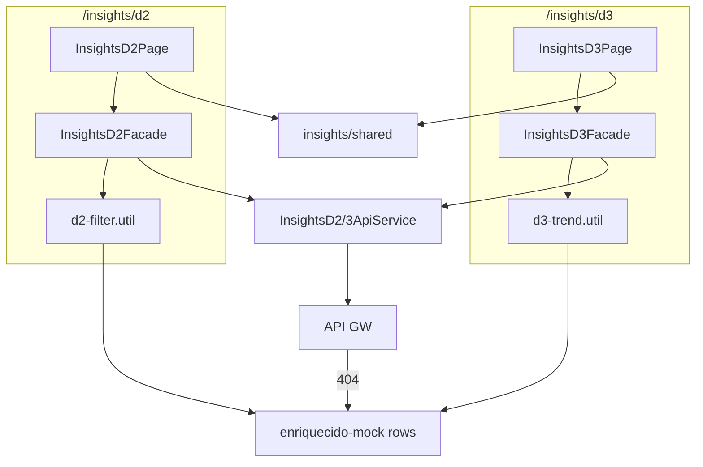

# Application Design · U8 Portal Web Insights D-2 e D-3 (E8-US08)

**Unidade:** U8-Portal-Web  
**Story:** E8-US08 · Dashboards insights D-2 e D-3 (M4)  
**Data:** 2026-06-30  
**Depende:** E8-US07 (D-1) · E8-US06 (enriquecido) · E6/W6 (Lambda D-2/D-3) · E8-US12 (BFF real)

---

## Escopo desta story

Substituir os placeholders `/insights/d2` e `/insights/d3` por dashboards de **ruptura priorizada** (D-2) e **tendência de consumo** (D-3), cada um com insight textual, tabela interativa e download Excel.

**Fora de escopo:** D-1 (E8-US07), pipeline SFN (E8-US09), FastAPI BFF (E8-US12), Athena (E8-US11).

---

## Componentes Angular (novos)

### Páginas

| ID | Componente | Rota | Responsabilidade |
|----|------------|------|------------------|
| AW35 | `InsightsD2PageComponent` | `/insights/d2` | Container D-2: dt, insight, tabela rupturas, download |
| AW36 | `InsightsD3PageComponent` | `/insights/d3` | Container D-3: dt, janela N, insight, tabela tendência, download |

### Tabelas específicas

| ID | Componente | Responsabilidade |
|----|------------|------------------|
| AW37 | `D2RupturasTableComponent` | `mat-table` rupturas ordenada `_lost` desc (RF-M4-03) |
| AW38 | `D3TrendTableComponent` | `mat-table` tendência + chips classificação (RF-M4-04) |
| AW39 | `D3WindowSelectorComponent` | `mat-select` janela N dias (default 7) |

### Compartilhados (extrair de `insights/d1/`)

| ID | Componente | Origem | Responsabilidade |
|----|------------|--------|------------------|
| AW40 | `InsightDateSelectorComponent` | `D1DateSelectorComponent` | Seletor dt + hint execução |
| AW41 | `InsightPanelComponent` | `D1InsightPanelComponent` | Card insight textual (tema configurável) |
| AW42 | `InsightDownloadButtonComponent` | `D1DownloadButtonComponent` | Download genérico via facade injetada |
| AW43 | `InsightMissingPartitionBannerComponent` | `D1MissingPartitionBannerComponent` | Banner CTA Operações (RF-M4-06) |

> **Refactor D-1:** Part 2 move componentes para `features/insights/shared/` e atualiza imports em `insights/d1/` (sem mudança funcional).

### Serviços (novos)

| ID | Serviço | Responsabilidade |
|----|---------|------------------|
| AS12 | `InsightsD2ApiService` | `GET /insights/d2?dt=`, `GET /insights/d2/download?dt=` |
| AS13 | `InsightsD2FacadeService` | API + mock fallback D-2 |
| AS14 | `InsightsD3ApiService` | `GET /insights/d3?dt=&window=`, download |
| AS15 | `InsightsD3FacadeService` | API + mock fallback D-3 (multi-dt window) |

### Utilitários

| ID | Artefato | Responsabilidade |
|----|----------|------------------|
| U11 | `d2-filter.util.ts` | Paridade `filter_rupturas` + `buildD2InsightText` |
| U12 | `d3-trend.util.ts` | Paridade `compute_trends` + `date_range` + `buildD3InsightText` |
| U13 | `d2-report-key.util.ts` | `relatorios/D2/relatorio_D2_exec*_dado*.xlsx` |
| U14 | `d3-report-key.util.ts` | `relatorios/D3/relatorio_D3_exec*_dado*.xlsx` |
| U15 | `insights-d2-mock.data.ts` | Mock D-2 filtrando `getMockEnriquecidoRows(dt)` |
| U16 | `insights-d3-mock.data.ts` | Mock D-3 agregando janela de rows mock |

### Reutilizados (sem quebrar)

`d1-date.util.ts`, `enriquecido-mock.data.ts`, `EnriquecidoFacadeService`, `InsightsD1PageComponent` (após refactor imports), `AppShell`, auth, `ApiErrorBanner`, `MatPaginatorIntl` PT-BR.

---

## Estrutura de pastas alvo

```text
portal-web/src/app/
├── core/api/
│   ├── models/
│   │   ├── insights-d2.model.ts
│   │   └── insights-d3.model.ts
│   ├── insights-d2-api.service.ts
│   ├── insights-d2-facade.service.ts
│   ├── insights-d3-api.service.ts
│   ├── insights-d3-facade.service.ts
│   ├── d2-filter.util.ts
│   ├── d3-trend.util.ts
│   ├── d2-report-key.util.ts
│   ├── d3-report-key.util.ts
│   └── data/
│       ├── insights-d2-mock.data.ts
│       └── insights-d3-mock.data.ts
├── features/insights/
│   ├── shared/
│   │   ├── insight-date-selector.component.ts
│   │   ├── insight-panel.component.ts
│   │   ├── insight-download-button.component.ts
│   │   └── insight-missing-partition-banner.component.ts
│   ├── d1/                    # imports → shared/
│   ├── d2/
│   │   ├── insights-d2-page.component.ts
│   │   └── d2-rupturas-table.component.ts
│   └── d3/
│       ├── insights-d3-page.component.ts
│       ├── d3-trend-table.component.ts
│       └── d3-window-selector.component.ts
└── app.routes.ts              # /insights/d2|d3 → novas páginas
```

---

## Contratos API

### `GET /insights/d2?dt=YYYY-MM-DD` (RF-API-09)

```typescript
interface D2RupturaRow {
  store_id: string;
  product_id: string;
  category: string;
  inventory_level: number;
  units_sold: number;
  demand_forecast: number;
  lost: number;
}

interface D2TopImpact {
  store_id: string;
  product_id: string;
  lost: number;
}

interface InsightsD2Response {
  dt: string;
  data_execucao: string;
  partition_exists: boolean;
  insight_text: string;
  rupturas_count: number;
  total_lost: number;
  top_impact: D2TopImpact | null;
  rows: D2RupturaRow[];
}
```

### `GET /insights/d3?dt=YYYY-MM-DD&window=7` (RF-API-10)

```typescript
type TrendLabel = 'Subindo' | 'Caindo' | 'Estável';

interface D3TrendRow {
  store_id: string;
  product_id: string;
  category: string;
  avg_weekday: number;
  avg_weekend: number;
  trend_pct: number;
  trend_label: TrendLabel;
  dias: number;
}

interface D3TopTrend {
  store_id: string;
  product_id: string;
  trend_pct: number;
  trend_label: TrendLabel;
}

interface InsightsD3Response {
  dt: string;
  data_execucao: string;
  window_days: number;
  partitions_read: number;
  partition_exists: boolean;   // dt final existe
  insight_text: string;
  subindo_count: number;
  caindo_count: number;
  estavel_count: number;
  top_trend: D3TopTrend | null;
  rows: D3TrendRow[];
}
```

### Download (RF-API-11)

```typescript
interface InsightsDownloadResponse {
  presigned_url: string;
  expires_in_seconds: number;  // ≤ 900
  s3_key: string;
  filename: string;
}
```

- D-2: `GET /insights/d2/download?dt=`
- D-3: `GET /insights/d3/download?dt=&window=`

---

## Regras de negócio (paridade Lambda)

### D-2 (`d2-filter.util.ts`)

```typescript
// filter: _stockout === 1 && _lost > 0
// sort: _lost desc
// insight (gerar_relatorio_d2.py):
//   com rupturas: "No dado de {dt}, {n} rupturas... Maior impacto: loja {S}, produto {P} ({lost} un.)"
//   vazio: "No dado de {dt}, nenhuma ruptura com venda perdida."
```

### D-3 (`d3-trend.util.ts`)

```typescript
// date_range(end_dt, window_days) — paridade common.date_range
// load rows de cada dt na janela (skip ausentes no mock)
// por (Store ID, Product ID): avg weekday/weekend Units Sold
// trend_pct: 1ª metade vs 2ª metade dos dias com dados
// label: >5 Subindo, <-5 Caindo, else Estável
// sort: abs(trend_pct) desc
```

---

## Layout wireframes

### D-2

```text
┌────────────────────────────────────────────────────────────────────┐
│ Insight D-2 · Reposição necessária          [Dados demonstração]   │
│ Dado: [2022-01-02 ▼]  Execução: 2022-01-03        [↓ Baixar Excel] │
├────────────────────────────────────────────────────────────────────┤
│ 💡 No dado de 2022-01-02, 3 rupturas com venda perdida...          │
├────────────────────────────────────────────────────────────────────┤
│ Rupturas · 3 linhas · total 42,5 un. perdidas                      │
│ ┌ Loja │ Produto │ Cat. │ Estoque │ Vendido │ Forecast │ Perdida ┐│
│ └──────────────────────────────────────────────────────────────────┘│
└────────────────────────────────────────────────────────────────────┘
```

### D-3

```text
┌────────────────────────────────────────────────────────────────────┐
│ Insight D-3 · Tendência de consumo                                 │
│ Dado: [2022-01-02 ▼]  Janela: [7 dias ▼]  Exec: 2022-01-03 [Excel]│
├────────────────────────────────────────────────────────────────────┤
│ 💡 Janela de 2 dia(s): X em alta, Y em queda (limiar ±5%)...      │
├────────────────────────────────────────────────────────────────────┤
│ ┌ Loja │ Produto │ Cat. │ Méd. úteis │ Méd. FDS │ Tend.% │ Class. ┐│
│ │ S01  │ P033    │ ...  │ 12,0       │ 15,0     │ +8%    │ Subindo││
│ └──────────────────────────────────────────────────────────────────┘│
└────────────────────────────────────────────────────────────────────┘
```

Tema visual: D-2 accent **vermelho** (`#DC2626` / `#FEE2E2`); D-3 accent **verde** (`#059669` / `#D1FAE5`) — alinhado aos Excel Lambdas.

---

## Mock brownfield

| Cenário | Comportamento |
|---------|---------------|
| D-2 `dt=2022-01-02` | ~3 rupturas reais do mock (`index % 33 === 0` + stockout) |
| D-2 `dt=2022-01-01` | 0 rupturas → insight vazio |
| D-2 `dt=2022-01-03` | `partition_exists=false` → banner |
| D-3 `window=7`, `dt=2022-01-02` | Lê `2021-12-27…2022-01-02`; mock só tem 2 dt → `partitions_read=2` |
| D-3 janela opções UI | `[3, 7, 14]` — default **7** |
| Download mock | `presigned_url` vazio + snackbar (padrão E8-US07) |

---

## Rotas

| Path | Antes | Depois |
|------|-------|--------|
| `/insights/d2` | Placeholder | `InsightsD2PageComponent` |
| `/insights/d3` | Placeholder | `InsightsD3PageComponent` |
| `/insights/d1` | `InsightsD1PageComponent` | **Inalterado** |

Query params:
- D-2: `?dt=2022-01-02`
- D-3: `?dt=2022-01-02&window=7`

---

## Decisões técnicas (fechadas)

| Item | Escolha |
|------|---------|
| Shared components | Extrair `features/insights/shared/`; refatorar D-1 imports |
| D-2 default dt | `defaultD1Dt()` (ontem) — reutilizar `d1-date.util.ts` |
| D-3 default dt | Igual D-2; default `window=7` |
| Paginação | `mat-paginator` page_size=25 |
| D-3 chips | `mat-chip` colorido: Subindo=primary, Caindo=warn, Estável=default |
| BFF | Mock até E8-US12 |
| RF-M4-06 | Banner shared; sem POST pipeline |

---

## Rastreabilidade

| Requisito | Implementação |
|-----------|---------------|
| RF-M4-03 | D2RupturasTable + d2-filter.util |
| RF-M4-04 | D3TrendTable + D3WindowSelector + d3-trend.util |
| RF-M4-05 | InsightDownloadButton + download APIs |
| RF-M4-06 | InsightMissingPartitionBanner |
| RF-M4-07 | InsightPanel + buildD2/D3InsightText |
| RF-API-09 | InsightsD2ApiService.getInsight |
| RF-API-10 | InsightsD3ApiService.getInsight |
| RF-API-11 | download D-2/D-3 |

---

## Diagrama


