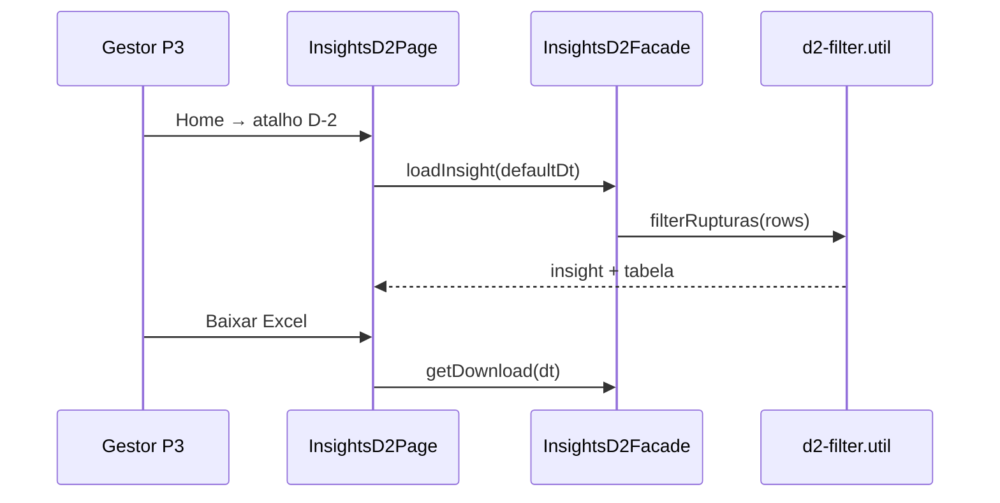
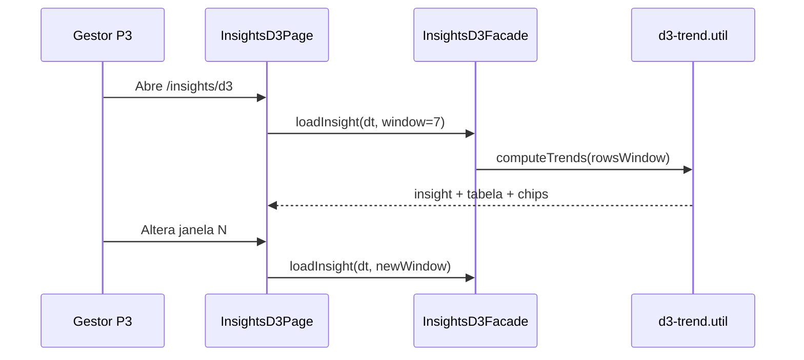

# Functional Design · U8 Portal Web Insights D-2 e D-3 (E8-US08)

**Story:** E8-US08  
**Persona:** P3 · Gestor de compras  
**Data:** 2026-06-30

---

## Regras de negócio

### BR-D2-01 · Filtro de rupturas (RF-M4-03)
Incluir apenas linhas enriquecido onde `_stockout === 1` **e** `_lost > 0`. Ordenar por `_lost` descendente.

### BR-D2-02 · Insight D-2 (RF-M4-07)
- Com rupturas: *"No dado de {dt}, {n} rupturas com venda perdida (total {total} un.). Maior impacto: loja {store}, produto {product} ({lost} un. perdidas)."*
- Sem rupturas: *"No dado de {dt}, nenhuma ruptura com venda perdida."*

### BR-D2-03 · Partição ausente
Se `enriquecido/dt={dt}/` não existe → `partition_exists=false`, banner CTA, tabela oculta.

### BR-D3-01 · Janela N (RF-M4-04)
Parâmetro `window` (dias), default **7**. Intervalo: `[dt - (N-1), dt]` inclusive (`date_range`).

### BR-D3-02 · Tendência por par loja×produto
Para cada `(Store ID, Product ID)` na janela:
- `avg_weekday`: média `Units Sold` onde `_is_weekend === 0`
- `avg_weekend`: média onde `_is_weekend === 1`
- `trend_pct`: compara soma 1ª metade vs 2ª metade dos dias com dados
- `trend_label`: `> +5` → Subindo; `< -5` → Caindo; senão Estável
- Ordenar por `|trend_pct|` desc

### BR-D3-03 · Insight D-3 (RF-M4-07)
*"Janela de {partitions_read} dia(s): {subindo} pares loja×produto em alta, {caindo} em queda (limiar ±5%). Maior variação: {store}/{product} ({pct:+.1f}%, {label})."*

### BR-D3-04 · Partições parciais na janela
Partições ausentes na janela são ignoradas (paridade Lambda `load_window_tables`). `partitions_read` = dt distintos efetivamente carregados. Se nenhuma → erro amigável.

### BR-D2/D3-05 · Download Excel (RF-M4-05)
Botão chama download API; abre presigned URL ou snackbar mock.

### BR-D2/D3-06 · Fallback mock
API indisponível → agregar `getMockEnriquecidoRows` + banner demonstração.

### BR-D2/D3-07 · Escopo
Pipeline SFN, BFF real, D-1: **N/A**.

---

## Fluxo D-2

---

## Fluxo D-3

---

## Estados da tela

| Estado | D-2 UI | D-3 UI |
|--------|--------|--------|
| `loading` | Spinner | Spinner |
| `ready` | Insight + tabela | Insight + tabela + chips |
| `empty_rupturas` | Insight "nenhuma ruptura" | — |
| `missing_partition` | Banner CTA | Banner CTA |
| `no_window_data` | — | Erro "Nenhuma partição na janela" |
| `error` | ApiErrorBanner | ApiErrorBanner |
| `mock` | Chip demonstração | Chip demonstração |

---

## Casos de teste

### Unitários

| ID | Cenário | Resultado |
|----|---------|-----------|
| TC-U01 | filterRupturas mock 2022-01-02 | `rows` ordenado `_lost` desc |
| TC-U02 | filterRupturas 2022-01-01 | `rupturas_count === 0` |
| TC-U03 | computeTrends 2 dt mock | `partitions_read === 2` |
| TC-U04 | trend label +8% | Subindo |
| TC-U05 | trend label -6% | Caindo |
| TC-U06 | D2 facade 404 | mock + data_source mock |
| TC-U07 | D3 facade window=7 | rows.length > 0 |
| TC-U08 | report keys D2/D3 | formato `relatorio_D2_exec*_dado*` |

### Manuais (checklist E8-US08)

| ID | Cenário | Resultado |
|----|---------|-----------|
| TC-M01 | Login → D-2 | Rupturas dt=2022-01-02 |
| TC-M02 | D-2 dt=2022-01-01 | Insight sem rupturas |
| TC-M03 | Login → D-3 | Tabela tendência + janela |
| TC-M04 | Alterar janela N | Recarrega dados |
| TC-M05 | Download D-2/D-3 mock | Snackbar filename |
| TC-M06 | /insights/d1 regressão | Inalterado |
| TC-M07 | DevTools | GET d2/d3 com JWT |

---

## Mensagens UI (PT-BR)

| Situação | Mensagem |
|----------|----------|
| Carregando D-2 | "Carregando insight D-2…" |
| Carregando D-3 | "Carregando tendência D-3…" |
| Mock | "Exibindo dados de demonstração até o BFF estar disponível." |
| Janela vazia | "Nenhuma partição enriquecida encontrada na janela selecionada." |
| Títulos | "Insight D-2 · Reposição necessária" / "Insight D-3 · Tendência de consumo" |
