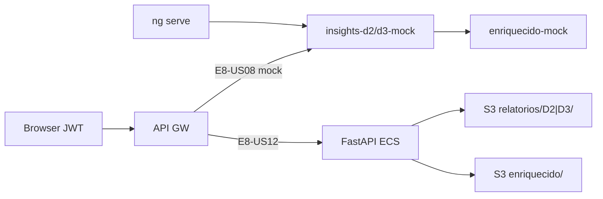

# Infrastructure Design · U8 Portal Web Insights D-2 e D-3 (E8-US08)

**Story:** E8-US08  
**Data:** 2026-06-30

---

## Escopo infraestrutura

**Nenhum recurso Terraform novo** nesta story. Frontend-only + mock até E8-US12.

| Camada | Alteração |
|--------|-----------|
| **S3** | Leitura futura `enriquecido/dt=*/` + presigned `relatorios/D2|D3/` |
| **Lambda D-2/D-3** | Já deployadas W6 — `gerar-relatorio-d2-dev`, `gerar-relatorio-d3-dev` |
| **API GW** | Rotas `/insights/d2`, `/insights/d3` — hoje nginx → mock frontend |
| **CloudFront** | Deploy portal após build (mesmo fluxo E8-US07) |
| **Cognito** | Sem mudança |

---

## Mapeamento story × infra

| Story | Infra |
|-------|-------|
| **E8-US08** | Frontend D-2/D-3 + mock + contratos API |
| E8-US12 | BFF FastAPI RF-API-09, RF-API-10, RF-API-11 |
| E6/W6 | Lambdas geram Excel em `relatorios/D2/`, `relatorios/D3/` |

---

## Validação local

```powershell
.\scripts\w7-us08-validate.ps1
```

Etapas:
1. `npm ci` em `portal-web/`
2. `npm run build:prod`
3. `npm test` (headless)
4. Checklist manual E8-US08

---

## Deploy dev (opcional pós-story)

Mesmo fluxo E8-US03…07 — build + sync S3 portal + invalidação CloudFront.

---

## Diagrama deploy



---

## Dados brownfield referência

| Artefato | Caminho |
|----------|---------|
| Lambda D-2 | `lambda/reports/gerar_relatorio_d2.py` |
| Lambda D-3 | `lambda/reports/gerar_relatorio_d3.py` |
| date_range | `lambda/reports/common.py` |
| Mock enriquecido | `enriquecido-mock.data.ts` — dt 2022-01-01, 2022-01-02 |

---

## Extension compliance

| Extension | Aplicável | Notas |
|-----------|-----------|-------|
| Security Baseline | Sim | JWT, presigned TTL |
| Resiliency Baseline | Sim | Fallback mock |
| Property-Based Testing | Sim | d2-filter, d3-trend specs |
