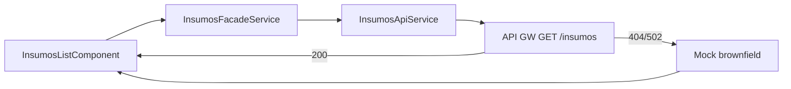

# Application Design · U8 Portal Web Insumos (E8-US04)

**Unidade:** U8-Portal-Web  
**Story:** E8-US04 · Listar insumos (M1)  
**Data:** 2026-06-30  
**Depende:** E8-US03 (shell) · E8-US01 (infra) · E8-US12 (BFF real — futuro)

---

## Escopo desta story

Substituir o placeholder `/insumos` por tela funcional que **lista objetos** no prefixo S3 `insumo/` (nome, tamanho, última modificação).

**Fora de escopo:** upload CSV (RF-M1-02..05), validação schema, preview, histórico — fase 2.

---

## Componentes Angular (novos / alterados)

| ID | Componente | Responsabilidade |
|----|------------|------------------|
| AW15 | `InsumosListComponent` | Página `/insumos`: carrega lista, exibe tabela Material, estados UI |
| AW16 | `InsumosTableComponent` | `mat-table` reutilizável (colunas Nome, Tamanho, Última modificação) |
| AW17 | `InsumosEmptyStateComponent` | Mensagem quando bucket/prefixo vazio |
| AW18 | `UploadPhase2NoticeComponent` | Banner informativo: upload via CLI/S3 (fase 2) |

### Serviços

| ID | Serviço | Responsabilidade |
|----|---------|------------------|
| AS5 | `InsumosApiService` | `GET /insumos` (JWT) |
| AS6 | `InsumosFacadeService` | Orquestra API + mock fallback; expõe `data_source` |

### Pipes / utilitários

| ID | Artefato | Responsabilidade |
|----|----------|------------------|
| P1 | `fileSizePipe` | Formata `size_bytes` → `"1,2 MB"`, `"450 KB"` (PT-BR) |
| U1 | `insumos-sort.util.ts` | Ordenação default `last_modified` desc |

### Mantidos

`AppShellComponent`, `authGuard`, `authInterceptor`, `ApiErrorService`, `ApiErrorBannerComponent`.

---

## Estrutura de pastas alvo

```text
portal-web/src/app/
├── core/api/
│   ├── models/
│   │   └── insumo.model.ts          # novo
│   ├── insumos-api.service.ts       # novo
│   └── insumos-facade.service.ts    # novo
├── features/insumos/
│   ├── insumos-list.component.ts
│   ├── insumos-table.component.ts
│   ├── insumos-empty-state.component.ts
│   └── upload-phase2-notice.component.ts
├── shared/pipes/
│   └── file-size.pipe.ts
└── app.routes.ts                    # /insumos → InsumosListComponent
```

---

## Contrato API (RF-API-02)

### Request

```http
GET /insumos
Authorization: Bearer {access_token}
```

### Response 200

```typescript
interface InsumosListResponse {
  items: InsumoItem[];
  prefix?: string;  // "insumo/"
}

interface InsumoItem {
  key: string;           // "insumo/retail_store_inventory.csv"
  name: string;          // "retail_store_inventory.csv"
  size_bytes: number;
  last_modified: string; // ISO 8601 UTC
}
```

### Erros esperados (até E8-US12)

| Status | Causa provável | Ação frontend |
|--------|----------------|---------------|
| 404 | BFF não implementado | Fallback mock |
| 502 | nginx placeholder | Fallback mock |
| 401 | Sessão expirada | Logout + mensagem PT-BR |
| 0 | Timeout/rede | Mensagem + retry |

---

## Mock brownfield (dev)

Quando `GET /insumos` falhar:

```typescript
const MOCK_INSUMOS: InsumosListResponse = {
  prefix: 'insumo/',
  items: [{
    key: 'insumo/retail_store_inventory.csv',
    name: 'retail_store_inventory.csv',
    size_bytes: 0, // preenchido em runtime se possível; senão placeholder ~2MB
    last_modified: '2022-01-01T00:00:00Z',
  }],
};
```

UI exibe chip **"Dados de demonstração"** quando `data_source === 'mock'`.

---

## Tela — wireframe lógico

```text
┌─────────────────────────────────────────────────────────┐
│ Insumos                                                 │
│ ℹ Upload via CLI/S3 — disponível na fase 2              │
├─────────────────────────────────────────────────────────┤
│ Nome                          │ Tamanho │ Modificação   │
│ retail_store_inventory.csv    │ 2,1 MB  │ 01/01/2022    │
└─────────────────────────────────────────────────────────┘
```

- `mat-table` + `matSort` (default: `last_modified` desc)
- Spinner durante loading
- Empty state: *"Nenhum arquivo encontrado em insumo/."*

---

## Rotas (alteração)

| Path | Antes | Depois |
|------|-------|--------|
| `/insumos` | `PlaceholderPageComponent` | `InsumosListComponent` |

Shell nav **Insumos** permanece inalterado (`shell-nav.config.ts`).

---

## Decisões técnicas (fechadas)

| Item | Escolha |
|------|---------|
| Tabela | Angular Material `MatTableModule` + `MatSortModule` |
| Estado | Signals (`loading`, `items`, `error`, `data_source`) |
| Datas | `DatePipe` locale `pt-BR` |
| Tamanho | `fileSizePipe` custom (base 1024) |
| BFF | **Não** implementar FastAPI nesta story — mock até E8-US12 |
| Upload | Apenas notice estático; sem botão |

---

## Rastreabilidade

| Requisito | Implementação |
|-----------|---------------|
| RF-M1-01 | Lista S3 `insumo/` via API ou mock |
| RF-API-02 | `InsumosApiService.getInsumos()` |
| RF-M1-02..05 | Fora de escopo — notice fase 2 |

---

## Diagrama de fluxo de dados


