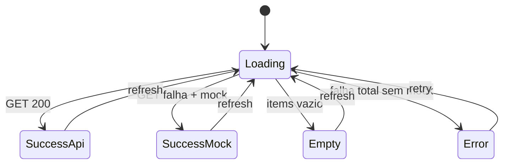

# Functional Design · U8 Portal Web Insumos (E8-US04)

**Story:** E8-US04  
**Persona:** P2 · Engenheiro de dados  
**Data:** 2026-06-30

---

## Regras de negócio

### BR-INS-01 · Listagem somente leitura
A tela exibe objetos existentes em `s3://{bucket}/insumo/`. **Nenhuma** ação de escrita (upload/delete) nesta story.

### BR-INS-02 · Colunas obrigatórias
Cada linha da tabela deve exibir:

| Coluna UI | Campo API | Formato PT-BR |
|-----------|-----------|---------------|
| Nome | `name` | Nome do arquivo (basename) |
| Tamanho | `size_bytes` | `fileSizePipe` (B, KB, MB, GB) |
| Última modificação | `last_modified` | `dd/MM/yyyy HH:mm` (timezone local) |

### BR-INS-03 · Ordenação default
Lista ordenada por `last_modified` **descendente** (mais recente primeiro). Usuário pode reordenar via cabeçalhos da tabela.

### BR-INS-04 · Upload fora de escopo
Exibir notice no topo:

> *"Upload de CSV pelo portal estará disponível na fase 2. Use AWS CLI ou console S3 para enviar arquivos a `insumo/`."*

Sem botão de upload.

### BR-INS-05 · Fallback mock
Se `GET /insumos` indisponível (BFF E8-US12 pendente), exibir mock com `retail_store_inventory.csv` e chip *"Dados de demonstração"* — **não** bloquear a tela.

### BR-INS-06 · Autenticação
Rota `/insumos` protegida por `authGuard` (herda shell). Requisição API inclui JWT via interceptor.

---

## Modelo de domínio

| Conceito | Atributos | Notas |
|----------|-----------|-------|
| `InsumoItem` | `key`, `name`, `size_bytes`, `last_modified` | Uma linha da tabela |
| `InsumosListResult` | `items`, `data_source`, `loaded_at` | Agregado na UI |
| `DataSource` | `'api' \| 'mock'` | Indica origem dos dados |

---

## Estados da tela

| Estado | UI |
|--------|-----|
| `loading` | `mat-progress-bar` indeterminado + skeleton opcional |
| `success` | Tabela + contagem `"N arquivo(s)"` |
| `empty` | `InsumosEmptyStateComponent` |
| `error` | `ApiErrorBanner` + botão "Tentar novamente" |

---

## Casos de teste

### Unitários

| ID | Cenário | Resultado |
|----|---------|-----------|
| TC-U01 | `InsumosFacadeService` API 404 | Retorna mock + `data_source: mock` |
| TC-U02 | `fileSizePipe` 1048576 | `"1,0 MB"` ou equivalente PT-BR |
| TC-U03 | Sort util desc | Item mais recente primeiro |
| TC-U04 | Lista vazia API 200 | `items.length === 0` → empty state |

### Manuais (checklist E8-US04)

| ID | Cenário | Resultado esperado |
|----|---------|-------------------|
| TC-M01 | Login → menu Insumos | Tabela visível |
| TC-M02 | Colunas | Nome, Tamanho, Última modificação preenchidas |
| TC-M03 | Ordenação | Default mais recente no topo |
| TC-M04 | Notice fase 2 | Texto upload CLI/S3 visível; sem botão upload |
| TC-M05 | Mock ativo | Chip "Dados de demonstração" |
| TC-M06 | DevTools | `GET /insumos` com header Authorization |

---

## Mensagens UI (PT-BR)

| Situação | Mensagem |
|----------|----------|
| Carregando | "Carregando insumos…" |
| Vazio | "Nenhum arquivo encontrado em insumo/." |
| Mock | "Exibindo dados de demonstração até o BFF estar disponível." |
| Erro rede | (via `ApiErrorService`) |
| Contagem | "{n} arquivo(s) em insumo/" |
