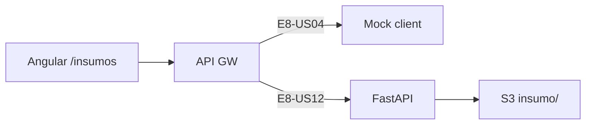

# Infrastructure Design · U8 Portal Web Insumos (E8-US04)

**Story:** E8-US04  
**Data:** 2026-06-30

---

## Infraestrutura AWS

**Sem novo Terraform** nesta story.

| Recurso | Uso E8-US04 |
|---------|-------------|
| S3 datamesh `retail-inventory-insights-dev-use1` | Prefixo `insumo/` — fonte real quando BFF existir |
| API Gateway | Rota `GET /insumos` — implementada em E8-US12 |
| ECS Fargate | BFF FastAPI substituirá nginx |
| CloudFront + S3 portal-web | Deploy SPA (inalterado) |

---

## Estratégia BFF (E8-US04 vs E8-US12)

| Abordagem | E8-US04 | E8-US12 |
|-----------|---------|---------|
| Frontend Angular | ✅ Implementar | Mantém |
| `GET /insumos` FastAPI | ❌ Não nesta story | ✅ boto3 `list_objects_v2` |
| Dados em dev | Mock fallback | API real S3 |

**Decisão:** E8-US04 entrega **frontend + contrato API + mock**. E8-US12 implementa endpoint com task role S3 read em `insumo/*`.

---

## Deploy frontend

Mesmo pipeline:

```powershell
.\scripts\w7-deploy-portal-web.ps1
```

---

## Validação

### Novo script: `scripts/w7-us04-validate.ps1`

1. `npm ci` (retry limpeza `node_modules`)
2. `npm run build:prod`
3. `npm test`
4. Checklist manual E8-US04

### Checklist manual

```text
[ ] ng serve → login → Insumos no menu
[ ] Tabela com Nome, Tamanho, Última modificação
[ ] Notice upload fase 2 (sem botão upload)
[ ] Ordenação default mais recente primeiro
[ ] DevTools: GET /insumos com Authorization (404 OK → mock)
[ ] (Opcional) deploy CloudFront
```

---

## Contrato BFF futuro (referência E8-US12)

```python
# portal-api/ — E8-US12
@router.get("/insumos")
def list_insumos(user=Depends(jwt_user)):
    # s3.list_objects_v2(Bucket=BUCKET, Prefix="insumo/")
    return {"items": [...], "prefix": "insumo/"}
```

Task role ECS (E8-US01) já inclui permissão S3 read no bucket datamesh.

---

## Diagrama


