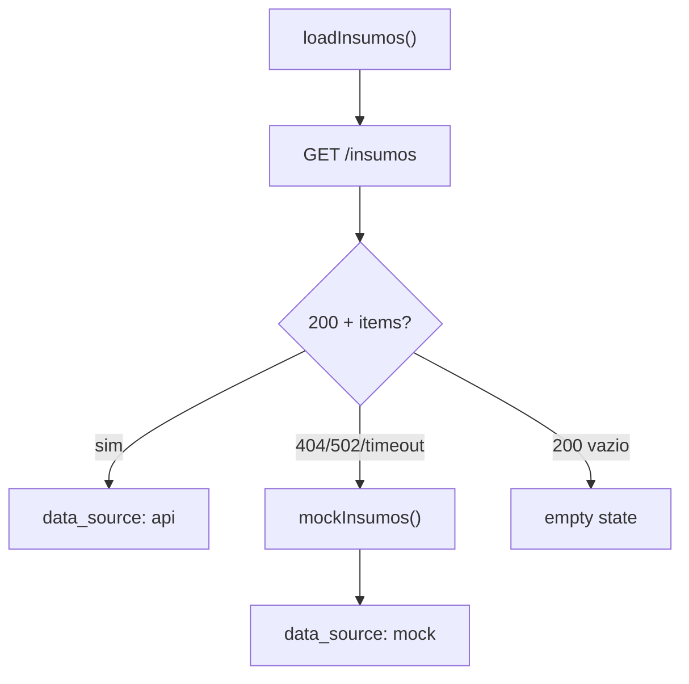

# NFR Design · U8 Portal Web Insumos (E8-US04)

**Data:** 2026-06-30

---

## Formatação PT-BR

### `fileSizePipe`

```typescript
// Base 1024; locale pt-BR
0 → "0 B"
1536 → "1,5 KB"
1048576 → "1,0 MB"
```

### Datas

```html
{{ item.last_modified | date:'dd/MM/yyyy HH:mm':'':'pt-BR' }}
```

Registrar locale `pt-BR` em `app.config.ts` se ainda não presente (`registerLocaleData`).

---

## Tabela Material

```typescript
displayedColumns = ['name', 'size_bytes', 'last_modified'];
dataSource = new MatTableDataSource<InsumoItem>(items);
// matSortActive="last_modified" matSortDirection="desc"
```

| Coluna | `mat-sort-header` | Alinhamento |
|--------|-------------------|-------------|
| name | sim | left |
| size_bytes | sim | right |
| last_modified | sim | right |

---

## Resiliência — `InsumosFacadeService`



| Cenário | Comportamento |
|---------|---------------|
| 404 nginx | Mock + banner info |
| 401 | AuthService logout flow |
| 200 items=[] | Empty state (sem mock) |
| Rede offline | Erro + retry |

---

## HTTP timeout

Reutilizar padrão global ou `HttpContext` timeout 30s na chamada `InsumosApiService` (alinhado NFR-W7-03).

---

## Testes (PBT leve)

| Arquivo | Propriedade |
|---------|-------------|
| `file-size.pipe.spec.ts` | bytes ≥ 0 → string match `/\\d.*(B|KB|MB|GB)/` |
| `insumos-facade.service.spec.ts` | 404 → mock com retail_store_inventory.csv |
| `insumos-sort.util.spec.ts` | ordem desc por ISO date |

---

## Extension compliance (E8-US04)

| Extension | Status |
|-----------|--------|
| Security Baseline | Compliant — JWT, no secrets, auth guard |
| Resiliency Baseline | Compliant — mock fallback, retry, timeout |
| Property-Based Testing | Compliant — 3 unit specs |
