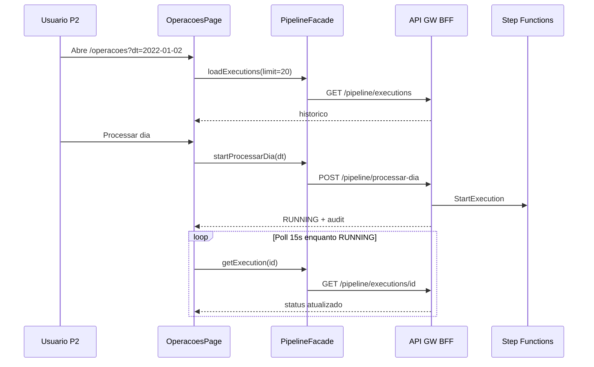

# Application Design · U8 Portal Web Operações Pipeline (E8-US09)

**Unidade:** U8-Portal-Web  
**Story:** E8-US09 · Disparar pipeline e acompanhar execução (M5)  
**Data:** 2026-06-30  
**Depende:** E8-US05 (origem) · E4 (SFN) · E8-US08 (insights + banner CTA) · E8-US12 (BFF real)

---

## Escopo desta story

Substituir o placeholder `/operacoes` por uma página **Operações** que permite **disparar** a Step Function `processar_dia` para um `dt`, **acompanhar** o status da execução (RUNNING / SUCCEEDED / FAILED) e consultar o **histórico** das últimas 20 execuções — sem depender do script `reprocessar-dia-dev.ps1`.

Integrar o CTA dos banners de partição ausente (insights D-1/D-2/D-3) com deep-link `/operacoes?dt=`.

**Fora de escopo:** alarmes CloudWatch na UI (E8-US10), FastAPI BFF deploy (E8-US12), Athena (E8-US11), alterações Terraform/SFN/Glue.

---

## Componentes Angular (novos)

### Página

| ID | Componente | Rota | Responsabilidade |
|----|------------|------|------------------|
| AW44 | `OperacoesPageComponent` | `/operacoes` | Container M5: seletor dt, disparo, status ativo, histórico |

### Filhos da página

| ID | Componente | Responsabilidade |
|----|------------|------------------|
| AW45 | `PipelineDtSelectorComponent` | Seletor `dt` (mat-datepicker ou select + input ISO); lê `?dt=` da query |
| AW46 | `PipelineTriggerPanelComponent` | Botão "Processar dia", confirmação, estado loading do POST |
| AW47 | `PipelineActiveExecutionComponent` | Card execução em andamento ou última disparada; spinner RUNNING |
| AW48 | `PipelineExecutionsTableComponent` | `mat-table` histórico 20 linhas + chips status |

### Alterações em componentes existentes

| ID | Componente | Alteração |
|----|------------|-----------|
| AW43 | `InsightMissingPartitionBannerComponent` | `routerLink="/operacoes"` com `[queryParams]="{ dt: dt() }"`; remover tooltip E8-US09 |

### Serviços (novos)

| ID | Serviço | Responsabilidade |
|----|---------|------------------|
| AS16 | `PipelineApiService` | `POST /pipeline/processar-dia`, `GET /pipeline/executions`, `GET /pipeline/executions/{id}` |
| AS17 | `PipelineFacadeService` | API + mock fallback; orquestra polling |

### Utilitários e mock

| ID | Artefato | Responsabilidade |
|----|----------|------------------|
| U17 | `pipeline-date.util.ts` | `normalizePipelineDt`, validação ISO, `defaultPipelineDt` |
| U18 | `pipeline-duration.util.ts` | `computeDurationSeconds(started, stopped)` |
| U19 | `pipeline-console-url.util.ts` | URL console AWS SFN a partir de `execution_arn` |
| U20 | `pipeline-execution-mock.store.ts` | Estado in-memory mock (execuções simuladas, transição RUNNING→SUCCEEDED) |
| U21 | `pipeline-mock.data.ts` | Seeds iniciais + builders de resposta mock |

### Reutilizados (sem quebrar)

`AuthService`, `authInterceptor`, `EnriquecidoFacadeService` (lista partições para sugestão de dt), `ApiErrorBannerComponent`, `AppShell`, `MatPaginatorIntl` PT-BR, padrão chip "Dados de demonstração".

---

## Estrutura de pastas alvo

```text
portal-web/src/app/
├── core/api/
│   ├── models/
│   │   └── pipeline.model.ts
│   ├── pipeline-api.service.ts
│   ├── pipeline-facade.service.ts
│   ├── pipeline-date.util.ts
│   ├── pipeline-duration.util.ts
│   ├── pipeline-console-url.util.ts
│   └── data/
│       ├── pipeline-mock.data.ts
│       └── pipeline-execution-mock.store.ts
├── features/operacoes/
│   ├── operacoes-page.component.ts
│   ├── pipeline-dt-selector.component.ts
│   ├── pipeline-trigger-panel.component.ts
│   ├── pipeline-active-execution.component.ts
│   └── pipeline-executions-table.component.ts
└── app.routes.ts                 # /operacoes → OperacoesPageComponent
```

---

## Contratos API

### `POST /pipeline/processar-dia` (RF-API-12, JWT)

**Request:**

```typescript
interface ProcessarDiaRequest {
  dt: string; // YYYY-MM-DD
}
```

**Response 202/200:**

```typescript
type PipelineExecutionStatus = 'RUNNING' | 'SUCCEEDED' | 'FAILED' | 'TIMED_OUT' | 'ABORTED';

interface PipelineAuditEntry {
  sub: string;
  email?: string;
  timestamp: string; // ISO 8601 UTC
}

interface ProcessarDiaResponse {
  execution_arn: string;
  execution_id: string;
  dt: string;
  status: PipelineExecutionStatus;
  started_at: string;
  audit: PipelineAuditEntry;
}
```

**Erros:** 400 (dt inválido), 401, 409 (opcional — política BFF futura), 502 (SFN indisponível).

---

### `GET /pipeline/executions?limit=20` (RF-API-13, JWT)

**Response:**

```typescript
interface PipelineExecutionSummary {
  execution_id: string;
  execution_arn: string;
  dt: string;
  status: PipelineExecutionStatus;
  started_at: string;
  stopped_at: string | null;
  duration_seconds: number | null;
  audit?: PipelineAuditEntry;
}

interface PipelineExecutionsListResponse {
  executions: PipelineExecutionSummary[];
  limit: number;
}
```

Ordenação: `started_at` descendente.

---

### `GET /pipeline/executions/{execution_id}` (polling RF-M5-02)

**Response:** mesmo shape que `PipelineExecutionSummary` (item único).

> Endpoint recomendado para polling leve sem re-listar 20 itens. Se BFF E8-US12 expuser apenas list, facade pode filtrar por id no mock.

---

## Integração brownfield SFN

| Atributo | Valor |
|----------|-------|
| State machine | `retail-inventory-insights-processar-dia-dev` |
| Região | `us-east-1` |
| Input | `{"dt":"YYYY-MM-DD"}` |
| ARN (dev) | `arn:aws:states:us-east-1:303238378103:stateMachine:retail-inventory-insights-processar-dia-dev` |

BFF futuro (E8-US12): `states:StartExecution` + `DescribeExecution` / `ListExecutions` com task role ECS.

---

## Fluxo de dados (página)



---

## Estados da UI

| Estado | Comportamento |
|--------|----------------|
| `loading` | Spinner inicial ao carregar histórico |
| `idle` | Histórico visível; nenhuma execução ativa na página |
| `triggering` | POST em andamento; botão desabilitado |
| `polling` | Execução RUNNING; auto-refresh 15s |
| `terminal` | SUCCEEDED/FAILED; atualiza linha no histórico |
| `mock` | Chip demonstração; store in-memory |

---

## Query params

| Param | Uso |
|-------|-----|
| `dt` | Pré-seleciona data ao abrir via banner insights ou origem |

---

## Rastreabilidade

| Requisito | Artefato |
|-----------|----------|
| RF-M5-01 | `PipelineTriggerPanel` + POST |
| RF-M5-02 | `PipelineActiveExecution` + polling |
| RF-M5-03 | `PipelineExecutionsTable` limit 20 |
| RF-M6-04 | `audit` em POST response |
| RF-M2-05 / RF-M4-06 | Banner deep-link `?dt=` |
| RF-API-12 | `PipelineApiService.startProcessarDia` |
| RF-API-13 | `PipelineApiService.listExecutions` |

---

## Regressão

| Módulo | Expectativa |
|--------|-------------|
| Insights D-1/D-2/D-3 | Inalterado exceto banner queryParams |
| Home / origem / enriquecido | Sem mudança funcional |
| `/health` badge home | Inalterado (E8-US10) |
