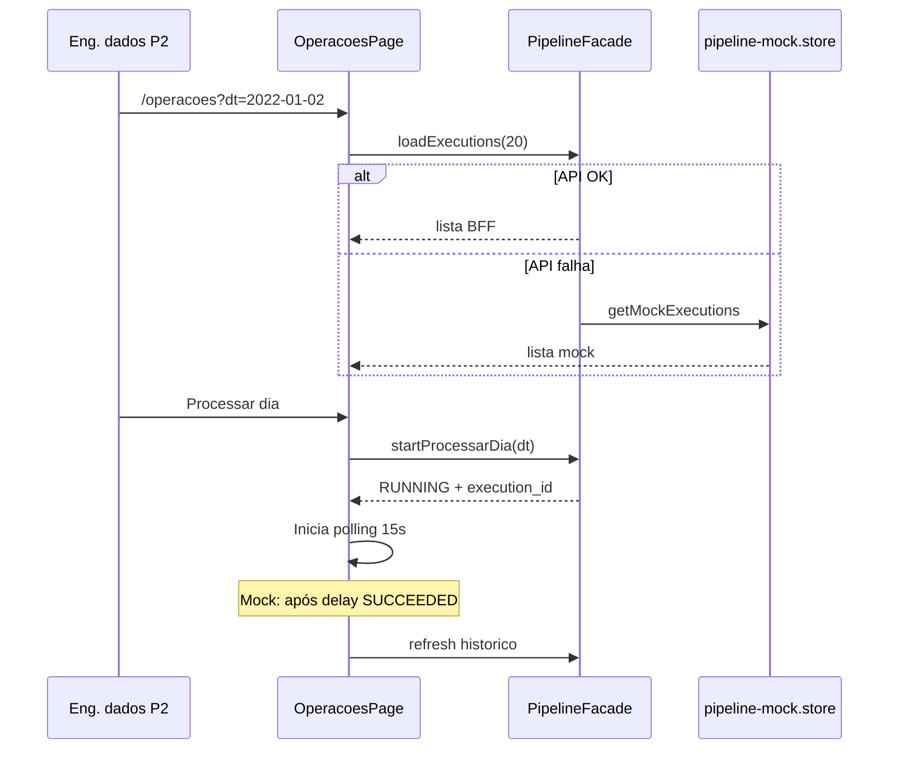

# Functional Design · U8 Portal Web Operações Pipeline (E8-US09)

**Story:** E8-US09  
**Persona:** P2 · Engenheiro de dados  
**Data:** 2026-06-30

---

## Regras de negócio

### BR-OPS-01 · Disparo pipeline (RF-M5-01)
- Usuário autenticado seleciona `dt` formato `YYYY-MM-DD` e aciona **Processar dia**.
- BFF chama `StartExecution` na SFN `retail-inventory-insights-processar-dia-dev` com input `{"dt":"<dt>"}`.
- Nova execução é permitida mesmo se já existir execução anterior para o mesmo `dt` (idempotência operacional — múltiplas executions).

### BR-OPS-02 · Validação de dt
- Rejeitar dt vazio, formato inválido ou data futura (opcional: alertar se dt > hoje).
- Normalizar para `YYYY-MM-DD` antes do POST.

### BR-OPS-03 · Status execução (RF-M5-02)
- Estados exibidos: **RUNNING**, **SUCCEEDED**, **FAILED** (mapear TIMED_OUT/ABORTED → FAILED na UI).
- Enquanto RUNNING na página: polling a cada **15s** via `GET /pipeline/executions/{id}`.
- Parar polling ao navegar fora da rota ou ao atingir estado terminal.

### BR-OPS-04 · Histórico (RF-M5-03)
- Listar até **20** execuções mais recentes.
- Colunas: dt, status, início, fim, duração (segundos ou `—` se RUNNING).
- Ordenação: `started_at` desc.

### BR-OPS-05 · Duração
- `duration_seconds = stopped_at - started_at` em segundos inteiros quando terminal.
- `null` enquanto RUNNING.

### BR-OPS-06 · Auditoria (RF-M6-04)
- Resposta do POST inclui `audit: { sub, timestamp }` extraído do JWT Cognito no BFF.
- Mock: `sub` de `identityClaims['sub']` ou placeholder `mock-user`; `timestamp` = `new Date().toISOString()`.

### BR-OPS-07 · Deep-link insights (RF-M4-06 / RF-M2-05)
- Banner partição ausente: link `/operacoes?dt={dt}` pré-preenche seletor.
- Texto do banner permanece; remover tooltip "E8-US09".

### BR-OPS-08 · Confirmação UX
- Se já existir execução **RUNNING** (qualquer dt): diálogo de confirmação antes de novo disparo (evitar sobrecarga acidental).

### BR-OPS-09 · Link console AWS
- Para execuções com `execution_arn`, link "Ver no console" abre SFN execution details (nova aba).

### BR-OPS-10 · Fallback mock
- Falha API (404/502/timeout) → mock in-memory com histórico seed + simulação RUNNING→SUCCEEDED após ~30s no mock store.
- Banner info: *"Exibindo dados de demonstração até o BFF estar disponível."*

### BR-OPS-11 · Escopo N/A
- Alarmes CW (RF-M5-04), health badge extra (RF-M5-05): **E8-US10**.
- BFF FastAPI deploy: **E8-US12**.

---

## Fluxo principal

---

## Casos de teste (manuais — checklist E8-US09)

| # | Cenário | Resultado esperado |
|---|---------|-------------------|
| T1 | Abrir `/operacoes` | Página carrega; tabela histórico (mock ou API) |
| T2 | Banner insight → Operações | `?dt=` pré-selecionado |
| T3 | Processar `2022-01-03` | POST; status RUNNING; polling visível |
| T4 | Aguardar término | Status SUCCEEDED ou FAILED; duração preenchida |
| T5 | Histórico | Nova linha no topo; máx 20 linhas |
| T6 | Mock mode | Chip demonstração; sem erro CORS |
| T7 | dt inválido | Mensagem PT-BR; POST bloqueado |
| T8 | Insights D-1 regressão | Ranking inalterado |

---

## Mensagens PT-BR (RF-M7-03)

| Situação | Mensagem |
|----------|----------|
| POST sucesso | *"Pipeline iniciado para {dt}."* |
| POST erro | *"Não foi possível iniciar o pipeline. Tente novamente."* |
| RUNNING | *"Processamento em andamento…"* |
| SUCCEEDED | *"Pipeline concluído com sucesso."* |
| FAILED | *"Pipeline falhou. Verifique o console AWS ou tente reprocessar."* |
| Lista vazia | *"Nenhuma execução registrada ainda."* |
