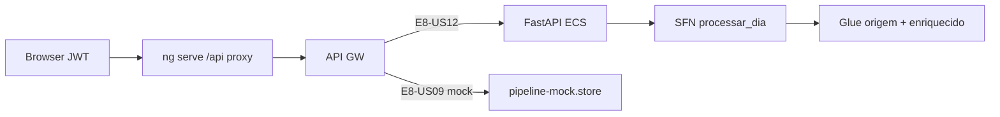

# Infrastructure Design · U8 Portal Web Operações Pipeline (E8-US09)

**Story:** E8-US09  
**Data:** 2026-06-30

---

## Escopo infraestrutura

**Nenhum recurso Terraform novo** nesta story. Frontend-only + mock até E8-US12 implementar `StartExecution` no BFF.

| Camada | Alteração |
|--------|-----------|
| **Step Functions** | Consumo via API — SM já existe `retail-inventory-insights-processar-dia-dev` |
| **API GW** | Rotas `/pipeline/*` — hoje proxy dev → API GW; BFF nginx placeholder até E8-US12 |
| **IAM ECS task role** | E8-US12: `states:StartExecution`, `DescribeExecution`, `ListExecutions` |
| **CloudWatch** | Logs SFN opcionais em dev (`enable_sfn_logging=false`) |
| **Cognito** | Sem mudança; JWT existente |
| **CloudFront** | Deploy portal após build (mesmo fluxo stories anteriores) |

---

## Mapeamento story × infra

| Story | Infra |
|-------|-------|
| **E8-US09** | Frontend Operações + mock + contratos RF-API-12/13 |
| **E8-US12** | FastAPI `portal-api/` — SFN boto3 |
| **E4** | SFN + Glue jobs já deployados |

---

## SFN brownfield

| Item | Valor |
|------|-------|
| Nome | `retail-inventory-insights-processar-dia-dev` |
| Input | `{"dt":"YYYY-MM-DD"}` |
| Estados | CarregarOrigem → EnriquecerDia → Sucesso \| Falha |
| Disparo manual CLI | Ver `aidlc-docs/construction/u4-orquestracao/application-design.md` |

---

## Validação local (Part 2)

```powershell
.\scripts\w7-us09-validate.ps1
```

Etapas planejadas:
1. `npm ci` em `portal-web/`
2. `npm run build:prod`
3. `npm test` (headless)
4. Checklist manual E8-US09

---

## Diagrama deploy



---

## Dados e scripts referência

| Artefato | Caminho |
|----------|---------|
| Reprocessamento manual | `scripts/reprocessar-dia-dev.ps1` |
| Testar esteira | `docs/dev-testar-esteira.md` |
| SFN design | `aidlc-docs/construction/u4-orquestracao/` |
| Proxy dev CORS | `portal-web/proxy.conf.json` |

---

## Extension compliance

| Extension | Aplicável | Notas |
|-----------|-----------|-------|
| Security Baseline | Sim | JWT; SFN só no BFF |
| Resiliency Baseline | Sim | Mock fallback |
| Property-Based Testing | Sim | date/duration utils |
