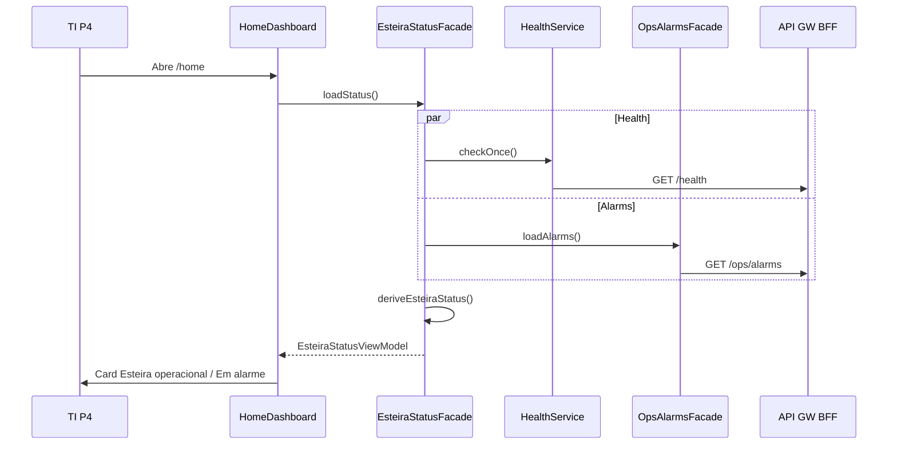

# Application Design · U8 Portal Web Ops Alarms + Health (E8-US10)

**Unidade:** U8-Portal-Web  
**Story:** E8-US10 · Alarmes CloudWatch e health na UI (M5)  
**Data:** 2026-06-30  
**Depende:** E8-US09 (operações) · E7-US02 (alarme SFN) · E8-US03 (shell health) · E8-US12 (BFF real)

---

## Escopo desta story

Expor na **home** o estado operacional da esteira combinando **saúde da API** (`GET /health`) e **alarme CloudWatch** da Step Function (`GET /ops/alarms`), para que TI saiba se a esteira falhou sem abrir o console AWS.

**Fora de escopo:** criar alarme Terraform/SNS, alterações em `/operacoes`, Athena (E8-US11), deploy FastAPI (E8-US12).

---

## Decisão UX: shell vs home

| Superfície | Componente | Escopo | Mantém? |
|------------|------------|--------|---------|
| **App shell** (toolbar) | `HealthBadgeComponent` | Saúde **API** apenas (`ok` / `degraded` / `offline`) | **Sim** — visão rápida em todas as rotas |
| **Home** (`/home`) | `EsteiraStatusCardComponent` | **Esteira** = health + alarme SFN | **Novo** — RF-M5-04/05 |

Rationale: o badge do shell responde “o BFF responde?”; o card da home responde “a esteira está operacional?” (requisito de negócio P4).

---

## Componentes Angular

### Novo (home)

| ID | Componente | Rota | Responsabilidade |
|----|------------|------|------------------|
| AW49 | `EsteiraStatusCardComponent` | `/home` (filho) | Card status esteira: operacional / em alarme / API indisponível |

### Alterações em existentes

| ID | Componente | Alteração |
|----|------------|-----------|
| AW20 | `HomeDashboardComponent` | Inserir `<app-esteira-status-card>` abaixo do header; opcional link `/operacoes` |
| AW18 | `HealthBadgeComponent` | **Sem alteração funcional** (regressão E8-US03) |
| AS08 | `DashboardService` | **Sem alteração** — esteira status via facade dedicado |

### Serviços (novos)

| ID | Serviço | Responsabilidade |
|----|---------|------------------|
| AS18 | `OpsAlarmsApiService` | `GET /ops/alarms` |
| AS19 | `OpsAlarmsFacadeService` | API + mock fallback |
| AS20 | `EsteiraStatusFacadeService` | Combina `HealthService.checkOnce()` + `OpsAlarmsFacade`; expõe `EsteiraStatusViewModel` |

### Utilitários e mock

| ID | Artefato | Responsabilidade |
|----|----------|------------------|
| U22 | `esteira-status.util.ts` | Derivar label, tema, `pipeline_operational` de health + alarm |
| U23 | `cloudwatch-console-url.util.ts` | URL console alarm / SFN |
| U24 | `ops-alarms-mock.data.ts` | Mock OK/ALARM para `retail-inventory-insights-processar-dia-failed-dev` |

### Reutilizados

`HealthService`, `HealthBadgeComponent`, `DashboardService`, `HomeDashboardComponent`, `authInterceptor` (JWT em `/ops/alarms`, público em `/health`).

---

## Estrutura de pastas alvo

```text
portal-web/src/app/
├── core/api/
│   ├── models/
│   │   └── ops-alarms.model.ts
│   ├── ops-alarms-api.service.ts
│   ├── ops-alarms-facade.service.ts
│   ├── esteira-status-facade.service.ts
│   ├── esteira-status.util.ts
│   ├── cloudwatch-console-url.util.ts
│   └── data/
│       └── ops-alarms-mock.data.ts
├── features/home/
│   ├── home-dashboard.component.ts    # + EsteiraStatusCard
│   └── esteira-status-card.component.ts
└── shared/components/health-badge/    # inalterado
```

---

## Contratos API

### `GET /health` (RF-API-01 — existente)

- **Auth:** público (interceptor não adiciona JWT)
- **Response:** texto `ok` ou JSON `{ "status": "ok" | "degraded" }`
- Frontend: `HealthService` mapeia para `HealthStatusValue`

---

### `GET /ops/alarms` (RF-API-15, JWT)

**Response:**

```typescript
export type CloudWatchAlarmState = 'OK' | 'ALARM' | 'INSUFFICIENT_DATA';

export interface OpsAlarmItem {
  alarm_name: string;
  state: CloudWatchAlarmState;
  state_reason?: string;
  updated_at?: string;
  metric?: string;
  resource_arn?: string;
}

export interface OpsAlarmsResponse {
  alarms: OpsAlarmItem[];
  pipeline_operational: boolean;
}
```

**Regras BFF (E8-US12):**
- `DescribeAlarms` filtrando `retail-inventory-insights-processar-dia-failed-dev`
- `pipeline_operational = primary_alarm.state === 'OK'`

**Mock (Part 2):** default `OK`; query home `?alarm=demo` força `ALARM` para demonstração.

---

## View model (home card)

```typescript
export type EsteiraStatusLevel =
  | 'operational'
  | 'alarm'
  | 'insufficient_data'
  | 'api_offline'
  | 'api_degraded';

export interface EsteiraStatusViewModel {
  level: EsteiraStatusLevel;
  label: string;
  detail: string;
  health: HealthStatusValue;
  primary_alarm_state: CloudWatchAlarmState | null;
  pipeline_operational: boolean;
  checked_at: Date;
  data_source: 'api' | 'mock';
  console_alarm_url?: string;
}
```

---

## Fluxo de dados



---

## Estados visuais (home card)

| level | Cor tema | Label PT-BR |
|-------|----------|-------------|
| `operational` | verde | Esteira operacional |
| `alarm` | vermelho | Esteira em alarme |
| `insufficient_data` | âmbar | Esteira — dados insuficientes |
| `api_degraded` | âmbar | API degradada |
| `api_offline` | cinza/vermelho | API indisponível |

Prioridade de derivação: `api_offline` > `alarm` > `insufficient_data` > `api_degraded` > `operational`.

---

## Polling

- `EsteiraStatusCardComponent`: poll combinado **60s** (alinhar `HealthService.POLL_MS`)
- Refresh manual via botão “Atualizar” na home (reutilizar `refresh()` existente — orquestrar reload card + KPIs)

---

## Rastreabilidade

| Requisito | Artefato |
|-----------|----------|
| RF-M5-04 | `OpsAlarmsFacade` + card alarme |
| RF-M5-05 | Card home + `HealthService` |
| RF-API-01 | Regressão `HealthService` / shell badge |
| RF-API-15 | `OpsAlarmsApiService` |
| RF-M7-03/05 | Labels PT-BR no card |

---

## Regressão

| Módulo | Expectativa |
|--------|-------------|
| Shell health badge | Inalterado |
| Home KPIs + atalhos | Inalterados |
| `/operacoes` E8-US09 | Inalterado |
| Insights M4 | Inalterados |
