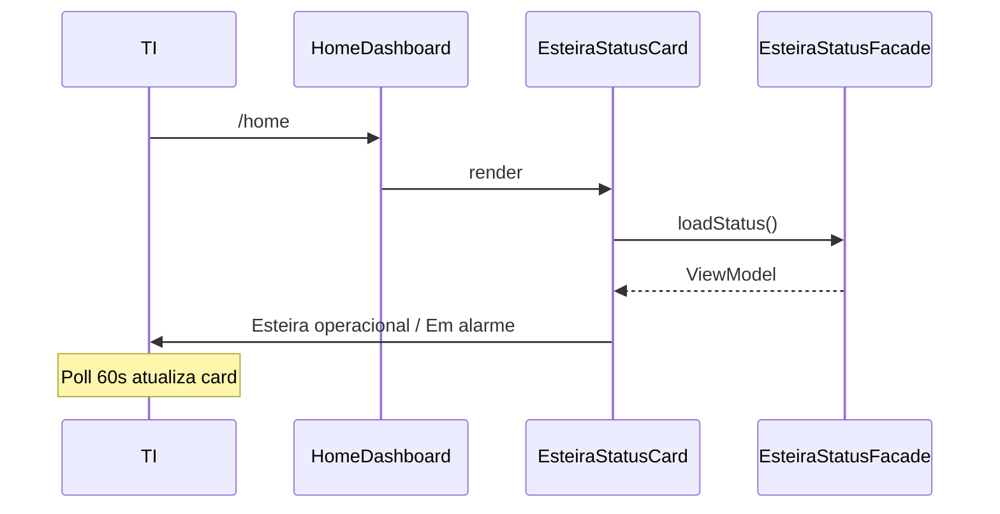

# Functional Design · U8 Portal Web Ops Alarms + Health (E8-US10)

**Story:** E8-US10  
**Persona:** P4 · Plataforma AWS / TI  
**Data:** 2026-06-30

---

## Regras de negócio

### BR-OPS-12 · Alarme primário (RF-M5-04)
- Alarme monitorado: `retail-inventory-insights-processar-dia-failed-dev`
- Métrica: `AWS/States` · `ExecutionsFailed` na SFN `retail-inventory-insights-processar-dia-dev`
- Estados CloudWatch: `OK`, `ALARM`, `INSUFFICIENT_DATA`

### BR-OPS-13 · Esteira operacional (RF-M5-05)
- **Esteira operacional** quando:
  - `GET /health` → `ok` **e**
  - alarme primário → `OK`
- Card na home comunica esse estado em linguagem de negócio (não jargão CW).

### BR-OPS-14 · Prioridade de exibição
1. API `offline` → “API indisponível” (não mascarar com operacional)
2. Alarme `ALARM` → “Esteira em alarme”
3. Alarme `INSUFFICIENT_DATA` → aviso âmbar
4. Health `degraded` → “API degradada”
5. Caso contrário → “Esteira operacional”

### BR-OPS-15 · Health público (RF-API-01)
- `/health` permanece sem JWT
- Shell badge continua refletindo apenas API

### BR-OPS-16 · Alarmes autenticados (RF-API-15)
- `GET /ops/alarms` exige JWT (interceptor existente)
- Falha 401 → fluxo logout existente

### BR-OPS-17 · Fallback mock
- API indisponível → mock com alarme `OK` (operacional demo)
- Banner chip “Dados de demonstração” quando `data_source === 'mock'`
- Query `?alarm=demo` na home força estado `ALARM` no mock (apenas dev)

### BR-OPS-18 · Links console
- Card exibe link “Ver alarme no console” quando `alarm_name` conhecido
- URL região `us-east-1`

### BR-OPS-19 · Escopo N/A
- Criar/editar alarme (`ensure-sfn-alarm.ps1`): **W6, fora desta story**
- Página `/operacoes`: **sem mudança funcional**

---

## Fluxo home

---

## Casos de teste (checklist E8-US10)

| # | Cenário | Resultado |
|---|---------|-----------|
| T1 | Mock OK + health ok | Card verde “Esteira operacional” |
| T2 | Mock ALARM (`?alarm=demo`) | Card vermelho “Esteira em alarme” |
| T3 | Health offline | Card “API indisponível” |
| T4 | Shell badge | Ainda mostra API ok/offline |
| T5 | Home KPIs | Inalterados |
| T6 | Link console | Abre URL CW em nova aba |

---

## Mensagens PT-BR

| level | Mensagem principal | Detalhe |
|-------|-------------------|---------|
| operational | Esteira operacional | API e alarme SFN em OK |
| alarm | Esteira em alarme | Falha detectada na Step Function |
| insufficient_data | Dados insuficientes | Alarme sem métricas recentes |
| api_degraded | API degradada | BFF degradado; verifique logs |
| api_offline | API indisponível | Não foi possível contactar o BFF |
