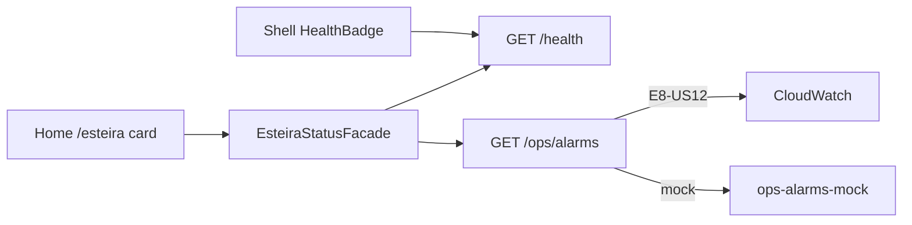

# Infrastructure Design · U8 Portal Web Ops Alarms + Health (E8-US10)

**Story:** E8-US10  
**Data:** 2026-06-30

---

## Escopo infraestrutura

**Nenhum recurso Terraform novo.** Frontend + mock até E8-US12.

| Camada | Alteração |
|--------|-----------|
| **CloudWatch** | Alarme já existe — `retail-inventory-insights-processar-dia-failed-dev` |
| **API GW** | Rota `GET /ops/alarms` — BFF futuro |
| **IAM ECS** | E8-US12: `cloudwatch:DescribeAlarms` na task role |
| **Cognito** | Sem mudança |
| **CloudFront** | Deploy portal pós-build (fluxo existente) |

---

## Brownfield alarme

| Item | Valor |
|------|-------|
| Nome | `retail-inventory-insights-processar-dia-failed-dev` |
| Namespace | `AWS/States` |
| Metric | `ExecutionsFailed` |
| SFN | `retail-inventory-insights-processar-dia-dev` |
| Criação | `scripts/ensure-sfn-alarm.ps1` |
| Terraform output | `module.monitoring.sfn_failed_alarm_name` |

---

## Mapeamento story × infra

| Story | Infra |
|-------|-------|
| **E8-US10** | UI alarmes + health card home |
| **E7-US02** | Alarme CW deployado |
| **E8-US12** | BFF `DescribeAlarms` |

---

## Validação local (Part 2)

```powershell
.\scripts\w7-us10-validate.ps1
```

---

## Diagrama



---

## Extension compliance

| Extension | Aplicável |
|-----------|-----------|
| Security Baseline | Sim |
| Resiliency Baseline | Sim |
| Property-Based Testing | Sim |
