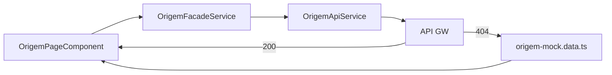

# Application Design · U8 Portal Web Origem (E8-US05)

**Unidade:** U8-Portal-Web  
**Story:** E8-US05 · Partições origem e preview (M2)  
**Data:** 2026-06-30  
**Depende:** E8-US04 (insumos) · E8-US03 (shell) · E8-US12 (BFF real)

---

## Escopo desta story

Substituir o placeholder `/origem` por tela que lista **partições** `origem/dt=YYYY-MM-DD/`, exibe **métricas** da partição selecionada e **preview paginado** do Parquet (≤ 500 linhas).

**Fora de escopo:** `POST /pipeline/processar-dia` (RF-M2-05 → E8-US09), enriquecimento (M3), upload insumo.

---

## Componentes Angular (novos)

| ID | Componente | Responsabilidade |
|----|------------|------------------|
| AW19 | `OrigemPageComponent` | Container `/origem`: orquestra partições, detalhe e preview |
| AW20 | `OrigemPartitionsPanelComponent` | Lista/calendário de `dt=` clicáveis + indicador ausente (RF-M2-04) |
| AW21 | `OrigemPartitionDetailComponent` | Cards: linhas, lojas distintas, produtos distintos (RF-M2-02) |
| AW22 | `OrigemPreviewTableComponent` | `mat-table` preview + `mat-paginator` (RF-M2-03) |
| AW23 | `OrigemMissingDtChipComponent` | Chip/badge visual "sem partição" para dt ausente |

### Serviços

| ID | Serviço | Responsabilidade |
|----|---------|------------------|
| AS7 | `OrigemApiService` | `GET /origem/partitions`, `GET /origem/{dt}/preview` |
| AS8 | `OrigemFacadeService` | API + mock fallback brownfield; `data_source` |

### Utilitários

| ID | Artefato | Responsabilidade |
|----|----------|------------------|
| U2 | `origem-mock.data.ts` | Partições e preview mock `dt=2022-01-01` (100 rows, 15 cols) |
| U3 | `origem-partition.util.ts` | Normaliza `dt`, ordena desc, detecta missing |

### Mantidos

`AppShellComponent`, `authGuard`, `authInterceptor`, `ApiErrorService`, `ApiErrorBannerComponent`.

---

## Estrutura de pastas alvo

```text
portal-web/src/app/
├── core/api/
│   ├── models/
│   │   └── origem.model.ts
│   ├── origem-api.service.ts
│   ├── origem-facade.service.ts
│   └── data/
│       └── origem-mock.data.ts
├── features/origem/
│   ├── origem-page.component.ts
│   ├── origem-partitions-panel.component.ts
│   ├── origem-partition-detail.component.ts
│   ├── origem-preview-table.component.ts
│   └── origem-missing-dt-chip.component.ts
└── app.routes.ts                    # /origem → OrigemPageComponent
```

---

## Contratos API

### `GET /origem/partitions` (RF-API-04)

```typescript
interface OrigemPartitionsResponse {
  partitions: string[];       // ['2022-01-01', '2022-01-02']
  latest?: string;
  missing_dates?: string[];   // RF-M2-04: dt esperados sem partição
}
```

### `GET /origem/{dt}/preview?page=1&page_size=50` (RF-API-05)

```typescript
interface OrigemPreviewResponse {
  dt: string;
  row_count: number;
  stores_count: number;
  products_count: number;
  columns: string[];
  rows: Record<string, unknown>[];
  page: number;
  page_size: number;
  total_pages: number;
  total_rows: number;         // min(row_count, 500) para preview cap
}
```

**Regra:** BFF retorna no máximo **500 linhas** no total (`total_rows ≤ 500`); paginação client-side ou server-side.

---

## Layout da página (wireframe)

```text
┌────────────────────────────────────────────────────────────────┐
│ Origem · extração diária                                       │
├──────────────────┬─────────────────────────────────────────────┤
│ Partições dt=    │ Detalhe · dt=2022-01-01                     │
│ ● 2022-01-01 ✓   │ [100 linhas] [10 lojas] [69 produtos]      │
│ ○ 2022-01-02 ✗   │                                             │
│   sem partição   │ Preview Parquet (pág. 1/2)                  │
│                  │ ┌ Date │ Store ID │ Product ID │ ... ┐      │
│                  │ └────────────────────────────────────┘      │
│                  │              < 1 2 >  mat-paginator         │
└──────────────────┴─────────────────────────────────────────────┘
```

- Painel esquerdo: partições disponíveis (clicáveis) + chips vermelhos para `missing_dates`
- Painel direito: detalhe + preview da `dt` selecionada

---

## Mock brownfield (dev)

| Campo | Valor mock |
|-------|------------|
| `partitions` | `['2022-01-01']` |
| `missing_dates` | `['2022-01-02']` (demo RF-M2-04) |
| `row_count` | `100` |
| `stores_count` | `10` (placeholder brownfield) |
| `products_count` | `69` (placeholder — alinhar preview distinct) |
| `columns` | 15 cols SCHEMA notebook |
| `rows` | 50 por página × 2 páginas (dados sintéticos consistentes) |

Chip *"Dados de demonstração"* quando `data_source === 'mock'`.

---

## Rotas

| Path | Antes | Depois |
|------|-------|--------|
| `/origem` | `PlaceholderPageComponent` | `OrigemPageComponent` |

Query param opcional: `/origem?dt=2022-01-01` para deep-link.

---

## Decisões técnicas (fechadas)

| Item | Escolha |
|------|---------|
| Seletor dt | Lista lateral + chips missing (não full calendar lib nesta story) |
| Preview | `mat-table` + `mat-paginator` page_size=50 |
| Cap linhas | 500 total (RF-M2-03) |
| Responsivo | Tablet: partições em accordion acima do preview |
| BFF | Mock até E8-US12; sem FastAPI nesta story |

---

## Rastreabilidade

| Requisito | Implementação |
|-----------|---------------|
| RF-M2-01 | OrigemPartitionsPanel |
| RF-M2-02 | OrigemPartitionDetail (3 KPIs) |
| RF-M2-03 | OrigemPreviewTable + paginator ≤500 |
| RF-M2-04 | OrigemMissingDtChip / missing_dates |
| RF-API-04 | OrigemApiService.getPartitions() |
| RF-API-05 | OrigemApiService.getPreview(dt, page) |

---

## Diagrama


