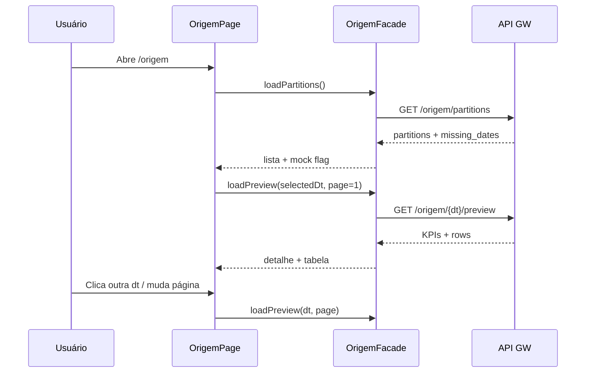

# Functional Design · U8 Portal Web Origem (E8-US05)

**Story:** E8-US05  
**Persona:** P2 · Engenheiro de dados  
**Data:** 2026-06-30

---

## Regras de negócio

### BR-ORIG-01 · Listagem de partições
Exibir todas as partições `origem/dt=YYYY-MM-DD/` retornadas por `GET /origem/partitions`, ordenadas **desc** (mais recente primeiro).

### BR-ORIG-02 · Seleção de dt
Ao clicar em uma partição disponível, carregar detalhe + preview para essa `dt`. Primeira partição da lista é selecionada automaticamente ao abrir a tela.

### BR-ORIG-03 · Métricas da partição (RF-M2-02)
Para a `dt` selecionada, exibir:

| KPI UI | Campo API |
|--------|-----------|
| Linhas | `row_count` |
| Lojas distintas | `stores_count` |
| Produtos distintos | `products_count` |

### BR-ORIG-04 · Preview paginado (RF-M2-03)
- Tabela com colunas do Parquet (`columns` da API)
- Máximo **500 linhas** no preview total
- Paginação: `page_size` default **50**
- Controles `mat-paginator` PT-BR

### BR-ORIG-05 · Dt sem partição (RF-M2-04)
Datas em `missing_dates` (ou derivadas no mock) exibidas com indicador visual:

| Estado | Visual |
|--------|--------|
| Partição existe | Item clicável, ícone check verde |
| Sem partição | Chip/lista com ícone `block`, cor warn, **não clicável** |

Tooltip: *"Nenhuma partição origem para esta data."*

### BR-ORIG-06 · Fallback mock
Se API indisponível, usar mock `2022-01-01` + `missing_dates: ['2022-01-02']` e banner informativo.

### BR-ORIG-07 · Reprocessar
**N/A** nesta story — botão pipeline fica para E8-US09.

---

## Modelo de domínio

| Conceito | Atributos |
|----------|-----------|
| `OrigemPartition` | `dt`, `status: 'available' \| 'missing'` |
| `OrigemPreviewPage` | `rows`, `page`, `total_pages`, `columns` |
| `OrigemViewState` | `partitions`, `selectedDt`, `detail`, `preview`, `data_source` |

---

## Fluxo principal

---

## Estados da tela

| Estado | UI |
|--------|-----|
| `loading_partitions` | Spinner painel esquerdo |
| `partitions_ready` | Lista dt + missing chips |
| `loading_preview` | Spinner painel direito |
| `preview_ready` | KPIs + mat-table + paginator |
| `no_partitions` | Empty state "Nenhuma partição origem encontrada" |
| `error` | ApiErrorBanner + retry |

---

## Casos de teste

### Unitários

| ID | Cenário | Resultado |
|----|---------|-----------|
| TC-U01 | Facade 404 partitions | Mock + `data_source: mock` |
| TC-U02 | Preview page 2 | `rows.length ≤ page_size` |
| TC-U03 | missing_dates render | Chip não clicável |
| TC-U04 | Cap 500 rows | `total_rows ≤ 500` |

### Manuais (checklist E8-US05)

| ID | Cenário | Resultado |
|----|---------|-----------|
| TC-M01 | Login → Origem | Partições visíveis |
| TC-M02 | Selecionar dt | KPIs + preview atualizam |
| TC-M03 | Paginação | Navega páginas sem erro |
| TC-M04 | Dt sem partição | Indicador visual vermelho/warn |
| TC-M05 | DevTools | GET partitions e preview com JWT |

---

## Mensagens UI (PT-BR)

| Situação | Mensagem |
|----------|----------|
| Carregando | "Carregando partições origem…" / "Carregando preview…" |
| Vazio | "Nenhuma partição origem encontrada." |
| Sem partição | "Sem partição origem" (chip) |
| Mock | "Exibindo dados de demonstração até o BFF estar disponível." |
| Paginator | Labels Material em PT-BR |
