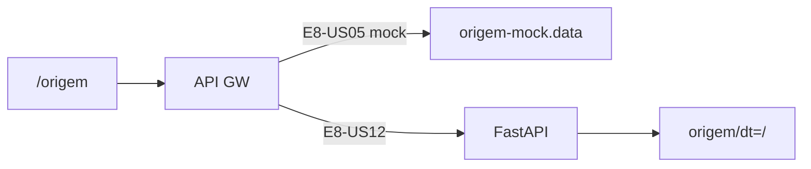

# Infrastructure Design · U8 Portal Web Origem (E8-US05)

**Story:** E8-US05  
**Data:** 2026-06-30

---

## Infraestrutura AWS

**Sem novo Terraform.**

| Recurso | Uso |
|---------|-----|
| S3 `retail-inventory-insights-dev-use1` | `origem/dt=YYYY-MM-DD/data.parquet` |
| Glue `carregar_origem_dia` | Job brownfield (W2) — fonte real E8-US12 |
| API GW + ECS | BFF lerá S3/Athena em E8-US12 |

---

## Estratégia BFF

| Story | Entrega |
|-------|---------|
| **E8-US05** | Frontend + mock + contratos API |
| **E8-US12** | `GET /origem/partitions` via `list_objects_v2` prefix `origem/` |
| **E8-US12** | `GET /origem/{dt}/preview` via pandas/pyarrow ou Athena LIMIT 500 |

---

## Deploy frontend

```powershell
.\scripts\w7-deploy-portal-web.ps1
```

---

## Validação

### `scripts/w7-us05-validate.ps1`

1. `npm ci` (retry)
2. `npm run build:prod`
3. `npm test`
4. Checklist manual E8-US05

### Checklist manual

```text
[ ] ng serve → login → menu Origem
[ ] Lista dt= com 2022-01-01 selecionável
[ ] KPIs: linhas, lojas, produtos
[ ] Preview tabela paginada (15 colunas)
[ ] Chip dt 2022-01-02 "sem partição" visível (mock)
[ ] DevTools: GET /origem/partitions e /preview com JWT
```

---

## Referência brownfield

| Artefato | Caminho |
|----------|---------|
| Parquet local | `tabela_origem/dt=2022-01-01/data.parquet` |
| Script baseline | `scripts/generate_local_origem.py` |
| Paridade | E2-US03 — 100 rows, 15 cols |

---

## Diagrama


