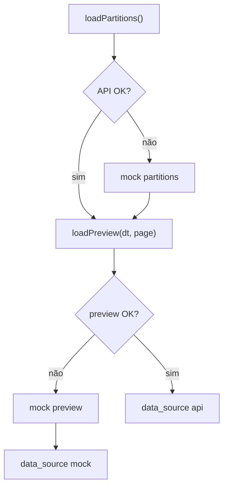

# NFR Design · U8 Portal Web Origem (E8-US05)

**Data:** 2026-06-30

---

## Preview table — implementação

```typescript
// page_size default 50; cap total_rows 500
const PREVIEW_PAGE_SIZE = 50;
const PREVIEW_MAX_ROWS = 500;
```

- `mat-table` com `displayedColumns` dinâmico a partir de `columns[]`
- `mat-paginator` `[pageSizeOptions]="[25, 50, 100]"` — default 50
- Container `.preview-scroll { overflow-x: auto; }` para 15 colunas

---

## Indicador dt ausente (RF-M2-04)

```html
<!-- missing chip -->
<mat-chip-set>
  <mat-chip disabled class="missing-dt">
    <mat-icon>block</mat-icon>
    {{ dt }} — sem partição
  </mat-chip>
</mat-chip-set>
```

CSS: `color: #e65100; opacity: 0.9` — distinto de erro fatal.

Partição disponível selecionada: `background: rgba(25, 118, 210, 0.12)`.

---

## Responsividade

| Breakpoint | Layout |
|------------|--------|
| ≥ 960px | Grid 2 colunas: partições 280px \| preview flex |
| &lt; 960px | Stack: accordion partições → detalhe → preview |

---

## OrigemFacadeService — resiliência



---

## MatPaginator i18n

Usar `MatPaginatorIntl` custom ou labels PT-BR:

| Chave | Texto |
|-------|-------|
| itemsPerPage | Itens por página |
| nextPage | Próxima página |
| previousPage | Página anterior |

---

## Testes (PBT leve)

| Arquivo | Propriedade |
|---------|-------------|
| `origem-facade.service.spec.ts` | 404 → mock partitions |
| `origem-preview.util.spec.ts` | clamp total_rows ≤ 500 |
| `origem-partition.util.spec.ts` | sort desc por dt |

---

## Extension compliance (E8-US05)

| Extension | Status |
|-----------|--------|
| Security Baseline | Compliant |
| Resiliency Baseline | Compliant |
| Property-Based Testing | Compliant |
