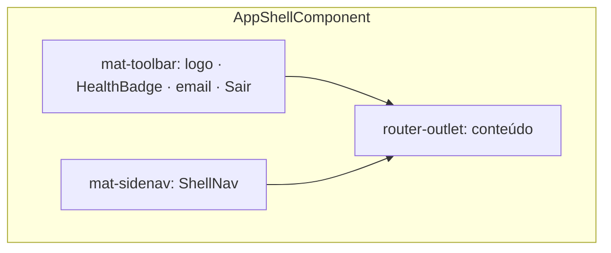

# Application Design · U8 Portal Web Shell (E8-US03)

**Unidade:** U8-Portal-Web  
**Story:** E8-US03 · Shell Angular e home dashboard  
**Data:** 2026-06-30  
**Depende:** E8-US02 (auth Cognito) · E8-US01 (infra)

---

## Escopo desta story

Evoluir `portal-web/` com **app shell** (navegação lateral + toolbar) e **home dashboard** com resumo do dia, KPIs e atalhos D-1/D-2/D-3.

**Fora de escopo:** implementação real dos módulos M1–M5 (E8-US04+), FastAPI BFF (E8-US12), RBAC por persona.

---

## Componentes Angular (novos / alterados)

| ID | Componente | Responsabilidade |
|----|------------|------------------|
| AW7 | `AppShellComponent` | Layout Material: `mat-sidenav` + `mat-toolbar` + `<router-outlet>` |
| AW8 | `ShellNavComponent` | Menu PT-BR: Insumos, Origem, Enriquecido, Insights (sub), Operações |
| AW9 | `HomeDashboardComponent` | Substitui `HomeComponent` mínimo: KPIs, último `dt`, atalhos D-1/D-2/D-3 |
| AW10 | `HealthBadgeComponent` | Badge API (`GET /health`) na toolbar |
| AW11 | `PlaceholderPageComponent` | Página "Em breve" reutilizável para rotas futuras |
| AW12 | `InsightShortcutCardComponent` | Card clicável D-1 / D-2 / D-3 na home |
| AW13 | `KpiSummaryCardComponent` | Cards de KPI (receita, ruptura %, produtos em falta) |
| AW14 | `ApiErrorBannerComponent` | Banner/mensagem PT-BR para erros HTTP |

### Serviços

| ID | Serviço | Responsabilidade |
|----|---------|------------------|
| AS1 | `HealthService` | `GET /health` (público); estado `ok \| degraded \| offline` |
| AS2 | `DashboardService` | Agrega último `dt` + KPIs; tenta API real, fallback mock |
| AS3 | `ApiErrorService` | Mapeia `HttpErrorResponse` → mensagem PT-BR (401, 500, timeout) |
| AS4 | `EnriquecidoApiService` | Contrato `GET /enriquecido/partitions`, `GET /enriquecido/{dt}/kpis` (stub até E8-US12) |

### Mantidos (E8-US02)

`AuthService`, `authGuard`, `authInterceptor`, `LoginComponent`.

---

## Estrutura de pastas alvo

```text
portal-web/src/app/
├── core/
│   ├── auth/                    # E8-US02 (inalterado)
│   ├── api/
│   │   ├── models/
│   │   │   ├── dashboard.model.ts
│   │   │   ├── enriquecido.model.ts
│   │   │   └── health.model.ts
│   │   ├── health.service.ts
│   │   ├── dashboard.service.ts
│   │   └── enriquecido-api.service.ts
│   └── errors/
│       ├── api-error.service.ts
│       └── api-error.interceptor.ts   # opcional: centraliza toast/banner
├── layout/
│   ├── app-shell/
│   │   ├── app-shell.component.ts
│   │   └── shell-nav.config.ts
│   └── placeholder-page/
│       └── placeholder-page.component.ts
├── shared/
│   ├── components/
│   │   ├── health-badge/
│   │   ├── kpi-summary-card/
│   │   ├── insight-shortcut-card/
│   │   └── api-error-banner/
│   └── pipes/                   # reservado
├── features/
│   ├── login/                   # E8-US02
│   ├── home/
│   │   └── home-dashboard.component.ts
│   ├── insumos/                 # placeholder route only
│   ├── origem/
│   ├── enriquecido/
│   ├── insights/
│   └── operacoes/
├── app.routes.ts
└── app.config.ts
```

---

## Rotas (alvo)

| Path | Guard | Componente | Notas |
|------|-------|------------|-------|
| `/login` | — | `LoginComponent` | Pública |
| `/` | `authGuard` | redirect → `/home` | — |
| *(shell)* | `authGuard` | `AppShellComponent` | Layout pai |
| `/home` | — | `HomeDashboardComponent` | Filha do shell |
| `/insumos` | — | `PlaceholderPageComponent` | E8-US04 |
| `/origem` | — | `PlaceholderPageComponent` | E8-US05 |
| `/enriquecido` | — | `PlaceholderPageComponent` | E8-US06 |
| `/insights/d1` | — | `PlaceholderPageComponent` | E8-US07 |
| `/insights/d2` | — | `PlaceholderPageComponent` | E8-US08 |
| `/insights/d3` | — | `PlaceholderPageComponent` | E8-US08 |
| `/operacoes` | — | `PlaceholderPageComponent` | E8-US09/10 |
| `**` | — | redirect → `/home` | SPA |

```typescript
// app.routes.ts (conceitual)
export const routes: Routes = [
  { path: 'login', component: LoginComponent },
  {
    path: '',
    component: AppShellComponent,
    canActivate: [authGuard],
    children: [
      { path: 'home', component: HomeDashboardComponent },
      { path: 'insumos', component: PlaceholderPageComponent, data: { title: 'Insumos' } },
      // ... demais rotas placeholder
      { path: '', redirectTo: 'home', pathMatch: 'full' },
    ],
  },
  { path: '**', redirectTo: 'home' },
];
```

---

## Layout shell (Material)



| Breakpoint | Comportamento |
|------------|---------------|
| ≥ 960px (desktop) | Sidenav `mode="side"` aberto |
| 600–959px (tablet) | Sidenav `mode="over"`; botão menu na toolbar |
| &lt; 600px | Mesmo que tablet; cards KPI em coluna única |

---

## Contratos API (preparação E8-US04..12)

Alinhados a `portal-requirements.md` RF-API-*.

### `GET /health` (público — disponível hoje)

```typescript
interface HealthResponse {
  status: 'ok' | 'degraded';
  service?: string;
}
```

### `GET /enriquecido/partitions` (JWT — E8-US12)

```typescript
interface PartitionListResponse {
  partitions: string[];  // ['2022-01-01', ...]
  latest?: string;
}
```

### `GET /enriquecido/{dt}/kpis` (JWT — E8-US12)

```typescript
interface EnriquecidoKpis {
  dt: string;
  row_count: number;
  revenue_total: number;
  stockout_pct: number;
  products_stockout: number;
  stores_count: number;
}
```

### `DashboardSummary` (agregado no frontend)

```typescript
interface DashboardSummary {
  ultimo_dt: string | null;
  kpis: EnriquecidoKpis | null;
  data_source: 'api' | 'mock' | 'partial';
  health: 'ok' | 'degraded' | 'offline';
}
```

### Estratégia até E8-US12

1. `HealthService` chama API real (`GET /health`).
2. `EnriquecidoApiService` tenta endpoints JWT; em **404/502/timeout** → `DashboardService` usa **mock brownfield** (`dt=2022-01-01`, KPIs do notebook).
3. UI exibe chip discreto **"Dados de demonstração"** quando `data_source === 'mock'`.

---

## Home dashboard — wireframe lógico

```text
┌─────────────────────────────────────────────────────────┐
│ [Health ●]  Portal Datamesh          user@email  [Sair] │
├──────────┬──────────────────────────────────────────────┤
│ Insumos  │  Resumo do dia · dt= 2022-01-01              │
│ Origem   │  ┌─────────┐ ┌─────────┐ ┌─────────┐         │
│ Enriq.   │  │ Receita │ │ Ruptura │ │ Produtos│         │
│ Insights▾│  └─────────┘ └─────────┘ └─────────┘         │
│ Operações│  Atalhos insights                            │
│          │  [ D-1 Comercial ] [ D-2 Ruptura ] [ D-3 ]   │
└──────────┴──────────────────────────────────────────────┘
```

Atalhos navegam para `/insights/d1`, `/insights/d2`, `/insights/d3` (placeholder até E8-US07/08).

---

## Decisões técnicas (fechadas)

| Item | Escolha |
|------|---------|
| Layout | Angular Material `mat-sidenav-container` + `mat-nav-list` |
| Estado home | Signals (`loading`, `summary`, `error`) |
| Mock KPIs | Valores fixos brownfield dev (`2022-01-01`) |
| Erros HTTP | `ApiErrorService` + banner na home; interceptor opcional |
| i18n | Strings hardcoded PT-BR (sem ngx-translate nesta story) |
| Testes | Unit: `DashboardService` mock fallback, `ApiErrorService`, shell nav |

---

## Rastreabilidade

| Requisito | Implementação |
|-----------|---------------|
| RF-M7-01 | AppShell + ShellNav 5 itens |
| RF-M7-02 | HomeDashboard + KPIs + atalhos D-1/D-2/D-3 |
| RF-M7-03 | ApiErrorService mensagens PT-BR |
| RF-M7-04 | Breakpoints sidenav + grid responsivo |
| RF-M7-05 | Labels e mensagens PT-BR |
| RF-M5-05 | HealthBadge via `GET /health` |
| NFR-W7-05 | Atalhos insights em 1 clique a partir da home |
