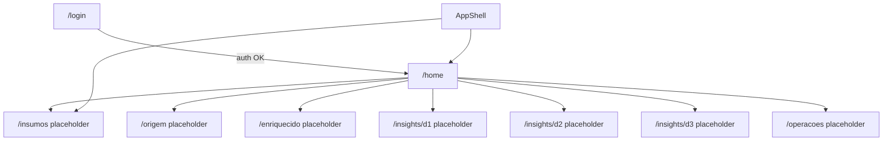
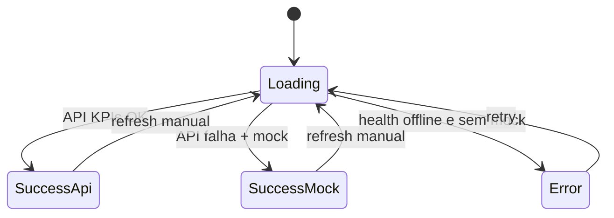

# Functional Design · U8 Portal Web Shell (E8-US03)

**Story:** E8-US03  
**Data:** 2026-06-30

---

## Regras de negócio (shell e home)

### BR-SHELL-01 · Navegação autenticada
Todo conteúdo sob `AppShellComponent` exige sessão Cognito válida (herda `authGuard` da rota pai).

### BR-SHELL-02 · Menu principal
Itens fixos PT-BR, nesta ordem:

1. **Início** → `/home`
2. **Insumos** → `/insumos`
3. **Origem** → `/origem`
4. **Enriquecido** → `/enriquecido`
5. **Insights** (expansível) → `/insights/d1`, `/insights/d2`, `/insights/d3`
6. **Operações** → `/operacoes`

Item ativo destacado via `routerLinkActive`.

### BR-SHELL-03 · Placeholder
Rotas de módulo sem implementação exibem `PlaceholderPageComponent` com título do módulo e texto: *"Módulo em desenvolvimento. Disponível nas próximas entregas W7."*

### BR-HOME-01 · Último dt processado
Exibir o `dt` mais recente retornado por `GET /enriquecido/partitions` (quando BFF existir) ou mock `2022-01-01`.

### BR-HOME-02 · KPIs resumidos
Para o `dt` selecionado, exibir no mínimo:

| KPI | Origem |
|-----|--------|
| Receita total | `revenue_total` |
| % ruptura | `stockout_pct` |
| Produtos em ruptura | `products_stockout` |

### BR-HOME-03 · Atalhos insights
Três cards clicáveis na home:

| Atalho | Rota | Descrição PT-BR |
|--------|------|-----------------|
| D-1 | `/insights/d1` | Comercial — ranking unidades/receita |
| D-2 | `/insights/d2` | Ruptura — perdas por produto |
| D-3 | `/insights/d3` | Tendência — janela temporal |

### BR-HOME-04 · Badge health
Toolbar exibe badge:

| Estado | Condição | Cor |
|--------|----------|-----|
| OK | `GET /health` → 2xx | Verde |
| Degradado | 2xx com body `degraded` ou latência &gt; 5s | Amarelo |
| Offline | timeout / rede / 5xx | Vermelho |

Polling health: ao carregar shell + a cada 60s (desligar em `ngOnDestroy`).

### BR-HOME-05 · Fonte dos dados
Se API de enriquecido indisponível, exibir KPIs mock e banner informativo (não é erro bloqueante).

### BR-ERR-01 · Mensagens de erro PT-BR

| HTTP / condição | Mensagem usuário |
|-----------------|------------------|
| 0 / timeout | "Não foi possível conectar ao servidor. Verifique sua rede ou tente novamente." |
| 401 | "Sua sessão expirou. Faça login novamente." → redirect login |
| 403 | "Você não tem permissão para esta ação." |
| 404 | "Recurso não encontrado. O BFF pode ainda não estar disponível." |
| 500+ | "Erro interno no servidor. Tente novamente em alguns minutos." |
| Mock ativo | "Exibindo dados de demonstração até o BFF estar disponível." |

---

## Modelo de domínio (dashboard)

| Conceito | Atributos | Notas |
|----------|-----------|-------|
| `DashboardSummary` | `ultimo_dt`, `kpis`, `data_source`, `health` | Agregado na home |
| `EnriquecidoKpis` | ver application-design | Paridade notebook |
| `HealthStatus` | `ok \| degraded \| offline`, `checked_at` | Toolbar badge |
| `NavItem` | `label`, `route`, `icon`, `children?` | Config estática |

### Mock brownfield (dev)

Valores padrão quando API falha (paridade E3-US03 / notebook):

| Campo | Valor mock |
|-------|------------|
| `dt` | `2022-01-01` |
| `row_count` | `100` |
| `revenue_total` | `879026.03` |
| `stockout_pct` | `0.0` |
| `products_stockout` | `0` |
| `stores_count` | *(derivado preview — placeholder `10`)* |

---

## Fluxos de navegação

---

## Estados da home (`HomeDashboardComponent`)

| Estado UI | Elementos visíveis |
|-----------|------------------|
| `loading` | Skeleton cards + spinner |
| `success` | KPIs + dt + atalhos + chip fonte (api/mock) |
| `error` | `ApiErrorBanner` + botão "Tentar novamente" |

---

## Casos de teste (aceite)

### Automatizados (unit)

| ID | Cenário | Resultado |
|----|---------|-----------|
| TC-U01 | `DashboardService` API 404 | Retorna mock + `data_source: mock` |
| TC-U02 | `ApiErrorService` status 401 | Mensagem PT-BR sessão expirada |
| TC-U03 | `ApiErrorService` status 0 | Mensagem timeout/rede |
| TC-U04 | `HealthService` 200 | `status: ok` |
| TC-U05 | Shell nav config | 6 entradas + 3 filhos Insights |

### Manuais (checklist E8-US03)

| ID | Cenário | Resultado esperado |
|----|---------|-------------------|
| TC-M01 | Login → home | Shell com sidenav + KPIs visíveis |
| TC-M02 | Clicar Insumos | Placeholder "Em breve" |
| TC-M03 | Atalho D-1 | Navega `/insights/d1` placeholder |
| TC-M04 | Redimensionar tablet | Sidenav over + menu hamburger |
| TC-M05 | Badge health | Verde com API nginx `/health` |
| TC-M06 | Desligar rede | Banner erro PT-BR + badge offline |
| TC-M07 | ≤ 3 cliques home → D-2 | Home → card D-2 (1 clique) |

---

## Mensagens UI adicionais (PT-BR)

| Situação | Mensagem |
|----------|----------|
| Sem dt processado | "Nenhuma partição enriquecida encontrada." |
| Carregando KPIs | "Carregando resumo do dia…" |
| Placeholder módulo | "Módulo em desenvolvimento. Disponível nas próximas entregas W7." |
| Logout (toolbar) | "Sair" |
