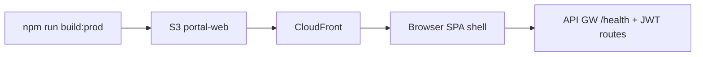

# Infrastructure Design · U8 Portal Web Shell (E8-US03)

**Story:** E8-US03  
**Data:** 2026-06-30

---

## Infraestrutura AWS

**Sem novo Terraform** nesta story. Reutiliza E8-US01:

| Recurso | Identificador dev |
|---------|-------------------|
| S3 portal-web | `retail-inventory-insights-portal-web-dev-use1` |
| CloudFront | `E1KJGUHSP2GWTK` / `d3g8ihrhzv7hsx.cloudfront.net` |
| API Gateway | `https://jvpw3k4mnf.execute-api.us-east-1.amazonaws.com` |
| Cognito pool | `us-east-1_yJLzwZgZE` |

---

## Deploy

Mesmo pipeline E8-US02 — `scripts/w7-deploy-portal-web.ps1`:

1. `npm ci` (com retry limpando `node_modules`)
2. `npm run build:prod`
3. `aws s3 sync dist/portal-web/browser s3://...`
4. `aws cloudfront create-invalidation --paths "/*"`

### Rotas SPA client-side

Novas rotas (`/insumos`, `/insights/d1`, etc.) exigem que CloudFront retorne `index.html` para 404.

| Situação | Ação E8-US03 |
|----------|--------------|
| Custom error 403/404 → `/index.html` já configurado | Nenhuma |
| Navegação direta URL falha | Documentar no README; ajuste Terraform se necessário (fase 2) |

---

## Validação local / CI

### Novo script: `scripts/w7-us03-validate.ps1`

1. `cd portal-web`
2. `npm ci` (retry com limpeza `node_modules` se falhar)
3. `npm run build:prod`
4. `npm test` (headless, single run)
5. Checklist manual E8-US03 (documentado no script)

### Checklist manual (resumo)

```text
[ ] ng serve → login Cognito → shell com sidenav visível
[ ] Home exibe dt + 3 KPIs + 3 atalhos D-1/D-2/D-3
[ ] Navegar Insumos / Origem / Enriquecido / Operações → placeholder
[ ] Badge health verde (GET /health)
[ ] Tablet: sidenav overlay funciona
[ ] (Opcional) deploy CloudFront + smoke test rotas
```

---

## Environments Angular

Sem alteração de URLs — `environment.ts` / `environment.production.ts` mantêm `apiBaseUrl` e Cognito.

---

## Diagrama deploy (inalterado)



---

## Dependências futuras

| Story | Impacto infra |
|-------|---------------|
| E8-US12 FastAPI BFF | Substituir nginx ECS; endpoints KPIs reais |
| E8-US07+ | Sem mudança CDN; apenas consumo API |
