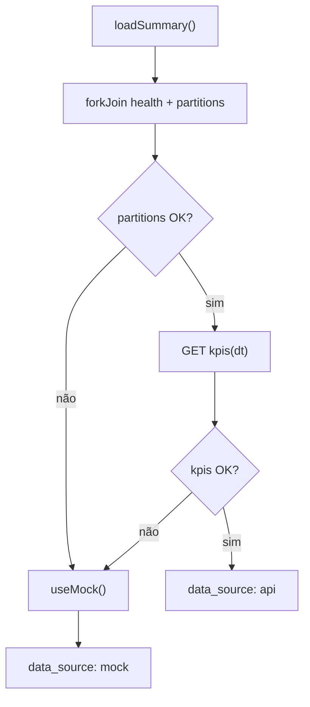

# NFR Design · U8 Portal Web Shell (E8-US03)

**Data:** 2026-06-30

---

## Responsividade — implementação

### Breakpoints (Angular CDK Layout ou CSS)

```scss
// styles/_breakpoints.scss
$desktop: 960px;
$tablet: 600px;
```

| Componente | Desktop | Tablet/Mobile |
|------------|---------|---------------|
| `AppShellComponent` | `sidenav mode="side" opened` | `mode="over"` + `mat-icon-button` menu |
| `KpiSummaryCardComponent` | `grid-template-columns: repeat(3, 1fr)` | 2 col / 1 col |
| `InsightShortcutCardComponent` | `repeat(3, 1fr)` | stack vertical |

### Touch targets
Botões sidenav e atalhos: mínimo **48px** altura (Material default).

---

## Erros HTTP — `ApiErrorService`

```typescript
mapHttpError(error: HttpErrorResponse): UserFacingError {
  if (error.status === 0) return { code: 'NETWORK', message: MSG_NETWORK };
  if (error.status === 401) return { code: 'UNAUTHORIZED', message: MSG_SESSION };
  // ... 403, 404, 500+
}
```

### Interceptor opcional (`api-error.interceptor.ts`)
- Captura erros em chamadas `DashboardService` / `HealthService`
- Emite via `ApiErrorService.error$` para `ApiErrorBannerComponent`
- **Não** intercepta 401 global se `AuthService` já trata refresh

### Exceção `/health`
`HealthService` usa `HttpClient` com URL absoluta; interceptor de auth **não** anexa JWT se path termina em `/health` (já público no API GW).

---

## Resiliência — `DashboardService`



| Cenário | Comportamento |
|---------|---------------|
| partitions 404 | Mock + chip "demonstração" |
| kpis timeout 30s | Mock + banner warning |
| health offline | Badge vermelho; KPIs ainda via mock |
| 401 em endpoint JWT | Logout + redirect `/login` |

---

## Performance

- Lazy load de rotas placeholder: **opcional** nesta story (bundle pequeno); preferir componentes standalone leves.
- `HealthService`: `shareReplay(1)` no poll para evitar duplicatas.
- OnPush change detection em cards KPI e shell.

---

## Segurança

- Mock KPIs: valores agregados apenas (sem linha-level PII).
- Placeholder pages: sem inputs de usuário (superfície XSS mínima).
- CSP herdada CloudFront E8-US01 — sem alteração nesta story.

---

## Testes (PBT leve)

| Arquivo | Propriedade |
|---------|-------------|
| `api-error.service.spec.ts` | status ∈ {0,401,403,404,500} → message.length &gt; 0 |
| `dashboard.service.spec.ts` | HttpTestingController 404 partitions → `data_source === 'mock'` |
| `shell-nav.config.spec.ts` | labels incluem 'Insumos', 'Operações' na ordem |

---

## Extension compliance (E8-US03)

| Extension | Status |
|-----------|--------|
| Security Baseline | Compliant (auth guard, no PII logs, /health sem token) |
| Resiliency Baseline | Compliant (timeout, mock fallback, retry) |
| Property-Based Testing | Compliant (3 unit specs) |
