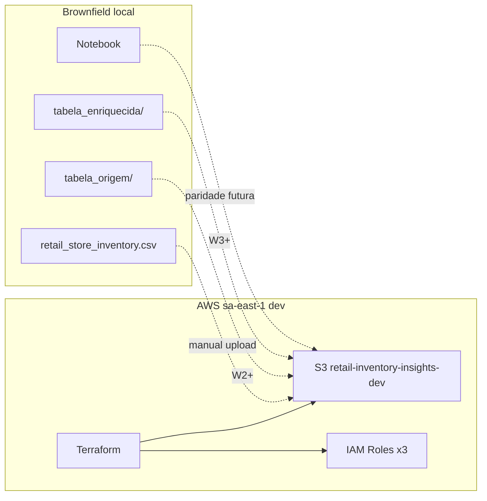

# Application Design · U1 Infra S3/IAM (consolidado)

**Projeto:** datamesh-retail-inventory-insights-d1-d2-d3  
**Unidade:** U1 · Onda W1 · Stories E1-US01–E1-US04  
**Data:** 2026-06-28

---

## Resumo

Design mínimo de alto nível para provisionar fundação AWS que espelha o filesystem local do notebook `Esteira_3Relatorios_D1_D2_D3.ipynb`. Quatro componentes lógicos: datalake S3, conjunto IAM, stack Terraform e documentação de layout.

**Fora de escopo U1:** Glue, Lambda, Step Functions, EventBridge, Athena.

---

## Arquitetura U1

---

## Componentes

| ID | Nome | Story |
|----|------|-------|
| C1 | S3DataLake | E1-US01, E1-US02 |
| C2 | IAMRoleSet | E1-US03 |
| C3 | TerraformStack | E1-US01, E1-US03 |
| C4 | DataLayoutDocumentation | E1-US04 |

Detalhes: [`components.md`](components.md)

---

## Interfaces principais

| Interface | Descrição |
|-----------|-----------|
| S3 paths | `insumo/`, `origem/dt=`, `enriquecido/dt=`, `relatorios/D1\|D2\|D3/` |
| IAM roles | glue-dev, lambda-reports-dev, sfn-dev |
| Terraform outputs | bucket_name, bucket_arn, role ARNs |
| Docs | Mapeamento local→S3 + exemplos dt= |

Detalhes: [`component-methods.md`](component-methods.md)

---

## Serviços

| Serviço | Tipo | Rodada |
|---------|------|--------|
| InfraProvisioningService | Terraform apply | W1 |
| InsumoUploadService | Manual CLI | W1 |
| LayoutDiscoveryService | Documentação | W1 |

Detalhes: [`services.md`](services.md)

---

## Dependências

- Terraform provisiona S3 antes de IAM policies scoped
- Compute futuro (W2+) assume roles já criadas
- Notebook não modificado em W1

Detalhes: [`component-dependency.md`](component-dependency.md)

---

## Decisões de design

| Decisão | Escolha |
|---------|---------|
| Região | sa-east-1 |
| IaC | Terraform modular |
| Bucket | Único `retail-inventory-insights-dev` |
| Encryption | SSE-S3 AES256 |
| Public access | Blocked |
| CSV upload | Manual (não no Terraform state) |

---

## Próximo passo (Construction)

Executar NFR Requirements → NFR Design → Infrastructure Design → Code Generation para U1:

- Módulos `terraform/modules/s3`, `terraform/modules/iam`
- Environment `terraform/environments/dev`
- **Não** criar Glue/Lambda/SFN nesta rodada

---

## Artefatos relacionados

- Requirements: `aidlc-docs/inception/requirements/requirements.md`
- Stories W1: `aidlc-docs/inception/user-stories/stories.md`
- Execution plan: `aidlc-docs/inception/plans/execution-plan.md`
- Reverse engineering: `aidlc-docs/inception/reverse-engineering/`
