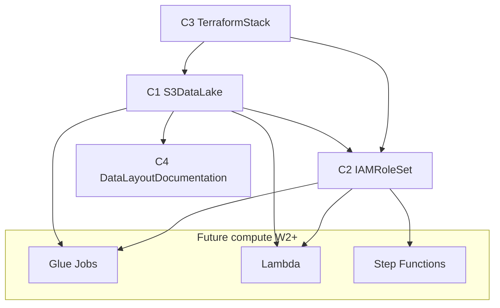

# Component Dependencies · U1

---

## Dependency Matrix

| Component | Depends On | Depended By (future) |
|-----------|------------|----------------------|
| C3 TerraformStack | AWS Provider, variáveis dev | Operador |
| C1 S3DataLake | C3 TerraformStack | C2 IAMRoleSet, C4 Docs, U2–U6 |
| C2 IAMRoleSet | C1 S3DataLake (bucket ARN) | U2 Glue, U4 SFN, U5 Lambda |
| C4 DataLayoutDocumentation | C1 paths definidos | P1, P2 |

---

## Communication Patterns



---

## Data Flow (W1 only)

```
retail_store_inventory.csv (local)
        |
        | aws s3 cp (manual)
        v
s3://retail-inventory-insights-dev/insumo/
        |
        | (future W2: Glue reads)
        v
s3://.../origem/dt=YYYY-MM-DD/data.parquet
        |
        | (future W3: Glue writes)
        v
s3://.../enriquecido/dt=YYYY-MM-DD/data.parquet
        |
        | (future W5: Lambda writes)
        v
s3://.../relatorios/D1/*.xlsx
```

---

## Coupling Rules

1. **IAM policies referenciam bucket ARN + prefix paths** — alterar layout exige update Terraform.
2. **Bucket name global** — `retail-inventory-insights-dev` fixo para dev; outros ambientes usam sufixo diferente.
3. **Notebook permanece source of truth** para lógica até paridade W2–W5 validada.
4. **Nenhum compute referencia bucket em hardcode** — usar outputs Terraform ou env vars nas ondas futuras.

---

## External Dependencies

| Dependency | Version/Config | Purpose |
|------------|----------------|---------|
| Terraform | >= 1.5 | IaC |
| AWS Provider | ~> 5.0 | Recursos us-east-1 |
| AWS CLI | v2 | Upload CSV manual |
