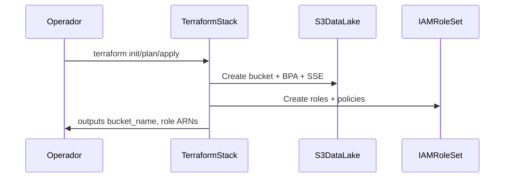

# Services · U1 Infra S3/IAM

**Escopo:** Serviços de provisionamento e operação — sem runtime compute nesta rodada.

---

## S1 · InfraProvisioningService

| Atributo | Valor |
|----------|-------|
| **Purpose** | Provisionar fundação AWS via Terraform |
| **Owner** | P2 Engenheiro de dados / P4 Plataforma |
| **Trigger** | Manual — `terraform apply` |

### Orchestration

### Responsibilities

1. Validar região us-east-1
2. Criar bucket com tags
3. Criar roles IAM (sem anexar a recursos inexistentes)
4. Exportar outputs para documentação

---

## S2 · InsumoUploadService (manual)

| Atributo | Valor |
|----------|-------|
| **Purpose** | Disponibilizar CSV no S3 (E1-US02) |
| **Owner** | P2 |
| **Trigger** | Manual pós-apply |

### Flow

1. Validar SCHEMA local (notebook §1 ou script)
2. `aws s3 cp` para `insumo/`
3. Verificar `aws s3 ls s3://retail-inventory-insights-dev/insumo/`

---

## S3 · LayoutDiscoveryService (documentação)

| Atributo | Valor |
|----------|-------|
| **Purpose** | Permitir P1 localizar dados sem Jupyter (E1-US04) |
| **Owner** | Documentação em aidlc-docs + README |
| **Trigger** | Leitura estática |

### Deliverables

- Tabela mapeamento local→S3
- Exemplos de path com `dt=2022-01-01`
- Instrução de acesso via Console S3 ou CLI

---

## Serviços FUTUROS (referência — não U1)

| Serviço | Onda | Notebook equivalente |
|---------|------|---------------------|
| DailyOriginExtraction | W2 | `carregar_origem_dia` |
| DailyEnrichment | W3 | `enriquecer_dia` |
| DailyPipelineOrchestrator | W4 | `processar_dia` + EventBridge |
| D1ReportGenerator | W5 | §3 Relatório D-1 |

U1 prepara S3 e IAM para que esses serviços se conectem sem redesign de layout.
