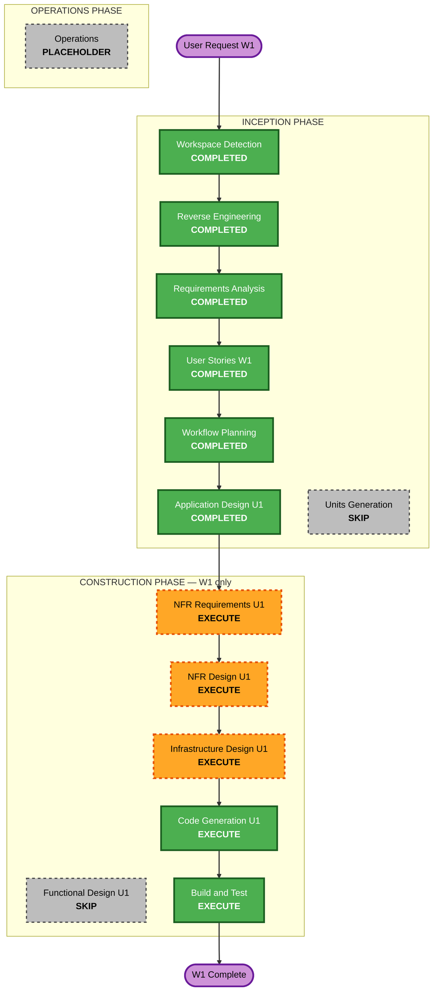

# Execution Plan

**Projeto:** datamesh-retail-inventory-insights-d1-d2-d3  
**Escopo aprovado:** Onda W1 · U1 Infra S3/IAM  
**Data:** 2026-06-28

---

## Detailed Analysis Summary

### Transformation Scope (Brownfield)

- **Transformation Type**: Infrastructure foundation — migração filesystem → S3
- **Primary Changes**: Bucket único, prefixos Hive-style, IAM roles preparatórias
- **Related Components**: Notebook (referência lógica); Terraform (novo); sem alteração no notebook nesta rodada

### Change Impact Assessment

| Área | Impacto |
|------|---------|
| User-facing changes | Indireto — P1 ganha paths S3 documentados (E1-US04) |
| Structural changes | Sim — nova camada infra AWS |
| Data model changes | Não — mesmo schema/particionamento |
| API changes | Não |
| NFR impact | Sim — segurança S3/IAM (Security Baseline enabled) |

### Component Relationships

- **Primary Component**: U1 — Infra Terraform (S3 + IAM)
- **Infrastructure Components**: `terraform/` modules s3, iam
- **Shared Components**: `aidlc-docs/` documentação
- **Dependent Components (futuro)**: U2 Glue origem, U3 Glue enriquecido, U4 Step Functions, U5 Lambda D-1
- **Supporting Components**: README, requirements.md mapeamento

### Risk Assessment

- **Risk Level**: Low
- **Rollback Complexity**: Easy (terraform destroy bucket dev)
- **Testing Complexity**: Simple (aws s3 ls, iam get-role, upload CSV teste)

---

## Workflow Visualization



### Text Alternative

```
INCEPTION (completo para W1):
  Workspace Detection → Reverse Engineering → Requirements → User Stories W1
  → Workflow Planning → Application Design U1
  SKIP: Units Generation (U1 única, design mínimo suficiente)

CONSTRUCTION (próxima rodada):
  SKIP Functional Design (infra pura)
  EXECUTE: NFR Requirements, NFR Design, Infrastructure Design, Code Generation, Build and Test
  NÃO EXECUTAR: Glue, Lambda, Step Functions
```

---

## Phases to Execute

### INCEPTION PHASE

- [x] Workspace Detection (COMPLETED)
- [x] Reverse Engineering (COMPLETED)
- [x] Requirements Analysis (COMPLETED)
- [x] User Stories W1 approved (COMPLETED)
- [x] Workflow Planning (COMPLETED)
- [x] Application Design U1 minimal (COMPLETED)
- [ ] Units Generation — **SKIP**
  - **Rationale**: U1 única nesta rodada; design mínimo em application-design/ suficiente

### CONSTRUCTION PHASE (próxima rodada — não iniciar nesta sessão)

- [ ] Functional Design U1 — **SKIP**
  - **Rationale**: Infra Terraform sem regras de negócio novas
- [ ] NFR Requirements U1 — **EXECUTE**
  - **Rationale**: Security Baseline enabled; SSE, BPA, IAM scoped
- [ ] NFR Design U1 — **EXECUTE**
  - **Rationale**: Traduzir NFR em padrões Terraform
- [ ] Infrastructure Design U1 — **EXECUTE**
  - **Rationale**: Módulos S3, IAM, outputs, variáveis us-east-1
- [ ] Code Generation U1 — **EXECUTE**
  - **Rationale**: Gerar Terraform + docs upload CSV
- [ ] Build and Test — **EXECUTE**
  - **Rationale**: terraform validate/plan; checklist W1 DoD

### OPERATIONS PHASE

- [ ] Operations — PLACEHOLDER

---

## Package Change Sequence

1. **terraform/** (novo) — S3 bucket, prefix placeholders, IAM roles
2. **aidlc-docs/** — mapeamento local→S3 (E1-US04)
3. **README.md** — instruções upload CSV e paths (atualização mínima se necessário)

**Não alterar nesta rodada:** notebook, lógica Glue/Lambda/SF

---

## Estimated Timeline

- **Inception W1**: Completo nesta sessão
- **Construction U1**: ~1 sessão AI-DLC (Terraform apply + validação manual)

---

## Success Criteria

- **Primary Goal**: Fundação S3/IAM dev em us-east-1 espelhando layout local
- **Key Deliverables**: Bucket `retail-inventory-insights-dev`, 3 IAM roles, docs mapeamento
- **Quality Gates**: W1 DoD em backlog-roadmap.md; Security Baseline para S3/IAM

---

## Ondas futuras (referência — fora desta rodada)

| Onda | Unidade | Serviços |
|------|---------|----------|
| W2 | U2 Origem | Glue/Lambda carregar_origem_dia |
| W3 | U3 Enriquecido | Glue enriquecer_dia |
| W4 | U4 Orquestração | Step Functions + EventBridge |
| W5 | U5 D-1 | Lambda Excel |
| W6 | U6 Ops | D-2/D-3, Athena, alarmes |
