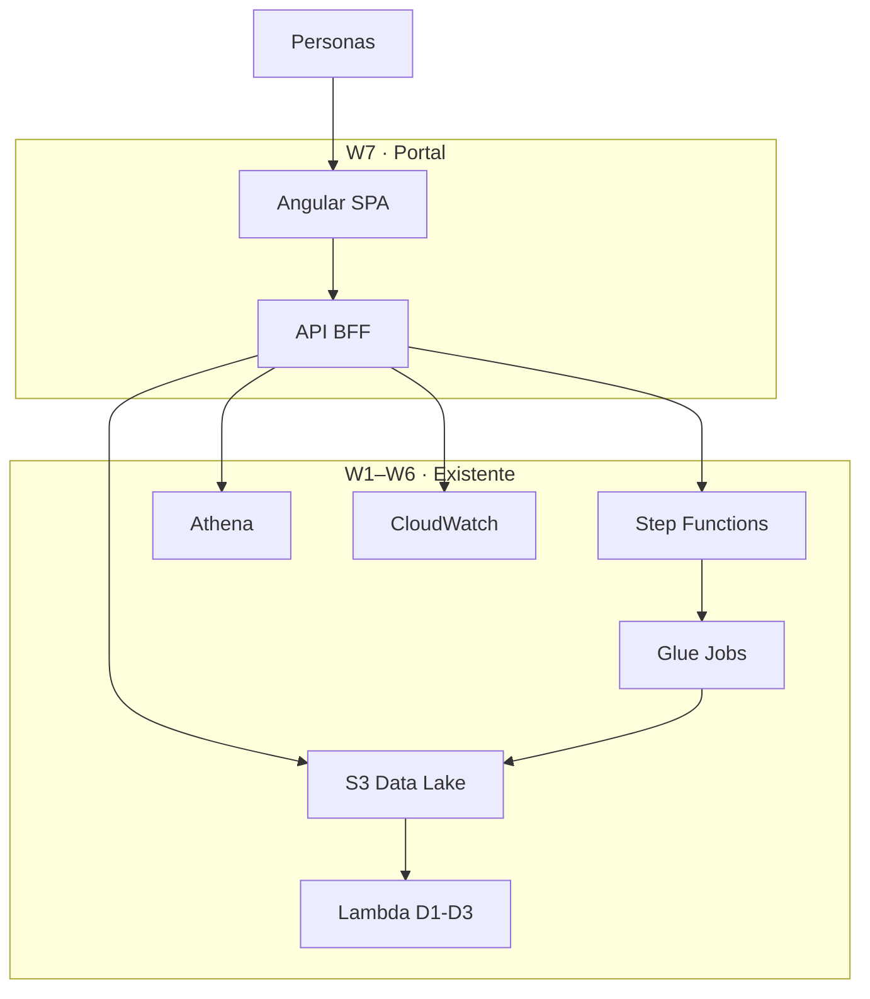
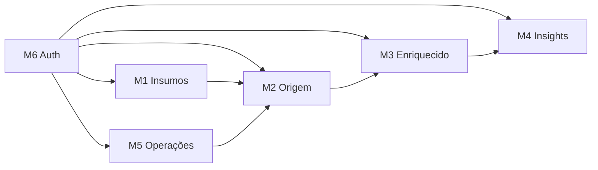
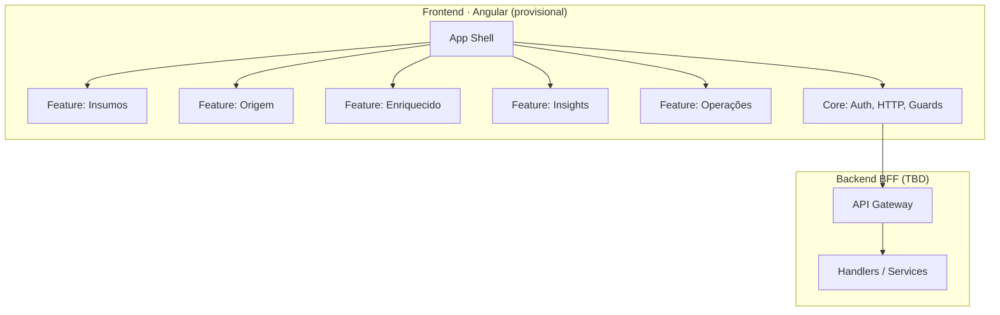
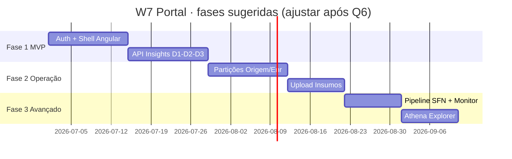

# Plano de Requisitos Funcionais · Portal Web (W7)

**Projeto:** datamesh-retail-inventory-insights-d1-d2-d3  
**Épico:** W7 — Portal de gestão de insumos, enriquecidos e insights  
**Status:** 📎 **Superseded** — ver documento definitivo [`portal-requirements.md`](portal-requirements.md)  
**Data:** 2026-06-29  
**Referências brownfield:** `Esteira_3Relatorios_D1_D2_D3.ipynb`, infra W1–W6, [`diagrams/09-portal-web.mmd`](../../../diagrams/09-portal-web.mmd)

---

## Intent Analysis

| Campo | Valor |
|-------|-------|
| **User request** | Criar portal web + backend para gerenciar insumos, camadas enriquecidas e insights D-1/D-2/D-3 sobre o datamesh AWS existente |
| **Request type** | New Feature / Enhancement (nova camada de consumo e operação) |
| **Scope estimate** | Multiple components — frontend SPA, BFF/API, integração S3/SFN/Athena/CW |
| **Complexity estimate** | **Moderate–Complex** — UI multi-módulo, RBAC, integração com esteira existente |
| **Frontend (provisional)** | **Angular** — pendente confirmação Q1 |
| **Backend (provisional)** | API BFF sobre AWS — pendente Q2–Q3 |

---

## Contexto e fronteira do sistema

### Dentro do escopo W7

| Camada | Responsabilidade |
|--------|------------------|
| **Frontend (Angular)** | SPA com módulos por persona; consumo da API BFF |
| **Backend (BFF)** | Orquestração de chamadas AWS; validação; autorização; sem reimplementar Glue/Lambda |
| **Integrações** | S3 (`insumo/`, `origem/`, `enriquecido/`, `relatorios/`), Step Functions, Athena, CloudWatch |

### Fora do escopo W7 (reutilizar existente)

- Lógica de `carregar_origem_dia`, `enriquecer_dia`, geração Excel D-1/D-2/D-3 (Glue + Lambda W2–W6)
- Novo data lake ou bucket (reutilizar `retail-inventory-insights-dev-use1`)
- Multi-ambiente prod (salvo decisão em Q11)
- Substituição do notebook brownfield (permanece referência)

### Diagrama de contexto



---

## Personas e objetivos (portal)

| ID | Persona | Objetivo no portal | Módulos principais |
|----|---------|-------------------|-------------------|
| P1 | Analista de estoque | Validar dados e consumir insights | Enriquecido, Insights, Athena |
| P2 | Eng. dados / TI | Operar pipeline e insumos | Insumos, Origem, Operações |
| P3 | Gestor compras | Reposição e tendência acionáveis | Insights D-2, D-3 |
| P4 | Diretoria comercial | Ranking vendas e receita | Insight D-1 |
| P5 | Plataforma | Saúde da esteira, IAM, custo | Operações, Monitoramento |

> RBAC detalhado depende de **Q15**.

---

## Módulos funcionais · mapa



| Módulo | Descrição | Prioridade sugerida* |
|--------|-----------|---------------------|
| M1 Insumos | Upload/listagem/validação CSV | Fase 2 (se Q6 ≠ C) |
| M2 Origem | Partições `origem/dt=`, preview | Fase 2 |
| M3 Enriquecido | Partições, métricas, comparativo | Fase 1–2 |
| M4 Insights | D-1, D-2, D-3 + download Excel | **Fase 1 (MVP)** |
| M5 Operações | Disparo SFN, logs, alarmes | Fase 2–3 |
| M6 Auth | Login, sessão, RBAC | Fase 1 |

\*Prioridade final definida por **Q6**.

---

## Requisitos funcionais

### M6 · Autenticação e sessão

| ID | Requisito | Critério de aceite | Depende de |
|----|-----------|-------------------|------------|
| RF-M6-01 | Login de usuário | Usuário autenticado acessa dashboard; não autenticado redireciona para login | Q4 |
| RF-M6-02 | Logout | Encerra sessão e invalida token | Q4 |
| RF-M6-03 | Controle por persona | Telas/ações restritas conforme grupo (TI, Analista, Gestor, Diretoria) | Q4, Q15 |
| RF-M6-04 | Auditoria de ações sensíveis | Upload, disparo pipeline e reprocessamento registram userId + timestamp | Q4 |

---

### M1 · Insumos

| ID | Requisito | Critério de aceite | Depende de |
|----|-----------|-------------------|------------|
| RF-M1-01 | Listar insumos | Exibe arquivos em `s3://…/insumo/` com nome, tamanho, data | — |
| RF-M1-02 | Upload CSV | Envia `retail_store_inventory.csv` (ou equivalente) para `insumo/` | Q7 |
| RF-M1-03 | Validar schema | Rejeita arquivo sem as **15 colunas** do contrato notebook §1 | Q7 |
| RF-M1-04 | Pré-visualização | Mostra primeiras N linhas e contagem total após upload | Q7 |
| RF-M1-05 | Histórico de cargas | Lista uploads com status (OK / schema inválido) | Q7 |

**Contrato schema (brownfield):** `Date`, `Store ID`, `Product ID`, `Category`, `Region`, `Inventory Level`, `Units Sold`, `Units Ordered`, `Demand Forecast`, `Price`, `Discount`, `Weather Condition`, `Holiday/Promotion`, `Competitor Pricing`, `Seasonality`.

---

### M2 · Origem (`origem/dt=`)

| ID | Requisito | Critério de aceite | Depende de |
|----|-----------|-------------------|------------|
| RF-M2-01 | Calendário de partições | Lista dias `dt=YYYY-MM-DD` disponíveis em `origem/` | — |
| RF-M2-02 | Detalhe da partição | Exibe contagem de linhas, lojas e produtos distintos | — |
| RF-M2-03 | Preview de dados | Tabela paginada com amostra do Parquet (máx. N linhas configurável) | — |
| RF-M2-04 | Indicador ausência | Marca dias do insumo sem partição correspondente | RF-M1-01 |
| RF-M2-05 | Reprocessar dia | Aciona pipeline para dt selecionado (idempotente) | Q8, RF-M5-01 |

---

### M3 · Enriquecido (`enriquecido/dt=`)

| ID | Requisito | Critério de aceite | Depende de |
|----|-----------|-------------------|------------|
| RF-M3-01 | Listar partições enriquecidas | Calendário/lista de `dt=` processados | — |
| RF-M3-02 | KPIs da partição | Total `_revenue`, contagem `_stockout`, soma `_lost`, flag `_is_weekend` | — |
| RF-M3-03 | Preview enriquecido | Amostra com colunas originais + derivadas | — |
| RF-M3-04 | Comparar dois dias | Side-by-side ou delta de KPIs entre dt A e dt B | — |
| RF-M3-05 | Consulta Athena | Executa SQL sobre tabela `enriquecido` (limitado) | Q9 |

---

### M4 · Insights D-1 / D-2 / D-3

| ID | Requisito | Critério de aceite | Depende de |
|----|-----------|-------------------|------------|
| RF-M4-01 | Seletor de data D-1 | Usuário escolhe **dado D-1** (dia processado); default = ontem | — |
| RF-M4-02 | Dashboard D-1 | Ranking por unidades e receita; insight top produto e concentração top 3 | Q10 |
| RF-M4-03 | Dashboard D-2 | Lista rupturas (`_stockout==1`, `_lost>0`) ordenada por `_lost` desc | Q10 |
| RF-M4-04 | Dashboard D-3 | Tendência Subindo/Caindo/Estável; média úteis vs FDS; janela N dias | Q10, Q6 |
| RF-M4-05 | Download Excel | Link para artefato em `relatorios/D1|D2|D3/` gerado pela Lambda | — |
| RF-M4-06 | Disponibilidade | Se partição enriquecida ausente, oferece “processar agora” (se permitido) | Q8, RF-M5-01 |
| RF-M4-07 | Insight textual | Exibe frase-resumo alinhada ao notebook (ex.: produto líder D-1) | Q10 |

**Regras de negócio (brownfield):**

- **D-1:** agrega por `Product ID` + `Category`; soma `Units Sold`, `_revenue`.
- **D-2:** filtra `_stockout == 1` e `_lost > 0`; ordena por `_lost` decrescente.
- **D-3:** janela de N partições `dt=`; compara médias `_is_weekend`; classifica tendência.

---

### M5 · Operações e monitoramento

| ID | Requisito | Critério de aceite | Depende de |
|----|-----------|-------------------|------------|
| RF-M5-01 | Disparar `processar_dia(dt)` | POST inicia Step Functions `retail-inventory-insights-processar-dia-dev` | Q8 |
| RF-M5-02 | Acompanhar execução | Status RUNNING/SUCCEEDED/FAILED + link para console SFN | — |
| RF-M5-03 | Histórico de execuções | Lista últimas N execuções com dt, duração, status | — |
| RF-M5-04 | Alarmes CloudWatch | Exibe estado do alarme SFN (OK/ALARM) | — |
| RF-M5-05 | Health check | Endpoint `/health` + indicador “esteira operacional” na UI | — |

---

### M7 · Layout e navegação (transversal)

| ID | Requisito | Critério de aceite | Depende de |
|----|-----------|-------------------|------------|
| RF-M7-01 | Shell Angular | Menu lateral/top com módulos M1–M5 conforme RBAC | Q1 |
| RF-M7-02 | Dashboard home | Resumo: último dt processado, KPIs do dia, links rápidos D-1/D-2/D-3 | — |
| RF-M7-03 | Feedback de erro | Mensagens claras para falha AWS, schema inválido, timeout Athena | — |
| RF-M7-04 | Responsivo | Usável em desktop e tablet (mobile nice-to-have) | Q14 |
| RF-M7-05 | Idioma PT-BR | Labels e insights em português | Q14 |

---

## Requisitos funcionais do backend (BFF)

| ID | Requisito | Endpoint sugerido | Integração AWS |
|----|-----------|-------------------|----------------|
| RF-API-01 | Health | `GET /health` | — |
| RF-API-02 | Listar insumos | `GET /insumos` | S3 ListObjects `insumo/` |
| RF-API-03 | Upload insumo | `POST /insumos/upload` | S3 PutObject + validação |
| RF-API-04 | Listar partições origem | `GET /origem/partitions` | S3 ListObjects `origem/` |
| RF-API-05 | Preview origem | `GET /origem/{dt}/preview` | S3 GetObject + parse Parquet |
| RF-API-06 | Listar partições enriquecido | `GET /enriquecido/partitions` | S3 ListObjects |
| RF-API-07 | KPIs enriquecido | `GET /enriquecido/{dt}/kpis` | Agregação Parquet ou Athena |
| RF-API-08 | Insight D-1 | `GET /insights/d1?dt=` | Parquet ou Excel S3 |
| RF-API-09 | Insight D-2 | `GET /insights/d2?dt=` | idem |
| RF-API-10 | Insight D-3 | `GET /insights/d3?dt=&window=` | idem |
| RF-API-11 | Download relatório | `GET /insights/{d1\|d2\|d3}/download?dt=` | Presigned URL S3 |
| RF-API-12 | Processar dia | `POST /pipeline/processar-dia` | SFN StartExecution |
| RF-API-13 | Status pipeline | `GET /pipeline/executions` | SFN ListExecutions |
| RF-API-14 | Query Athena | `POST /athena/query` | Athena StartQueryExecution |
| RF-API-15 | Alarmes | `GET /ops/alarms` | CloudWatch DescribeAlarms |

> Implementação física (Lambda vs container) pendente **Q2–Q3**.

---

## Stack provisional · Angular + BFF



### Estrutura Angular sugerida (se Q1 = Angular)

```text
portal-web/
├── src/app/
│   ├── core/           # auth, interceptors, guards, api-client
│   ├── shared/         # tabelas, date-picker dt=, kpi-cards
│   └── features/
│       ├── insumos/
│       ├── origem/
│       ├── enriquecido/
│       ├── insights/   # d1, d2, d3 sub-routes
│       └── operacoes/
```

### Decisão pendente · validar Angular

| Critério | Angular | Alternativa (React/Next) |
|----------|---------|--------------------------|
| Equipe / skill | ⏳ validar Q1 | — |
| UI corporativa | Angular Material maduro | shadcn/MUI |
| Paridade TS backend | NestJS natural | Next API routes |
| Diagrama 09 original | React/Next | ✅ já documentado |
| Curva para datamesh Python-heavy | Neutra | Neutra |

---

## Fases de entrega sugeridas



| Fase | Entregáveis | RFs |
|------|-------------|-----|
| **1 · MVP** | Login, home, D-1/D-2/D-3, download Excel | M6, M4, M7, RF-API-08..11 |
| **2 · Dados** | Partições origem/enriquecido, upload insumo | M1–M3, RF-API-02..07 |
| **3 · Ops** | Disparo SFN, monitoramento, Athena | M5, RF-API-12..15 |

---

## Rastreabilidade · RF → diagrama 09

| Diagrama 09 | Requisitos |
|-------------|------------|
| Ecossistema (portal sobre datamesh) | Contexto, fronteira W7 |
| Módulos telas ↔ S3 | M1–M5, RF-M1..RF-M5 |
| Sequência jornada diária | RF-M4, RF-M5, RF-API-08..12 |
| Arquitetura técnica | Stack provisional, RF-API-* |
| Personas → telas | Personas P1–P5, RF-M6-03 |
| Modelo ER | Entidades INSUMO, PARTICAO_*, INSIGHT_*, EXECUCAO_PIPELINE |

---

## Requisitos não funcionais (rascunho · validar na fase NFR)

| ID | Categoria | Diretriz inicial |
|----|-----------|------------------|
| NFR-W7-01 | Segurança | HTTPS only; Cognito; IAM least privilege no BFF; presigned URLs curtas |
| NFR-W7-02 | Performance | Preview Parquet ≤ 500 linhas; timeout Athena configurável |
| NFR-W7-03 | Disponibilidade | Portal stateless; degradar graciosamente se SFN indisponível |
| NFR-W7-04 | Usabilidade | PT-BR; feedback &lt; 3 cliques para insight do dia |
| NFR-W7-05 | Manutenibilidade | Monorepo ou pasta `portal-web/` na raiz; Terraform módulo portal |
| NFR-W7-06 | Custo | Lambda/CloudFront tier dev; sem duplicar dados do S3 |

> Detalhamento NFR após aprovação deste plano e opt-in extensions (Q16–Q18).

---

## Próximos passos (AI-DLC)

| # | Stage | Ação |
|---|-------|------|
| 1 | **Requirements Analysis** | Preencher [`requirement-verification-questions-portal.md`](requirement-verification-questions-portal.md) |
| 2 | Requirements Analysis | Gerar `portal-requirements.md` definitivo |
| 3 | User Stories | Épico E8 — stories por módulo M1–M7 |
| 4 | Workflow Planning | Unidades U8-Frontend, U8-Backend, U8-Infra |
| 5 | Application Design | Componentes Angular + contratos OpenAPI BFF |

---

## Extension Configuration

| Extension | Enabled | Decided At |
|-----------|---------|------------|
| Security Baseline | ⏳ Pendente | Q16 |
| Resiliency Baseline | ⏳ Pendente | Q17 |
| Property-Based Testing | ⏳ Pendente | Q18 |
