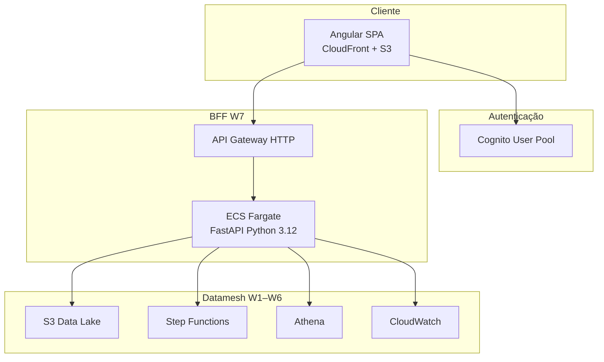

# Requirements · Portal Web W7

**Projeto:** datamesh-retail-inventory-insights-d1-d2-d3  
**Épico:** W7 — Portal de gestão (insumos, enriquecidos, insights D-1/D-2/D-3)  
**Status:** ✅ Aprovado 2026-06-29  
**Data:** 2026-06-29  
**Fonte Q&A:** [`requirement-verification-questions-portal.md`](requirement-verification-questions-portal.md)  
**Referências:** `Esteira_3Relatorios_D1_D2_D3.ipynb`, infra W1–W6, [`diagrams/09-portal-web.mmd`](../../../diagrams/09-portal-web.mmd)

---

## Intent Analysis

| Campo | Valor |
|-------|-------|
| **User request** | Portal web Angular + backend para gerenciar insumos, enriquecidos e insights sobre o datamesh AWS |
| **Request type** | New Feature / Enhancement |
| **Scope estimate** | Multiple components — Angular SPA, FastAPI BFF em ECS, integrações AWS |
| **Complexity estimate** | **Complex** — 6 módulos funcionais, Cognito, integração S3/SFN/Athena/CW |

---

## Decisões arquiteturais (confirmadas)

| # | Decisão | Valor |
|---|---------|-------|
| Q1 | Frontend | **Angular** + Angular Material |
| Q2 | API | **API Gateway HTTP + ECS/Fargate** (monolito BFF) |
| Q3 | Backend runtime | **Python 3.12 · FastAPI** (paridade com Glue/Lambda existentes) |
| Q4 | Auth | **Amazon Cognito** User Pool |
| Q5 | Hosting frontend | **S3 estático + CloudFront** |
| Q6 | Escopo W7 | **Completo** — M1–M5 (com exceção documentada em Q7) |
| Q7 | Upload insumo | **Lista apenas** — upload permanece CLI/S3 manual nesta rodada |
| Q8 | Disparo SFN | **Qualquer usuário autenticado** |
| Q9 | Athena | **Queries pré-aprovadas** (templates `athena-validation-queries.md`) |
| Q10 | Insights UI | **Tabela interativa** + download Excel S3 |
| Q11 | Ambiente | **dev** · `retail-inventory-insights-dev-use1` · us-east-1 |
| Q12 | Tenancy | **Single-tenant** |
| Q13 | IaC | **Terraform** · `terraform/modules/portal/` |
| Q14 | Idioma | **Português (BR)** |
| Q15 | RBAC por persona | **Fase 2** — W7: auth Cognito; todos os módulos visíveis |

### Resolução de tensões entre respostas

| Tensão | Resolução W7 |
|--------|----------------|
| Q6 completo × Q7 sem upload | M1 entrega **RF-M1-01** (listar); RF-M1-02..05 **fora de escopo W7** |
| Q8 qualquer usuário × Q15 RBAC fase 2 | Pipeline e telas abertos a **qualquer autenticado**; grupos Cognito preparados sem enforcement |
| Q2 ECS × Q3 Python | BFF = **FastAPI** em container Fargate (não NestJS) |

---

## Arquitetura alvo



### Estrutura de repositório (planejada)

```text
project-datamesh-1/
├── portal-web/              # Angular SPA
├── portal-api/              # FastAPI BFF
└── terraform/modules/portal/
```

---

## Fronteira do sistema

### Dentro do escopo W7

- Angular SPA (M4 insights, M1–M3 dados, M5 ops, M6 auth, M7 shell)
- FastAPI BFF com integração AWS SDK (boto3)
- Terraform módulo portal (CloudFront, S3 site, API GW, ECS, Cognito, IAM)
- Queries Athena pré-aprovadas (sem editor SQL livre)

### Fora do escopo W7

- Upload CSV via portal (RF-M1-02..05) — CLI/S3 manual
- RBAC por persona com restrição de telas (fase 2)
- Reimplementação Glue/Lambda relatórios
- Multi-tenant / multi-ambiente prod
- Editor SQL ad hoc livre

---

## Personas (referência · RBAC fase 2)

| Persona | Uso W7 (sem RBAC) | Módulos de interesse |
|---------|-------------------|----------------------|
| Analista | Acesso total autenticado | Enriquecido, Insights, Athena templates |
| Eng. dados / TI | Acesso total autenticado | Origem, Operações, Pipeline |
| Gestor compras | Acesso total autenticado | D-2, D-3 |
| Diretoria | Acesso total autenticado | D-1 |

---

## Requisitos funcionais

### M6 · Autenticação

| ID | Requisito | Critério de aceite | W7 |
|----|-----------|-------------------|-----|
| RF-M6-01 | Login Cognito | Redirect login; JWT no interceptor Angular | ✅ |
| RF-M6-02 | Logout | Limpa sessão Cognito e storage local | ✅ |
| RF-M6-03 | RBAC por persona | Grupos Cognito criados; **sem guard por tela em W7** | ⏳ Fase 2 |
| RF-M6-04 | Auditoria | `processar_dia` e ações sensíveis logam `sub` + timestamp | ✅ |

---

### M1 · Insumos

| ID | Requisito | Critério de aceite | W7 |
|----|-----------|-------------------|-----|
| RF-M1-01 | Listar insumos | Lista objetos em `s3://…/insumo/` (nome, tamanho, LastModified) | ✅ |
| RF-M1-02 | Upload CSV | Upload pelo portal com validação schema | ❌ Fase 2 |
| RF-M1-03 | Validar schema | 15 colunas obrigatórias no upload | ❌ Fase 2 |
| RF-M1-04 | Pré-visualização upload | Primeiras N linhas pós-upload | ❌ Fase 2 |
| RF-M1-05 | Histórico cargas | Histórico com status | ❌ Fase 2 |

**Schema contrato (referência):** `Date`, `Store ID`, `Product ID`, `Category`, `Region`, `Inventory Level`, `Units Sold`, `Units Ordered`, `Demand Forecast`, `Price`, `Discount`, `Weather Condition`, `Holiday/Promotion`, `Competitor Pricing`, `Seasonality`.

---

### M2 · Origem

| ID | Requisito | Critério de aceite | W7 |
|----|-----------|-------------------|-----|
| RF-M2-01 | Calendário partições | Lista prefixos `origem/dt=YYYY-MM-DD/` | ✅ |
| RF-M2-02 | Detalhe partição | Linhas, lojas e produtos distintos | ✅ |
| RF-M2-03 | Preview Parquet | Tabela paginada, máx. 500 linhas | ✅ |
| RF-M2-04 | Gap insumo×origem | Indica dt sem partição quando aplicável | ✅ |
| RF-M2-05 | Reprocessar dia | Botão aciona `POST /pipeline/processar-dia` | ✅ |

---

### M3 · Enriquecido

| ID | Requisito | Critério de aceite | W7 |
|----|-----------|-------------------|-----|
| RF-M3-01 | Listar partições | Lista `enriquecido/dt=` | ✅ |
| RF-M3-02 | KPIs partição | `sum(_revenue)`, `count(_stockout)`, `sum(_lost)` | ✅ |
| RF-M3-03 | Preview enriquecido | Amostra colunas originais + derivadas | ✅ |
| RF-M3-04 | Comparar dias | Delta KPIs entre dt A e dt B | ✅ |
| RF-M3-05 | Athena templates | Executa queries pré-aprovadas; limite resultados | ✅ |

---

### M4 · Insights D-1 / D-2 / D-3

| ID | Requisito | Critério de aceite | W7 |
|----|-----------|-------------------|-----|
| RF-M4-01 | Seletor dt | Seleção de data do dado; default ontem | ✅ |
| RF-M4-02 | Dashboard D-1 | Tabela ranking unidades/receita; insight top 3 | ✅ |
| RF-M4-03 | Dashboard D-2 | Tabela rupturas por `_lost` desc | ✅ |
| RF-M4-04 | Dashboard D-3 | Tendência + janela N + úteis vs FDS | ✅ |
| RF-M4-05 | Download Excel | Presigned URL `relatorios/D1|D2|D3/` | ✅ |
| RF-M4-06 | Processar se ausente | Se sem partição, CTA processar (autenticado) | ✅ |
| RF-M4-07 | Insight textual | Frase-resumo alinhada ao notebook | ✅ |

**Regras de negócio (brownfield):**

- **D-1:** `groupby(Product ID, Category)` → `sum(Units Sold)`, `sum(_revenue)`
- **D-2:** `_stockout == 1` e `_lost > 0`; sort `_lost` desc
- **D-3:** janela N partições; médias `_is_weekend`; classificação Subindo/Caindo/Estável

---

### M5 · Operações

| ID | Requisito | Critério de aceite | W7 |
|----|-----------|-------------------|-----|
| RF-M5-01 | Disparar pipeline | `StartExecution` SFN `processar_dia` com `{dt}` | ✅ |
| RF-M5-02 | Status execução | RUNNING / SUCCEEDED / FAILED em tempo quase real | ✅ |
| RF-M5-03 | Histórico | Últimas 20 execuções com dt, duração, status | ✅ |
| RF-M5-04 | Alarmes CW | Estado alarme SFN OK/ALARM na UI | ✅ |
| RF-M5-05 | Health | `GET /health` + badge na home | ✅ |

---

### M7 · Layout Angular

| ID | Requisito | Critério de aceite | W7 |
|----|-----------|-------------------|-----|
| RF-M7-01 | App shell | Menu: Insumos, Origem, Enriquecido, Insights, Operações | ✅ |
| RF-M7-02 | Home dashboard | Último dt, KPIs, atalhos D-1/D-2/D-3 | ✅ |
| RF-M7-03 | Erros UX | Mensagens PT-BR para falhas AWS/timeout | ✅ |
| RF-M7-04 | Responsivo | Desktop + tablet | ✅ |
| RF-M7-05 | Idioma PT-BR | Interface e insights em português | ✅ |

---

## API BFF · contratos (FastAPI)

| ID | Método | Path | Descrição | Auth |
|----|--------|------|-----------|------|
| RF-API-01 | GET | `/health` | Liveness | Público |
| RF-API-02 | GET | `/insumos` | Lista S3 `insumo/` | JWT |
| RF-API-04 | GET | `/origem/partitions` | Lista dt= origem | JWT |
| RF-API-05 | GET | `/origem/{dt}/preview` | Preview Parquet | JWT |
| RF-API-06 | GET | `/enriquecido/partitions` | Lista dt= enriquecido | JWT |
| RF-API-07 | GET | `/enriquecido/{dt}/kpis` | KPIs agregados | JWT |
| RF-API-08 | GET | `/insights/d1` | Dados D-1 `?dt=` | JWT |
| RF-API-09 | GET | `/insights/d2` | Dados D-2 `?dt=` | JWT |
| RF-API-10 | GET | `/insights/d3` | Dados D-3 `?dt=&window=` | JWT |
| RF-API-11 | GET | `/insights/{tipo}/download` | Presigned Excel | JWT |
| RF-API-12 | POST | `/pipeline/processar-dia` | Body `{dt}` → SFN | JWT |
| RF-API-13 | GET | `/pipeline/executions` | Histórico SFN | JWT |
| RF-API-14 | POST | `/athena/query-template` | Body `{template_id}` | JWT |
| RF-API-15 | GET | `/ops/alarms` | CloudWatch alarms | JWT |

> RF-API-03 upload **fora de escopo W7** (Q7).

---

## Requisitos não funcionais (W7)

| ID | Categoria | Requisito |
|----|-----------|-----------|
| NFR-W7-01 | Segurança | HTTPS only; Cognito JWT no API GW; IAM task role least privilege; Security extension **habilitada** |
| NFR-W7-02 | Segurança | Presigned URLs S3 TTL ≤ 15 min |
| NFR-W7-03 | Performance | Preview ≤ 500 linhas; timeout API 30s (Athena até 60s) |
| NFR-W7-04 | Resiliência | ECS mín. 1 task; health check ALB; retry boto3 idempotente — Resiliency extension **habilitada** |
| NFR-W7-05 | Usabilidade | Insight do dia em ≤ 3 cliques a partir da home |
| NFR-W7-06 | Manutenibilidade | OpenAPI gerado por FastAPI; testes PBT em funções puras de agregação |
| NFR-W7-07 | Custo | Fargate dev mínimo (0.25 vCPU / 0.5 GB); CloudFront price class 100 |
| NFR-W7-08 | i18n | PT-BR apenas |

---

## Extension Configuration

| Extension | Enabled | Decided At |
|-----------|---------|------------|
| Security Baseline | **Yes** | Requirements Analysis W7 — Q16 |
| Resiliency Baseline | **Yes** | Requirements Analysis W7 — Q17 |
| Property-Based Testing | **Yes** | Requirements Analysis W7 — Q18 |

---

## Rastreabilidade

| Artefato | Cobertura |
|----------|-----------|
| `diagrams/09-portal-web.mmd` | M1–M5, BFF, personas |
| W1–W6 infra | Bucket, SFN, Glue, Lambda, Athena, CW reutilizados |
| Notebook §1 | Schema 15 colunas (validação futura upload) |
| `scripts/athena-validation-queries.md` | Templates RF-API-14 |

---

## Entregáveis W7

| # | Entregável |
|---|------------|
| 1 | `portal-web/` — Angular app deployada CloudFront |
| 2 | `portal-api/` — FastAPI container ECS |
| 3 | `terraform/modules/portal/` — infra portal |
| 4 | Cognito User Pool + app client |
| 5 | Documentação deploy dev |

---

## Fase 2 (backlog explícito)

- RF-M1-02..05 upload insumo via portal (presigned URL + validação)
- RF-M6-03 RBAC por grupo Cognito (Gestor, Diretoria, TI, Analista)
- Gráficos nos dashboards D-1/D-2/D-3 (Q10 opção C)
- Editor SQL livre Athena (Q9 opção A)
