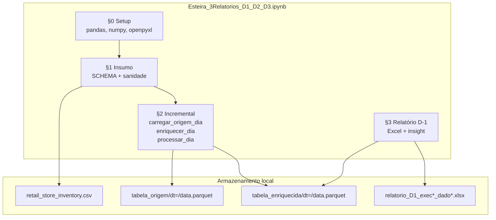
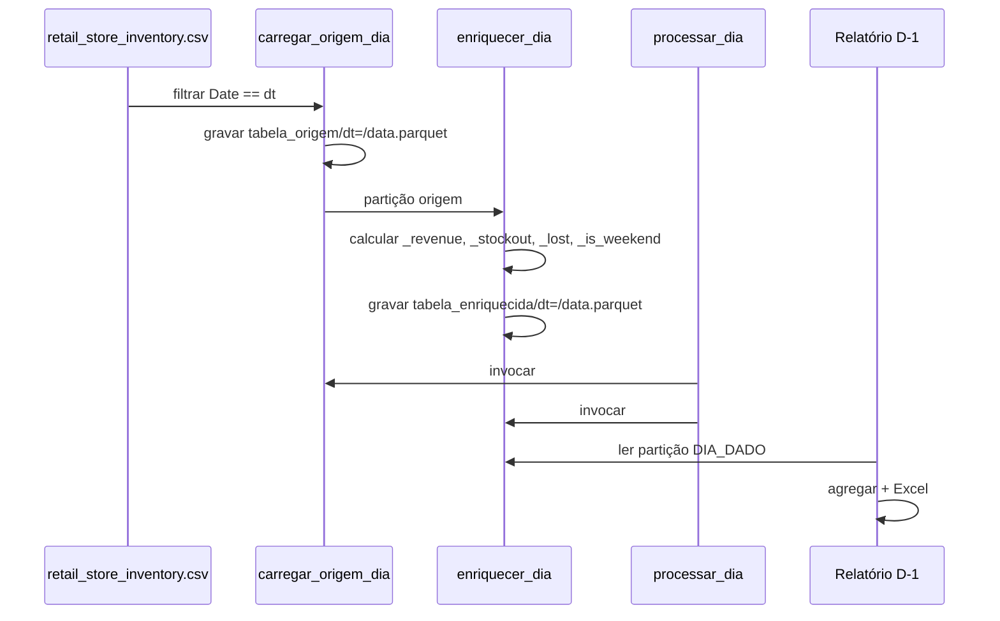

# System Architecture

## System Overview

Sistema brownfield monolítico em Jupyter Notebook (Python 3.13) que implementa uma esteira de dados de estoque varejo com processamento incremental por partição diária e geração de relatório Excel D-1. Não há serviços distribuídos, APIs REST ou infraestrutura AWS no repositório atual — apenas simulação local com equivalência documentada para S3, Glue, Lambda, Step Functions e EventBridge.

## Architecture Diagram

## Component Descriptions

### Notebook principal
- **Purpose**: Orquestração e transformação end-to-end em células sequenciais.
- **Responsibilities**: Validação, particionamento, enriquecimento, agregação D-1, export Excel.
- **Dependencies**: pandas, numpy, pyarrow, openpyxl.
- **Type**: Application

### Camada origem (tabela_origem)
- **Purpose**: Snapshot diário filtrado do insumo.
- **Responsibilities**: Parquet por `dt=`; overwrite idempotente.
- **Dependencies**: insumo CSV, pyarrow.
- **Type**: Application / Data Store (local)

### Camada enriquecida (tabela_enriquecida)
- **Purpose**: Dados de negócio calculados por linha.
- **Responsibilities**: Métricas `_revenue`, `_stockout`, `_lost`, `_is_weekend`, `dt`.
- **Dependencies**: tabela_origem.
- **Type**: Application / Data Store (local)

### Relatório D-1
- **Purpose**: Entrega analítica para P1 (analista de estoque).
- **Responsibilities**: Agregação produto+categoria; insight automático; fórmulas Excel.
- **Dependencies**: tabela_enriquecida.
- **Type**: Application / Output

## Data Flow

## Integration Points

- **External APIs**: Nenhuma — dataset estático CSV (Kaggle).
- **Databases**: Nenhum — arquivos CSV/Parquet/Excel locais.
- **Third-party Services**: Nenhum no estado atual.

## Infrastructure Components

- **CDK Stacks**: Nenhum no repositório.
- **Terraform**: Nenhum no repositório (alvo W1).
- **Deployment Model**: Execução manual via Jupyter kernel `.venv`.
- **Networking**: N/A (local).
