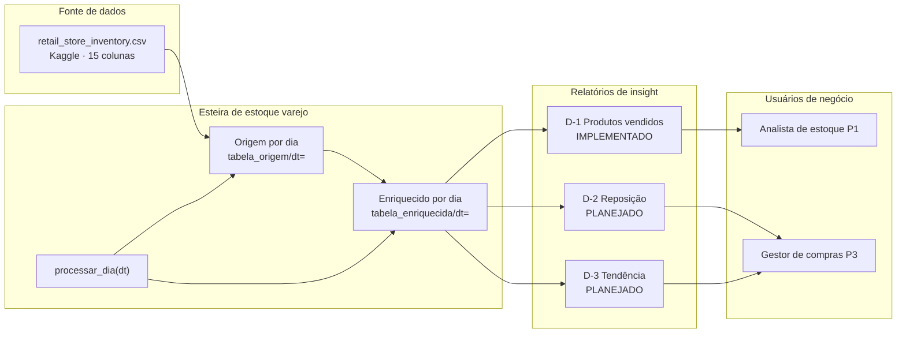

# Business Overview

## Business Context Diagram

## Business Description

- **Business Description**: Pipeline fechado de gestão de estoque em varejo que consome inventário diário por loja e produto, enriquece com métricas de receita e ruptura, e gera relatórios Excel de insight com defasagem D-1/D-2/D-3 para apoiar decisões comerciais, operacionais e de planejamento.
- **Business Transactions**:
  1. **Ingestão e validação do insumo** — Carregar CSV, validar schema de 15 colunas, executar sanidade (volume, duplicatas, nulos, ruptura).
  2. **Extração diária (origem)** — Filtrar insumo por `Date` e gravar partição parquet idempotente em `tabela_origem/dt=`.
  3. **Enriquecimento diário** — Calcular `_revenue`, `_stockout`, `_lost`, `_is_weekend`, `dt` e gravar em `tabela_enriquecida/dt=`.
  4. **Processamento incremental** — Orquestrar origem → enriquecido por dia via `processar_dia(dt)`.
  5. **Relatório D-1** — Agregar vendas por produto/categoria do dia D-1 e gerar Excel com insight e fórmulas.
  6. **Relatórios D-2/D-3** (planejados) — Ruptura priorizada por `_lost`; tendência de consumo em janela histórica.
- **Business Dictionary**:
  - **Grão do dado**: 1 linha = Date × Store ID × Product ID
  - **D-1 / D-2 / D-3**: Defasagem do insight em relação à data de execução (D-1 = dia anterior)
  - **Ruptura (_stockout)**: Vendeu todo estoque e demanda prevista excede estoque
  - **Venda perdida (_lost)**: Estimativa de unidades não vendidas por ruptura
  - **Partição dt=**: Unidade idempotente de processamento diário (formato `YYYY-MM-DD`)

## Component Level Business Descriptions

### Esteira_3Relatorios_D1_D2_D3.ipynb
- **Purpose**: Implementação única da esteira local simulando serviços AWS (Lambda, Glue, Step Functions).
- **Responsibilities**: Setup, ingestão, validação, processamento incremental, geração Excel D-1.

### retail_store_inventory.csv
- **Purpose**: Fonte única de inventário varejo (dataset Kaggle ou equivalente).
- **Responsibilities**: Fornecer 15 colunas contratuais para toda a cadeia downstream.

### Partições locais (tabela_origem / tabela_enriquecida)
- **Purpose**: Camadas bronze (origem) e silver lógico (enriquecido) particionadas por dia.
- **Responsibilities**: Persistência idempotente; base para relatórios e paridade AWS futura.
