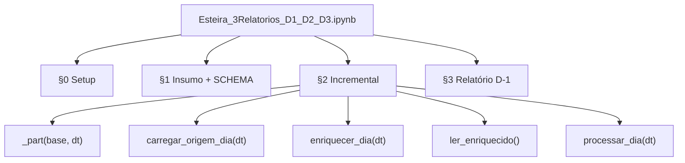

# Code Structure

## Build System

- **Type**: Python venv + pip (`requirements.txt`)
- **Configuration**: `requirements.txt`, `.venv/`, kernel Jupyter `python3`

## Key Classes/Modules

### Existing Files Inventory

- `Esteira_3Relatorios_D1_D2_D3.ipynb` — Notebook principal; toda a lógica de negócio e esteira
- `retail_store_inventory.csv` — Insumo (73.100 linhas, 731 dias, 5 lojas, 20 produtos)
- `requirements.txt` — Dependências Python (pandas, numpy, pyarrow, openpyxl, jupyter)
- `PROJETO_DATAMESH.txt` — Documentação funcional do projeto
- `diagrams/*.mmd` — Diagramas Mermaid versionados (fluxo, pastas, AWS)
- `tabela_origem/dt=*/data.parquet` — Partições origem geradas em runtime
- `tabela_enriquecida/dt=*/data.parquet` — Partições enriquecidas geradas em runtime
- `relatorio_D1_exec*_dado*.xlsx` — Saídas D-1 geradas em runtime

## Design Patterns

### Particionamento Hive-style
- **Location**: `_part(base, dt)` → `dt=YYYY-MM-DD/data.parquet`
- **Purpose**: Idempotência e processamento incremental diário
- **Implementation**: Diretórios locais; overwrite via `shutil.rmtree` antes de regravar

### Pipeline sequencial em células
- **Location**: Notebook §0 → §3
- **Purpose**: Simular esteira AWS como funções Python encadeadas
- **Implementation**: Funções puras por dia; estado em filesystem

### Contrato de schema explícito
- **Location**: `SCHEMA` (15 colunas) em §1
- **Purpose**: Fail-fast na ingestão
- **Implementation**: `ValueError` se coluna ausente

## Critical Dependencies

### pandas
- **Version**: >=2.2,<3
- **Usage**: DataFrames, groupby, filtros por data
- **Purpose**: Transformação e agregação central

### pyarrow
- **Version**: >=18,<22
- **Usage**: `to_parquet` / `read_parquet`
- **Purpose**: Partições columnar

### openpyxl
- **Version**: >=3.1,<4
- **Usage**: Workbook, estilos, fórmulas Excel
- **Purpose**: Relatório D-1 formatado

### numpy
- **Version**: >=2.0,<3
- **Usage**: `_lost`, seeds, operações vetorizadas
- **Purpose**: Cálculos numéricos de enriquecimento
