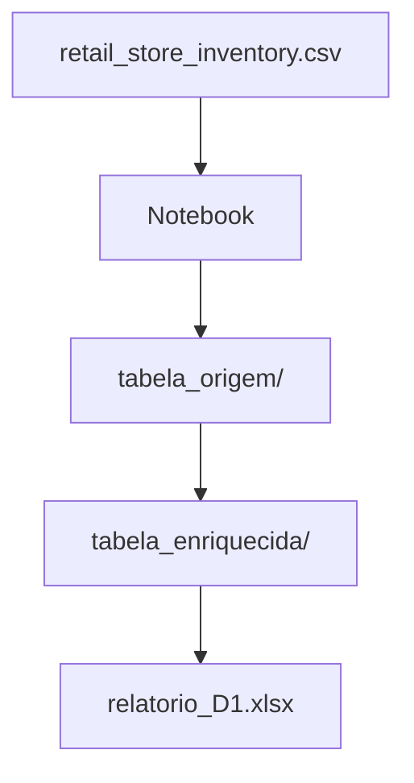

# Dependencies

## Internal Dependencies

### Notebook depends on retail_store_inventory.csv
- **Type**: Runtime / Data
- **Reason**: Fonte única para extração diária

### enriquecer_dia depends on tabela_origem
- **Type**: Runtime / Data
- **Reason**: Lê parquet origem antes de calcular métricas

### Relatório D-1 depends on tabela_enriquecida
- **Type**: Runtime / Data
- **Reason**: Agrega partição DIA_DADO enriquecida

## External Dependencies

### pandas
- **Version**: >=2.2,<3
- **Purpose**: Core data processing
- **License**: BSD-3-Clause

### numpy
- **Version**: >=2.0,<3
- **Purpose**: Numeric operations
- **License**: BSD-3-Clause

### pyarrow
- **Version**: >=18,<22
- **Purpose**: Parquet I/O
- **License**: Apache-2.0

### openpyxl
- **Version**: >=3.1,<4
- **Purpose**: Excel generation
- **License**: MIT

### ipykernel / jupyter
- **Version**: ipykernel >=6.29; jupyter >=1.0
- **Purpose**: Notebook execution environment
- **License**: BSD-3-Clause
